# JavaDeveloper

Материалы для собеседования на позицию java developer.

<!--ts-->
<!--te-->

## Общие вопросы

#### Если нажать поиск в гугл, что происходит под капотом?
<details><summary markdown="span">Ответ</summary>

ToDo: развернутый большой ответ

</details>

---

#### Расскажите про клиент-серверную архитектуру
Ответ: 
Архитектура "Клиент-Сервер" предусматривает разделение сетевой нагрузки между потребителем услуг (*клиентом*) и поставщиком услуг (*сервером*) на разных компьютерах сети, каждый из которых работает независимо от других.
<details><summary markdown="span">Типы реализаций</summary>

  1. **Одноуровневая архитектура (1-Tier)**: клиенты через интерфейс взаимодействуют с общим <u>сервером баз данных</u> или <u>файловым сервером</u> (только предоставление данных);
  2. **Двухуровневая архитектура (2-Tier)**: клиенты через интерфейс взаимодействуют с общим <u>сервером приложений с БД</u>:
     1. *fat client thin server* - данные хранятся на сервере, а логика их обработки и бизнес-логика - на клиенте;
     2. *thin client fat server* - на сервере хранятся и данные, и логика их обработки, и бизнес-логика;
  3. **Трёхуровневая архитектура (3-Tier)**: клиенты через интерфейс взаимодействуют с общемим сервером, который использует результат взаимодействия с сервером БД.
  4. **Многоуровневая архитектура (N-Tier)**: клиенты через интерфейс взаимодействуют с одним из несколько серверов приложений, использующих результаты работы друг друга, а также данные от различных серверов БД, файловых серверов и других видов серверов.
   
</details>

<details><summary markdown="span">Практические примеры
</summary>

* веб-сайт;
* автомобильный навигатор;
* корпоративная сеть (нпр. почтовый сервер);
* и др.
  
</details>

<details><summary markdown="span">Преимущества
</summary>

* *Масштабируемость* - количество клиентов и серверов можно изменять независимо друг от друга;
* *Централизованность* - управление и данные сосредоточены на центральном сервере;
* *Информационная безопасность* - ресурсы общего пользования администрируются централизованно;
* *Производительность* - использование выделенного сервера повышает скорость работы ресурсов общего пользования;
  
</details>

<details><summary markdown="span">Недостатки
</summary>

* *Перегрузку трафика в сети* - когда большое число клиентов одновременно запрашивают одну услугу на сервере, то число запросов может создать перегрузку в сети;
* *Наличие единой точки отказа* в небольших сетях с одним сервером. Если он отказывает, все клиенты остаются без обслуживания;
* *Превышение пределов ресурсов сервера*, когда новые клиенты, запрашивающие услугу, остаются без обслуживания. В таких случаях, требуется срочное расширение ресурсов сервера;
* Потенциально специфический интерфейс клиента, для использования которого требуются дополнительные настройки.

</details>

---

#### Что такое xml, как он связан с xsd?
Ответ:
***XML** (eXtensible Markup Language)* - это язык разметки, рекомендованный W3C для хранения и передачи данных.
***XSD** (XML Schema Definition)* - это язык описания (в XML-формате) структуры XML документа.

---

#### Чем удобен json, есть ли у него инструменты для проведения валидации?
ToDo: ответ

---

#### Что такое сериализация и десериализация?
ToDo: ответ

---

#### Какие знаете http методы? какие из них персистентные?
ToDo: ответ

---

#### Зачем нужны куки?
ToDo: ответ

---

#### Чем аутентификация отличается от идентификации?
ToDo: ответ

---

#### REST vs SOAP
ToDo: ответ

---

#### RESTful api и JSON-pure api в чем отличие?
ToDo: ответ

---

#### Расскажите про CRUD
ToDo: ответ

---

#### Как согласно CAP теореме я должен выбирать элементы для фронт и бэк систем (Базы данных, системы резервирования и проч)?
ToDo: ответ

---

## Сервера приложений

#### Чем сервер приложений отличается от web сервера?
ToDo: ответ

---

#### Какие упрощения для приложения предоставляет app server?
ToDo: ответ

---

#### Вам нужно настроить TLS в вашем приложении. Какие есть способы реализации этого, если приложение установлено не standalone?
ToDo: ответ

---

#### Чем отличается jar от war?
ToDo: ответ

---

#### Зачем нужен в общем случае кластер WAS? могу ли я использовать кластер для распределения нагрузки?
ToDo: ответ

---

## Java EE

#### Назовите принципы ООП (с примерами)
ToDo: ответ

---

#### Расскажите про Object Pools (Boolean/Short/Integer/Long/String)
Ответ:

Для более эффективного использования памяти, в Java используются так называемые пулы (`Boolean`, `Short`, `Integer`, 
`Long` и `String`). Когда мы создаем объект, не используя оператор `new` (посредством литералов, либо с использованием 
механизма autoboxing), объект помещается в пул, и в последствии, если мы захотим создать такой же объект (опять же, 
без использования оператора `new`), то новый объект создан не будет, а мы просто получим ссылку на наш объект из пула, 
т.е. по факту один и тот же объект будет переиспользован в нескольких местах (такое поведение допустимо для объектов 
вышеописанных типов, т.к. они являются immutable).

Стоит заметить, что использование любого Pool'а за исключением `String` будет осуществляться при любой автоупаковке 
(если, конечно, значение соответсвует определенному диапазону, зависящему от типа, см. autoboxing). 
В случае же Pool'а String интернирование (intern) работает только для литералов.

<details><summary markdown="span">Boolean pool</summary>

Boolean pool хранит оба возможных значения, т.е. объектные Wrapper'ы для обоих примитивов (true и false).

Контрольный пример:

```java
Boolean valueFromPool1 = true; // произойдет вызов: Boolean.valueOf(true);
Boolean valueFromPool2 = true; // произойдет вызов: Boolean.valueOf(true);

System.out.println(valueFromPool1 == valueFromPool2); // true
System.out.println(true == valueFromPool1);           // true (произойдет вызов: valueFromPool1.booleanValue();)
System.out.println((Boolean) true == valueFromPool1); // true (произойдет вызов: Boolean.valueOf(true);)
```

</details>

<details><summary markdown="span">Short / Integer / Long pool</summary>

Особенность целочисленных (`Short`, `Integer` и `Long`) pool'ов состоит в том, что, по умолчанию, они хранят только 
числа, которые помещаются в тип данных `byte`, т.е. числа в интервале от `-128` до `127` (который начиная с Java 7 
(раньше это было захардкожено внутри классов `java.lang.Short`, `java.lang.Integer` и `java.lang.Long`, соответственно) 
можно расширить с помощью опции JVM, пример для Integer: `-Djava.lang.Integer.IntegerCache.high=<size>` или 
`-XX:AutoBoxCacheMax=<size>`). Для остальных чисел данных типов pool не работает.

**Контрольный пример**

```java
Integer valueFromPool1 = 127;    // произойдет вызов: Integer.valueOf(127);
Integer valueFromPool2 = 127;    // произойдет вызов: Integer.valueOf(127);
Integer valueNotFromPool1 = 128; // произойдет вызов: Integer.valueOf(128);
Integer valueNotFromPool2 = 128; // произойдет вызов: Integer.valueOf(128);

System.out.println(valueFromPool1 == valueFromPool2);       // true
System.out.println(valueNotFromPool1 == valueNotFromPool2); // false

System.out.println(127 == valueFromPool1);              // true  (произойдет вызов: valueFromPool1.intValue();)
System.out.println(128 == valueNotFromPool1);           // true  (произойдет вызов: valueNotFromPool1.intValue();)
System.out.println((Integer) 127 == valueFromPool1);    // true  (произойдет вызов: Integer.valueOf(127);)
System.out.println((Integer) 128 == valueNotFromPool1); // false (произойдет вызов: Integer.valueOf(128);)
```

</details>

<details><summary markdown="span">String pool</summary>

Выделим основные нюансы строкового пула в Java:
* строковые литералы (в одном/разных классе(ах) и в одном/разных пакете(ах)) представляют собой ссылки на один и 
тот же объект;
* строки, получающиеся сложением констант, вычисляются во время компиляции и далее смотри пункт первый;
* строки, создаваемые во время выполнения НЕ ссылаются на один и тот же объект;
* метод intern(), в любом случае, возвращает объект из пула, вне зависимости от того, когда создается строка, 
на этапе компиляции или выполнения (если на этапе выполнения, то объект сначала принудительно разместится в pool, 
а затем на него будет получена ссылка).

В контексте данных пунктов речь шла об "одинаковых" строковых литералах.

**Контрольный пример**

```java
String hello = "Hello", hello2 = "Hello";
String hel = "Hel", lo = "lo";

System.out.println("Hello" == "Hello");           // true
System.out.println("Hello" == "hello");           // false
System.out.println(hello == hello2);              // true
System.out.println(hello == ("Hel" + "lo"));      // true
System.out.println(hello == (hel + lo));          // false
System.out.println(hello == (hel + lo).intern()); // true
```

</details>

<details><summary markdown="span">Почему отсутствуют `Float` и `Double` pool</summary>

Для чисел с плавающей точкой (`Float` и `Double`) отсутствуют специфичные pool'ы вследствие особенностей хранения таких 
чисел согласно стандарту [IEEE 754](https://habr.com/ru/post/112953/). 
Использование для них pool'ов оказалось бы крайне неэффективно (хотя бы, в виду огромного количества чисел с плавающей 
точкой, находящихся в интервале от `-128.0` до `127.0`).

</details>

---

#### Расскажите про контракт между методами equals() и hashCode()

Для сравнения двух экземпляров объектных типов в Java помимо оператора `==` также существуют такие методы как: 
`equals()` и `hashCode()`, определенные на уровне класса `java.lang.Object`, который является родительским классом 
для объектов Java, поэтому все Java-объекты наследуют от этих методов реализацию по умолчанию.

Метод equals(), как и следует из его названия, используется для простой проверки равенства двух объектов.
Реализация этого метода, по умолчанию, проверяет равенство ссылок двух объектов, т.е. по умолчанию, 
поведение идентично работе оператора `==` за исключением того, что оператор `==` не позволяет сравнивать операнды 
неприводимых друг к другу типов.

Метод `hashCode()` обычно используется для получения уникального целого числа, что на самом деле не является правдой, 
т.к. результат работы данного метода - это целое число примитивного типа `int` (называемое хеш-кодом), полученное 
посредством работы хэш-функции входным параметром которой является объект, вызывающий данный метод, но множество 
возможных хеш-кодов ограничено примитивным типом `int` (всего `2^32` вариантов значений), а множество объектов 
ограничено только нашей фантазией.

Из вышеописанного между методами `hashCode()` и `equals()` следует следующий контракт:
* если хеш-коды разные, то и объекты гарантированно разные;
* если хеш-коды равны, то входные объекты могут быть неравны (это обусловленно тем, что множество объектов мощнее 
множества хеш-кодов, т.к. множество возможных хеш-кодов ограничено размером примитивного типа `int`).

Создавая пользовательский класс следует переопределять методы `hashCode()` и `equals()`, чтобы они корректно работали 
и учитывали необходимые для вас данные (поля) объекта. Кроме того, если не переопределить реализацию из `Object`, то, 
например, при использовании таких объектов в `java.util.HashMap` у вас наверняка возникнут проблемы, поскольку `HashMap` 
активно использует `hashCode()` и `equals()` в своей работе (подробнее см. [здесь](https://habr.com/ru/post/168195/)).

Подробнее про данные методы можно прочитать [здесь](https://ru.stackoverflow.com/questions/493576/%D0%9C%D0%B5%D1%82%D0%BE%D0%B4%D1%8B-equals-%D0%B8-hashcode).

---

#### Как следует сравнивать вещественные примитивы

Вещественные примитивы (`float` и `double`) стоит сравнивать с определенной точностью.
Например, округлять их до 6-го знака после запятой (`1E-6` для double, либо `1E-6F` для `float`), либо, 
что предпочтительнее, проверять абсолютное значение разницы между ними.

**Контрольный пример**

```java
float float1 = 0.7F;
float float2 = 0.3F + 0.4F;
final float EPS = 1E-6F;

System.out.println(Math.abs(float1 - float2) < EPS); // true
```

Стоит понимать, что существуют и [другие более точные](https://randomascii.wordpress.com/2012/02/25/comparing-floating-point-numbers-2012-edition/), 
но при этом куда более изощренные варианты сравнения чисел с плавающей точкой.

---

#### Что будет если вызвать String#intern() у строки, которой еще нет в пуле?
Ответ: Строка будет размещена в String Pool.

Если в String Pool уже присутствовала данная строка, то будет возвращена ссылка на строку из Pool, а текущая позднее
будет "собрана" GC.

Стоит заметить, что область памяти (PermGen / Heap) размещения String Pool зависит от JDK.
Например, в рамках Oracle HotSpot JDK:
* до JDK 7 (не включая) Pool хранился в PermGen;
* [начиная с JDK 7](https://www.oracle.com/java/technologies/javase/jdk7-relnotes.html) (включая) Pool 
хранится в Heap (в области old generation).

Подробнее см. [здесь](https://www.baeldung.com/string/intern) и [здесь](https://stackoverflow.com/questions/10578984/what-is-java-string-interning).

---

#### Что хранится в Stack, Heap, PermGen / MetaSpace

<details><summary markdown="span">Stack</summary>

Стек (stack) - область ОЗУ, выделенная под поток и содержащая список элементов (стек вызовов / stack frames), 
организованных по принципу LIFO (Last In First Out).

Содержимое элемента стека вызова (stack frame):
* примитивы:
  * `byte`, `char`, `boolean`, `short`, `int`, `long`, `float`, `double`;
* ссылки на объекты и кучи, используемые в методе:
  * наследники класса `Object`.

Основные опции JVM, отвечающие за размер стека:
* `-Xss` - объем выделяемый под стек памяти.

</details>

<details><summary markdown="span">Heap</summary>

Куча (heap) – область памяти в ОЗУ, выделенная под процесс и используемая для размещения создаваемых на этапе 
выполнения объектов.

Содержимое объекта кучи:
* заголовок объекта:
  * ссылка на таблицу виртуальных методов, hashCode, ...;
* примитивы:
  * поля объектов, имеющие один из следующих типов: `byte`, `char`, `boolean`, `short`, `int`, `long`, `float`, `double`;
* ссылки на другие объекты:
  * поля наследники класса Object.

Основные опции JVM, отвечающие за размер кучи:
* `-Xms` - исходный/минимальный размер heap;
* `-Xmx` - максимальный размер heap.

</details>

<details><summary markdown="span">PermGen / MetaSpace</summary>

PermGen (до JDK 8) / MetaSpace (с JDK 8) – область памяти в ОЗУ, выделенная под процесс и используемая
ClassLoader’ами для загрузки мета-информации о классах.

Содержимое PermGen/MetaSpace:
* экземпляры классов: `Class`, `Constructor`, `Method`, `Field`, `Modifier`, ...;
* до JDK 7 (Oracle HotSpot) в PermGen хранился String Pool.

Основные опции JVM, отвечающие за размер Permanent Generation:
* `-XX:PermSize` - исходный/минимальный размер PG;
* `-XX:MaxPermSize` - максимальный размер PG.

Основные опции JVM, отвечающие за размер MetaSpace:
* `-XX:MetaspaceSize` - исходный/минимальный размер MT;
* `-XX:MaxMetaspaceSize` - максимальный размер MT.

</details>

---

#### Расскажите, как работает GC

Сборщик мусора – часть JVM, отвечающая за освобождение и перераспределение памяти,
которая занята более неиспользуемыми объектами (мусором).

Что считается мусором?
* мусор (минорная сборка мусора) – объект младшего поколения (young generation),
недоступный/недостижимый из корней (roots), либо из ссылок на объекты старшего
поколения (old generation);
* мусор (мажорная сборка мусора) - объект, недоступный/недостижимый из корней
(roots).

Что является корнем?
* ссылка на объект из стека потока;
* ссылка на объект из статического поля класса.

Когда запускается сборка мусора?
* когда становится недостаточно памяти для создания нового объекта.

Большая часть сборщиков мусора опирается на «слабую гипотезу о поколениях».

В общем виде, гипотеза о поколениях гласит, что вероятность смерти как функция от возраста снижается очень быстро. 
Ее приложение к сборке мусора в частности означает, что подавляющее большинство объектов живут крайне недолго. 
По людским меркам, большинство даже в детский сад не пойдут. Также это означает, что чем дольше прожил объект, 
тем выше вероятность того, что он будет жить и дальше.

Большинство приложений имеют распределение времен жизни объектов, схематично описываемое примерно такой кривой:

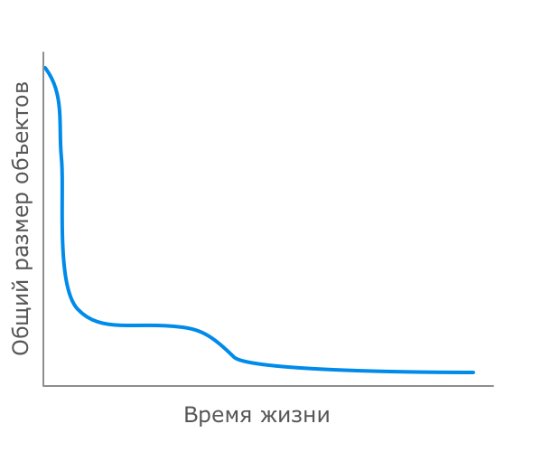

Подавляющее большинство объектов создаются на очень короткое время, они становятся ненужными практически сразу после 
их первого использования. Итераторы, локальные переменные методов, результаты боксинга и прочие временные объекты, 
которые зачастую создаются неявно, попадают именно в эту категорию, образуя пик в самом начале графика.

Далее идут объекты, создаваемые для выполнения более-менее долгих вычислений. Их жизнь чуть разнообразнее — они обычно 
гуляют по различным методам, трансформируясь и обогащаясь в процессе, но после этого становятся ненужными и 
превращаются в мусор. Благодаря таким объектам возникает небольшой бугорок на графике следом за пиком временных объектов.

И, наконец, объекты-старожилы, переживающие почти всех — это постоянные данные программы, загружаемые часто в самом 
начале и проживающие долгую и счастливую жизнь до остановки приложения.

Все это навело разработчиков на мысль, что в первую очередь необходимо сосредотачиваться на очистке тех объектов, 
которые были созданы совсем недавно. Именно среди них чаще всего находится бóльшее число тех, кто уже отжил свое, 
и именно здесь можно получить максимум эффекта при минимуме трудозатрат.

Вот тут и возникает идея разделения объектов на младшее поколение (young generation) и старшее поколение (old generation). 
В соответствии с этим разделением и процессы сборки мусора разделяются на малую сборку (minor GC), затрагивающую только 
младшее поколение, и полную сборку (full GC), которая может затрагивать оба поколения. Малые сборки выполняются 
достаточно часто и удаляют основную часть мертвых объектов. Полные сборки выполняются тогда, когда текущий объем 
выделенной программе памяти близок к исчерпанию и малой сборкой уже не обойтись.

При этом разделение объектов по поколениям не просто условное, они физически размещаются в разных регионах памяти. 
Объекты из младшего поколения по мере выживания в сборках мусора переходят в старшее поколение. 
В старшем поколении объект может прожить до окончания работы приложения, либо будет удален в процессе одной из 
полных сборок мусора.


Особенности работы сборки мусора зависят от конкретного GC, поэтому подробнее смотрите в серии статей 
[здесь](https://habr.com/ru/post/269621/).

Сборщики мусора HotSpot VM:
1. Serial (последовательный);
2. Parallel (параллельный);
3. Concurrent Mark Sweep (CMS);
4. Garbage-First (G1);
5. ZGC (экспериментальный);
6. Epsilon.

Опция JVM для явного использования определенного GC (на примере Serial):
* `-XX:+UseSerialGC`

---

#### Назовите методы класса Object
ToDo: ответ

---

#### Расскажите про принципы happens before
ToDo: ответ

---

#### Как я могу создать поток?
ToDo: ответ

---

#### Что такое thread-safe?
ToDo: ответ

---

#### Будет ли ошибка, если вызвать wait не из блока synchronize?
ToDo: ответ

---

#### Использовали ли Вы что-то из пакета java.concurrent.atomic?
ToDo: ответ

---

#### Что такое оптимистичная блокировка?
ToDo: ответ

---

#### Расскажите про synchronize блоки и методы, чем отличаются? Что такое монитор?
ToDo: ответ

---

#### Как я могу пустить не один поток в синхронизированный блок, а например не больше пяти?
ToDo: ответ

---

#### Влияет ли как то volatile на оптимизации, выполняемые JVM?
ToDo: ответ

---

#### Назовите concurrent коллекцию. Как осущестляется расспаралеливание в ConcurrentHashMap?
ToDo: ответ

---

#### Что такое livelock и deadlock
ToDo: ответ

---

#### Расскажите про структуру исключений. Что значит обрабатываемые и необрабатываемые исключения?
ToDo: ответ

---

#### Могу ли я создавать свои исключения?
ToDo: ответ

---

#### Как в коде мне получить StackOverflow и OutOfMemory намеренно?
ToDo: ответ

---


## Коллекции

####  Какие существуют коллекции?
ToDo: ответ

---

#### Какую коллекцию мне нужно использовать для хранения отсортированного набора данных?
ToDo: ответ

---

#### Каким образом мы понимаем, в какой бакет положить элемент в HashMap?
ToDo: ответ

---

#### Что будет, если в один бакет попали элементы equals которых вернул true. Перезапишется ключ или значение? Останется старое value или новое?
ToDo: ответ

---

#### Что лучше ArrayList или LinkedList, если мне нужно будет в большой массив вставлять много элементов в середину?
ToDo: ответ

---

#### У array copy стоит нотация native, что значит эта нотация?
ToDo: ответ

---

#### Какие есть способы пройтись по коллекции?
ToDo: ответ

---

#### Что такое функциональный интерфейс? В чем его основное назначение?
ToDo: ответ

---

#### Сколько может быть терминальных операторов внутри стрима?
ToDo: ответ

---

#### Что внутри парралел стрима?
ToDo: ответ

---

#### Сколько тредов внутри парралел стрима по умолчанию? Могу ли я как-то сам задать их количество?
ToDo: ответ

---

## реактивное программирование
расскажите что такое проблема 10к и как реактивное программирование позволяет ее решить
почему получить ддос легче именно на реакте
можно ли анализировать ошибки по стектрейсу в реактивном приложении
у меня небольшой веб сервер со сложной логикой на бэке. запрос в среднем занимет 100мс.
При нагрузке 1к запросов в секунду есть ли мне смысл переписывать свое приложение под реакт?
какой есть у спринг модуль для реактива
что общего у SEDA архитектуры и AKKA

## паттерны разработки
какие существуют типы паттернов
чем отличается абстрактная фабрика от фабричного метода
почему синглтон считается антипаттерном
назовите примеры паттернов которые недавно использовали и какие были задачи
расскажите про паттерн сага
какие паттерны использует спринг?

## архитектура

#### DDD. Расскажите в чем основная суть подхода
Ответ: DDD (Domain Driven Design) - это подход, который нацелен на изучение предметной области предприятия в целом или 
каких-то отдельных бизнес-процессов. Это отличный подход для проектов, в которых сложность (запутанность) бизнес-логики 
достаточно велика. Его применение призвано снизить эту сложность, насколько возможно.

**Единый язык (Ubiquitous language)**

Вне подхода DDD, когда программист пишет код, больше внимания он уделяет технологиям и инфраструктуре, например, 
как отправить сообщение, как его получить, закодировать, сохранить в базу данных, в какую именно базу данных.

Подход DDD говорит о том, что всё это, конечно, важно, но вторично. Бизнес главнее и должен стоять на первом месте.
И чтобы все это заработало вместе, DDD учит нас (разработчиков) разговаривать с бизнесом на одном языке.
Не на языке программирования, а на языке бизнеса.
Это называется в DDD "Единый язык (Ubiquitous language)".

**Ограниченный Контекст (Bounded Context)**

Ограниченный Контекст (Bounded Context) — ключевой инструмент DDD, это явная граница, внутри которой существует модель 
предметной области. Она отображает единый язык в модель программного обеспечения. Именно на основании контекстов можно 
разделить код на модули/пакеты/компоненты таким образом, чтобы изменения в каждом из них оказывали минимальное 
(или нулевое) влияние на других.

Для разработчиков такой подход позволяет вносить изменения в код не опасаясь, что где-то в другом месте что-то сломается 
(например, менять что-то в кассе и не переживать, что из-за этого что-то отвалится у курьеров).

Для тимлидов такой подход позволяет в значительной степени распараллелить работу команд(ы), что может значительно 
ускорить работу по проекту.

**Как понять, что пора применять DDD**

Посчитайте количество сценариев использования вашей системы. Если их в районе 10-15, значит бизнес-логика не такая 
сложная, и вы можете никакого DDD не применять.

Если у вас 30-50 и более UX-кейсов, и они очень сильно пересекаются, имеет смысл задуматься над применением DDD хотя 
бы в какой-то части системы.

Подробнее см. [здесь](https://habr.com/ru/company/dododev/blog/489352/).

#### Принцип CQRS

<details><summary markdown="span">Ответ</summary>

CQRS расшифровывается как Command Query Responsibility Segregation (разделение ответственности на команды и запросы), 
т.е. принцип гласит, что точка доступа (endpoint) сервиса, либо сервис целиком является либо командой, выполняющей 
какое-то действие, либо запросом, возвращающим данные, но не является одновременно и тем и тем.

Другими словами:
* запрос на получение данных (Query) не должен изменять состояние сервиса;
* запрос на изменение данных (Command) не должен возвращать данные, не связанные со статусом/результатом выполнения записи.

При реализации принципа CQRS поверх протокола HTTP можно достаточно легко вывести соответствие с методами последнего:
* Query соответствует метод GET;
* Command соответствуют методы POST / PUT / DELETE.

В более высокоуровневой архитектурной интерпретации данный принцип декларирует разделение операций чтения и записи.

Одной из естественных причин появления CQRS в системе является несимметричность нагрузки и/или сложности бизнес-логики, 
закладываемой в рамках операций чтения и записи.

В частности, обычно, большая часть бизнес-логики и нетривиальных проверок сосредоточены именно вокруг операции записи. 
При всем этом, операция чтения, в среднем, вызывается намного чаще операции записи.

Эта разнотипность профилей работы и использования операций чтения и записи является основной причиной внедрения 
принципа CQRS в рамках сервиса.

При его внедрении акцентируется внимание на двух основных моментах:
* разделение доменных моделей, используемых в рамках операций чтения и записи;
* разделение областей хранения данных (например, БД), используемых в рамках операций чтения и записи.

В простейшем варианте реализации допустимо разделение только доменной модели, без разделения используемых хранилищ. 
Такой подход сильно упрощает реализацию, но, по факту, не позволяет полноценно разделить операции чтения и записи, 
как следствие, не позволяет воспользоваться всеми преимуществами, привносимыми принципом CQRS.

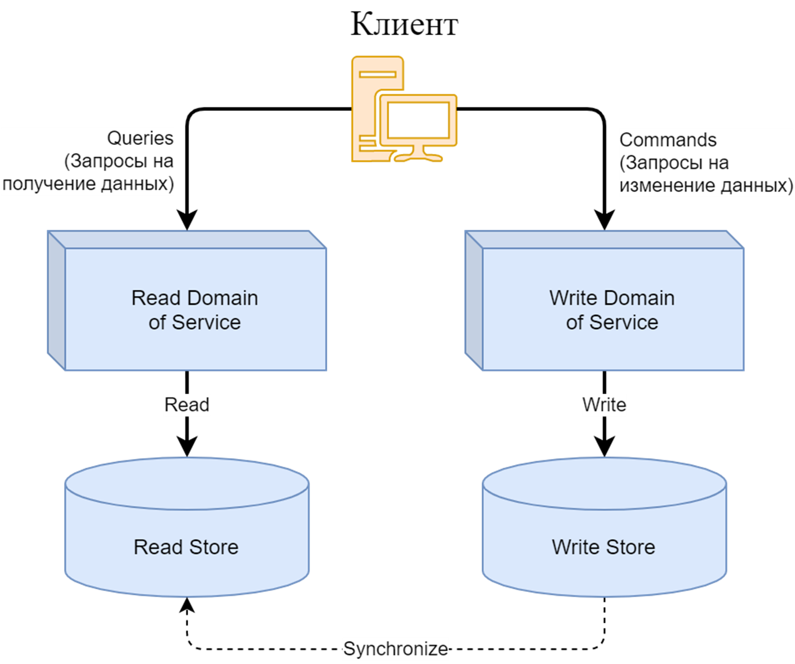

В противном случае, для операций чтения и записи выделяются отдельные персистентные хранилища, каждое из которых
адаптировано под выполняемые над ним действия. Как следствие, каждое хранилища могут быть разных типов. Например, одно
из них может быть реляционной БД, а другое - чем-то иным.

Хранилище, используемое в рамках доменной модели на получение данных (т.е. для чтения, далее Read Store) насколько
возможно адаптировано под эту модель, т.е. структура хранения данных строится, ориентируясь на формат запросов данных. В
дополнение к этому под запросы полностью адаптируются навешиваемые на данные индексы (что особенно актуально в случае
использования реляционных БД).

Хранилище, используемое в рамках доменной модели на обновление (запись/изменение) данных (далее, Write Store), может
быть представлено во множестве различных вариантов. Начиная от обычной реляционной БД, адаптированной соответствующим
образом под операции записи, заканчивая персистентным хранилищем event’ов, отражающих изменение состояния данных (дельту
относительно предыдущего состояния).

Особенности использования последнего типа хранения мы, как раз, подробнее рассмотрим далее в этом уроке.

Вследствие наличия двух несвязанных хранилищ требуется некоторый механизм синхронизации хранилища, используемого в
рамках операций записи, с хранилищем, используемым в рамках операций чтения, т.к. первое всегда будет являться
“источником истины” для второго.

Механизм может быть реализован множеством различных вариантов. Например, за счет откидывания событий (event’ов),
отражающих изменения состояния данных во Write Store, в доменную модель, работающую с Read Store, чтобы та сама
необходимым образом обновила модель данных в Read Store.

Потенциально, дополняя этот механизм периодическим перестроением модели данных (всей или её части) в Read Store за счет
данных из Write Store.

Стоит заметить, что подход, заключающийся в представлении данных одной доменной модели, в виде иной структуры
соответствует одному из паттернов Domain-Driven Design (DDD) под названием Projector.

<details>

#### Принцип Event Notification

<details><summary markdown="span">Ответ</summary>

Данный принцип предполагает, что при сколько-нибудь значимом изменении состояния системы (в нашем текущем контексте, под
системой подразумевается отдельно взятый сервис) происходит отправка в Event Channel (событийный канал) уведомления (
notification’а), содержащего информацию о произошедшем событии (event’е).

Таким образом, события являются зарегистрированными фактами произошедших действий, как следствие, события не могут (по
крайней мере, не должны) быть изменены.

В качестве event channel может выступать как web service endpoint (т.е. обычный http endpoint), так и message
queue/topic (т.е. некоторый канал сообщений).

Рассмотрим на примере:
* клиент изменяет данные в своем профиле (прикладывает/изменяет аватар или обогащает иные личные данные), отправляя
  запрос в сервис клиентского профиля;
* сервис клиентского профиля изменяет свое состояние (за счет обновления информации о клиенте в соответствующем
  хранилище сервиса, например, в БД);
* сервис клиентского профиля отправляет уведомление в event channel об изменении состояния в профиле клиента после чего
  успешно отвечает клиенту; сервис аудита вычитывает уведомление из event channel и записывает к себе во внутреннее
  хранилище информации о действиях клиента.

Последние два пункта могут меняться места в зависимости от типа используемого event channel (web endpoint или message
queue/topic).

Стоит заметить, что при использовании message queue/topic в качестве event channel, то в большинстве случаев, в качестве
синхронного ответа при размещении уведомления (о событии) ожидается лишь “отбивка” о том, что уведомление было принято,
т.е. используется асинхронный механизм обработки уведомления.

</details>

#### Принцип Event Sourcing

<details><summary markdown="span">Ответ</summary>

Данный принцип базируется на системе уведомлений о событиях, заложенной принципом Event Notification, но при этом обязывает:
* отправлять уведомления о событиях на любое изменение, происходящее в системе и влияющее на ее состояние;
* последовательно сохранять уведомления в некотором персистентном хранилище.

Причем, уведомления о событиях обязательно должны отправляться в event channel в той же последовательности, в которой
происходило обновление данных согласно бизнес-логике. Все уведомления, отправленные в event channel, асинхронно
вычитываются отдельным сервисом и сохраняются в персистентное хранилище (например, в БД).

В частном случае, непосредственно event channel может являться тем самым персистентным хранилищем (например, при
использовании Kafka в качестве event channel). В таком случае, для персистирования (долгосрочного хранения) последовательности событий не требуется никаких
дополнительных действий. Разве что, настроить соответствующим образом времени жизни сообщений (retention period) в
рамках этого персистентного event channel.

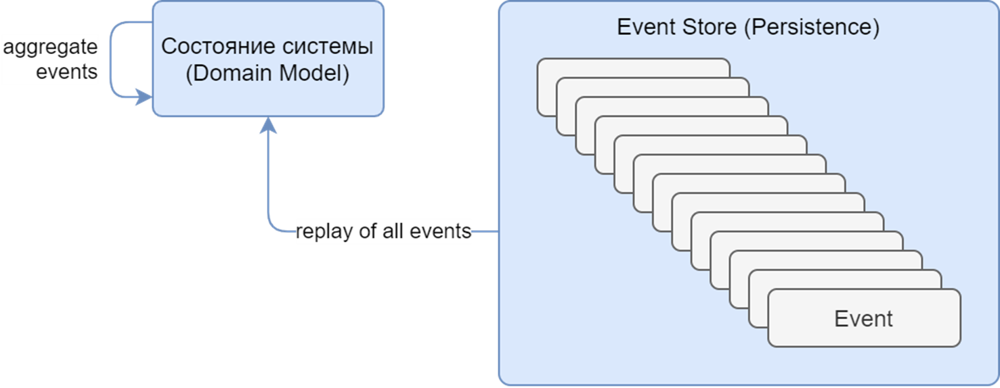

Имея в персистентном хранилище все события (event’ы) об изменении состояния системы, сохраненные в порядке логического
их исполнения (далее, event log’а), открываются удивительные возможности.

Event log становится “источником истины”, т.к. состояние системы становится полностью воссоздаваемо (выводимо) за счет
последовательного воспроизведения событий (“replay events”) event log’а.

Стоит заметить, что подход, заключающийся в группировке изменений данных и применению их к некоторому агрегированному (
т.е. собирательному) состоянию соответствует одному из паттернов Domain-Driven Design (DDD) под названием Aggregator.

Вследствие наличия таких особенностей, у приложения появляется возможность хранить свое состояние в любом из удобных ему
вариантов:

* полностью in-memory (за счет replicated или distributed cache, рассмотренные на предыдущем уроке в рамках
  архитектурного стиля Space-Based);
* полность персистентно (на диске, либо в специальном хранилище по типу БД);
* гибридно (каким-либо образом совмещать вариант хранения in-memory с персистентностью).

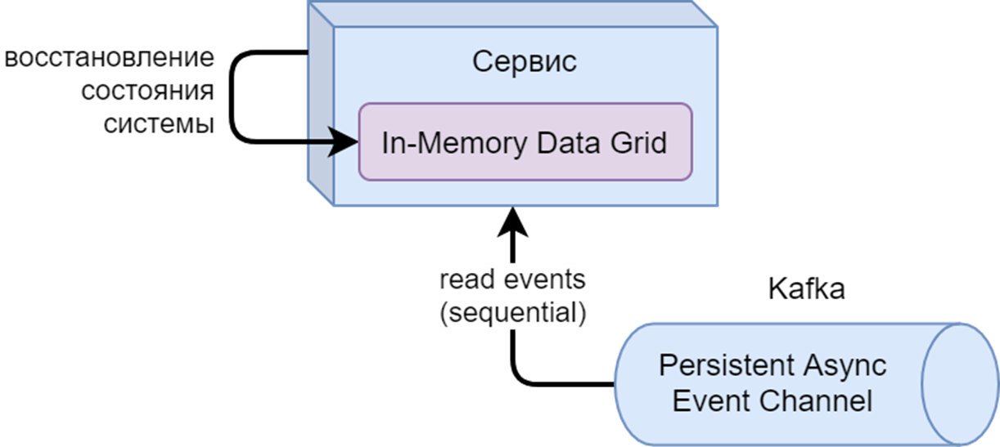

В случае хранения состояния системы полностью in-memory при рестарте её In-Memory Data Grid (штатном или после падения)
потребуется восстановление состояния, в котором находилась система в момент падения.

Состояние системы (“пустой на момент старта”) может быть восстановлено за счет последовательного извлечения из event
log (в естественном порядке) событий и “накатывания” изменений из них друг за другом на систему (на ее IMDG).

Стоит заметить, что таким же образом может быть полностью восстановлено состояние системы на любой момент времени (не
обязательно на последний) за счет прекращения вычитывания событий после определенной временной метки.

Такая возможность может быть весьма полезной в ряде ситуаций. Например, для точного воссоздания на тестовой среде
состояния системы на определенный момент времени при определении причины возникновения сложно
воспроизводимого/фантомного дефекта.

Стоит заметить, что в такой ситуации в случае работы с конфиденциальными данными также может возникнуть необходимость их
обезличивания в случае предоставления такой восстановленной среды разработчику/тестировщику, который не должен иметь
доступ к данным такого типа (во избежание потенциальных утечек данных или иных проблемных ситуаций). Тем не менее, это
не является темой нашего урока, поэтому не станем сильно акцентировать на этом внимание и будем двигаться дальше.

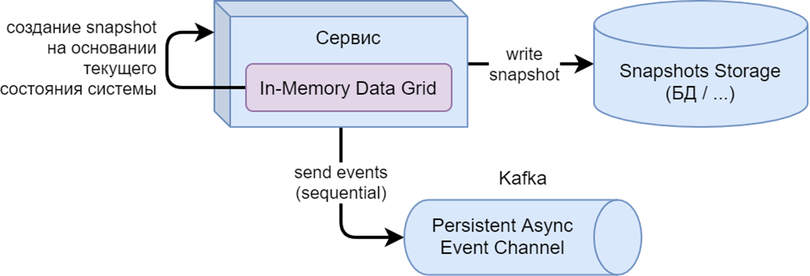

Очевидно, что в рамках крупного высоконагруженного сервиса производить процедуру восстановления состояния системы за
счет последовательного “накатывания” на систему абсолютно всех событий с самого первого является крайне расточительным и
может занимать неприемлемое количество времени (в зависимости от количества ивентов и объема изменений, выполняемых в
рамках каждого из них).

В качестве решения проблемы может использоваться подход, заключающийся в периодическом создании snapshot’ов, т.е.
образов, хранящих состояние системы на определенный момент времени.

Например, каждый день в 03:00 ночи может создаваться snapshot, полностью отражающий состояние системы на тот момент.
Snapshot сохраняется в отдельное персистентное хранилище (например, в БД или даже Kafka). Сама же система в процессе
работы (при возникновении новых изменений в системе) продолжает отправлять события в event channel.

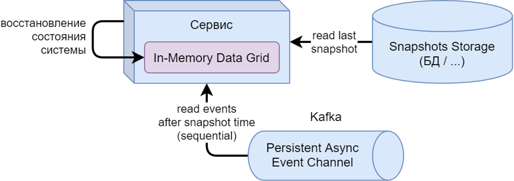

В случае рестарта / падения системы, работающей в режиме in-memory (или гибридном с ним), для восстановления состояния:

* извлекается последний snapshot;
* в систему подгружается его состояние;
* из event log последовательно вычитываются все event’ы начиная с момента времени, в который был сделан использованный
  snapshot (он тем или иным образом должен содержать метку времени);
* изменения из каждого вычитанного event’а “накатываются” на систему.

Принципы CQRS и Event Sourcing довольно хорошо комбинируются вместе, например, следующим образом:


Сервис разбивается на две части:
* одна для обработки commands (запросов на изменение данных);
* вторая для обработки queries (запросов на получение данных).

При обработке запроса на изменение данных (command) компонент сервиса под названием aggregator (реализующий один 
из одноименных паттернов DDD, упомянутых ранее):
* извлекает из Event Store (он же event log) все event’ы, связанные с изменяемыми данными;
* последовательно применяет упорядоченные в естественном порядке события к агрегированному (т.е. собирательному) 
состоянию модели данных (первое событие применяется к пустой модели):
  * этот и предыдущий этап могут быть оптимизированы либо за счет применения ранее рассмотренных snapshot’ов, либо за
    счет использования консистентного варианта IMDG (in-memory data grid);
* применяет новое событие (из command) на получившуюся модель данных;
* проверяет соблюдение бизнес-ограничений (constraints), накладываемых на данные:
  * если какое-либо из ограничений не выполняется, то процесс обработки прекращается, клиенту возвращается ошибка;
* добавляет новый event в Event Store;
* отправляет клиенту успешный ответ.

Компонент под названием Projector (реализующий один из одноименных паттернов DDD, упомянутых ранее):
* вычитывает из Event Store новый event, добавленный другой частью сервиса в процессе обработки command:
  * реализуется за счет подписки на новые event’ы в Event Store;
* вычитывает из БД entity (текущее состояние объекта) по ID, присутствующему в event’е;
* применяет изменения из event’а к entity;
* записывает обновленный entity обратно в БД.

При обработке запроса на получение данных (query) соответствующий компонент сервиса просто вычитывает из БД entity, 
связанную с запрошенными данными и возвращает её в ответе:
* обычно перед возвращение ответа происходит минимальное преобразование формата данных, полученных из БД, в формат
  запрошенной доменной модели (либо преобразования не происходит вовсе, если они полностью совпадают), т.к. база данных
  для запросов проектировалась именно ориентируясь на данную доменную модель.

</details>

#### Screaming architecture
Термин "кричащая архитектура" применяется в тех случаях, когда мы можем просто взглянув на проект сразу же получить
основное представление о том, что делает проект и о чем он, а не о том, какие фреймворки в нем используются.

Например, такого эффекта можно достичь, если при построении структуры каталогов сосредоточиться на не технологических
аспектах, а постараться отразить бизнес структуру:


Подробнее см. в [оригинальной статье](https://blog.cleancoder.com/uncle-bob/2011/09/30/Screaming-Architecture.html) или 
[её интерпретации](https://levelup.gitconnected.com/what-is-screaming-architecture-f7c327af9bb2).

#### Clean Architecture & Onion architecture

<details><summary markdown="span">Ответ</summary>

Clean Architecture объединила в себе идеи нескольких других архитектурных подходов, которые сходятся в том, что архитектура должна:
* быть тестируемой;
* не зависеть от UI;
* не зависеть от БД, внешних фреймворков и библиотек.

Это достигается разделением на слои и следованием Dependency Rule (правилу зависимостей).

Dependency Rule говорит нам, что внутренние слои не должны зависеть от внешних. То есть наша бизнес-логика и логика
приложения не должны зависеть от презентеров, UI, баз данных и т.п. На оригинальной схеме это правило изображено
стрелками, указывающими внутрь.

Имена сущностей (классов, функций, переменных, чего угодно), объявленных во внешних слоях, не должны встречаться в коде 
внутренних слоев. Это правило позволяет строить системы, которые будет проще поддерживать, потому что изменения во внешних слоях не
затронут внутренние слои.

Такой способ представления уровней абстрации в виде слоев получил название слоистой архитектуры (onion architecture),
и визуализировался примерно следующим образом:


Более удобное для восприятия линейное представление этой же схемы:


А теперь давайте рассмотрим схему с точки зрения потока обработки:


Событие пользователя идет в Presenter, тот передает в Use Case. Use Case делает запрос в Repository. Repository получает
данные где-то, создает Entity, передает его в UseCase. Так Use Case получает все нужные ему Entity. Затем, применив их и
свою логику, получает результат, который передает обратно в Presenter. А тот, в свою очередь, отображает результат в UI.

Как видите, согласно этой схеме UseCases взаимодействует с Repositories, т.е. из внутреннего слоя присутствует 
взаимодействие с внешним. На первый взгляд, в этом месте кажется, что нарушается правило зависимостей снаружи вовнутрь.

Чтобы зависимость была направлена в сторону обратную потоку данных, применяется принцип инверсии зависимостей (буква D
из аббревиатуры SOLID). То есть, вместо того чтобы UseCase напрямую зависел от Repositories’a (что нарушало бы 
Dependency Rule), он зависит от интерфейса в своём слое, а Repositories должен этот интерфейс реализовать.

Подробнее см. в [оригинальной статье](https://blog.cleancoder.com/uncle-bob/2012/08/13/the-clean-architecture.html) или
[её интерпретации](https://habr.com/ru/company/mobileup/blog/335382/).

</details>

#### SOA архитектура

SOA – это модульный подход в разработке приложений, основанный на использовании распределенных, слабо связанных,
заменяемых компонентов, доступных по сети и предоставляющих четко-определенный формат общения, никоим образом не
диктующий способ реализации.

В 2009 году был опубликован манифест (soa-manifesto.org), описывающий шесть наиболее значимых положений SOA, гласящих следующее:

* ценность бизнеса важнее технологических средств;
* стратегические цели важнее, чем выгода конкретных проектов (иначе говоря, стратегические цели важнее тактических);
* внутренняя совместимость важнее, чем точечная интеграция;
* общие (распределенные и переиспользуемые) сервисы важнее, чем узкоспециализированные;
* гибкость важнее, чем оптимизация;
* усовершенствование в развитии важнее, чем стремление к изначальному совершенству.

Звучат они так же абстрактно, как и сам SOA. Давайте рассмотрим эти принципы подробнее.

<details><summary markdown="span">Ценность бизнеса важнее технологических средств</summary>

Необходимость адаптации под изменения в бизнесе является важнейшей стратегической целью. Следовательно, основополагающий
принцип SOA заключается в ориентации на бизнес.

Речь идет не о технологиях, определяющих направление бизнеса, а о видении бизнеса, определяющем допустимый стек
технологий для решения его задач.

Если совсем просто, то принцип говорит нам о том, что не нужно гнаться за техническим хайпом и внедрять новую
технологию, потому что вы услышали о ней на конференции. В первую очередь нужно понять, а какую ценность для бизнеса
принесет эта технология и принесет ли она ценность вообще?

Все остальные положения (ценности и принципы) манифеста, так или иначе, поддерживают реализацию данного положения.

</details>

<details><summary markdown="span">Стратегические цели важнее выгоды конкретных проектов</summary>

Исторически так сложилось, что многие IT проекты были сосредоточены исключительно на создании приложений, проектируемых
специально для автоматизации бизнес процессов, которые были актуальны в то время.

Такой подход позволял удовлетворять насущные потребности отдельно взятого проекта (т.е. тактические, но не
стратегические потребности), но по мере того, как появлялось все больше и больше таких приложений, в результате,
оказывалось, что все состоит из таких “изолированных островков”, наполненных логикой и данными, которые, фактически,
являются полностью изолированным приложениями.

По мере поступления новых бизнес требований, либо появлялись новые изолированные приложения, либо устанавливались связи
между уже существующими, которые абсолютно не были адаптированы для этих целей.

Со временем (при поступлении очередных бизнес требований) каналы интеграции между такими приложениями приходилось еще
больше расширять, а также создавать новые “изолированные приложения”.

Вскоре, IT ландшафт становился все более:

* сложным;
* дорогим в поддержке;
* медленным в развитии.

Во многих отношениях данное положение SOA возникло самостоятельно в ответ на эти насущные проблемы. Таким образом, эта
парадигма представляет собой альтернативу разработке приложений, специфичных для отдельно взятого проекта, разрозненных
относительно остальных окружающих проектов. Альтернатива предоставляется путем определения приоритетов для достижения
долгосрочных стратегических бизнес-целей.

В целевом виде, предполагается, полное отсутствие “изолированных приложений”, но даже если таковые имеются (например, по
причинам наследования), то они должны быть доведены до такого состояния, в котором они насколько только возможно
лаконично интегрированы с окружением.

</details>

<details><summary markdown="span">Внутренняя совместимость важнее, чем точечная интеграция</summary>

Давайте для начала поймем, что такое точечная интеграция. Как мы уже выяснили, изолированные приложения - это плохая
практика в SOA. Но даже изолированным приложениям в одной системе нет-нет, да и нужно обмениваться данными друг с
другом. Под точечной интеграцией тут понимается реализация функции обмена данными индивидуально под каждую такую задачу.
Системы, которые используют такой подход обычно характерны отсутствием четкой структуры API и наличием множества
протоколов взаимодействия. Поддержка такой системы становиться дорогостоющей и трудемкой, а также может привести к
слабым местам в архитектуре, развитие которой со временем станет обременительно.

Совместимость же, напротив, нацелена на проектирование систем с четкой структурой API и возможностью интегрировать
приложения без доработок или с минимальными доработками.

Одна из целей SOA - свести к минимум необходимость индивидуальных (точечных) интеграций путем формирования приложений (в
рамках одной доменной области) таким образом, чтобы они были изначально совместимы за счет стандартизации протоколов и
базовых форматов взаимодействий.

</details>

<details><summary markdown="span">Общие сервисы важнее, чем узкоспециализированные</summary>

Одна из важных характеристик системы - инкапсуляция логики, которая может быть совместно использована во множестве мест
для поддержки автоматизации различных бизнес-процессов.

Принцип гласит, что вместо того, чтобы реализовывать какую-либо функцию, например, функцию отправки уведомлений отдельно
для каждого сервиса [слайд-13] лучше будет вынести эту функцию в отдельный сервис для возможности его переиспользования.
Переиспользуемый сервис становится ресурсом, который обеспечивает повторяемую ценность для бизнеса, снижая при этом
затраты и усилия для предоставления решений по автоматизации новых бизнес требований.

Традиционные одноцелевые приложения, при этом, отвечают только за решение своих бизнес требований, т.е. отвечают только
за тактические цели, абсолютно не закладываясь на стратегические цели компании.

</details>

<details><summary markdown="span">Гибкость важнее, чем оптимизация</summary>

Оптимизация, в первую очередь, отвечает за извлечение тактических выгод за счет адаптации/настройки отдельно взятого
приложения, либо ускорения процесса его разработки или delivery для удовлетворения текущих потребностей.

В самом этом действии нет ничего плохого, за исключением того, что оно может привести к появлению ранее упомянутых
“изолированных приложений”. Такое может произойти в случае, если при оптимизации не будет в нужной степени выставлен
приоритет относительно повышения, ну или, хотя бы, сохранения гибкости системы.

Это означает, что при изменении существующего бизнес-процесса или при внедрении нового мы должны иметь возможность
добавлять, удалять или расширять сервис с минимальными усилиями.

Для примера возьмем тот самый сервис уведомлений с предыдущего слайда. Вместо того, чтобы делать отправку уведомлений
только по E-mail имеет смысл задуматься о более универсальном механизме, который позволит добавлять в будущем другие
каналы отправки уведомлений. Это может потребовать немного больше времени на разработку, но принесет существенную пользу
в будущем за счет гибкости решения.

</details>

<details><summary markdown="span">Усовершенствование в развитии важнее, чем стремление к изначальному совершенству</summary>

Для обеспечения гибкости организации, IT сервисы должны развиваться параллельно с бизнесом, но проблема в том, что, как
правило, сложно заранее предсказать, как бизнесу следует развиваться с течением времени. В связи с чем, отсутствует
возможность изначально построить сервисы идеально.

Тем не менее, как правило, на основании существующей бизнес аналитики организации можно получить достаточно информации
для проектирования сервисов согласно принципам SOA.

Использование этой информации вместе с принципам SOA, а также проверенными методологиями разработки может помочь
определить набор сервисов, которые отражают то, как бизнес существует и работает сегодня, при этом закладывая уровень
гибкости, необходимый для того, чтобы адаптироваться к возможным изменениям бизнеса с течением времени.

</details>

<details><summary markdown="span">Альтернативные манифесту интерпретации</summary>

Параллельно с формированием манифеста гиганты индустрии (по типу Microsoft) и ряд других активных участников индустриальных стандартов опубликовали свои собственные принципы, базовые из которых звучат следующим образом:

* переиспользуемость сервисов:
  * по факту, является аналогом одного из рассмотренных положений манифеста: “общие (распределенные и переиспользуемые)
    сервисы важнее, чем узкоспециализированные (реализованне для конкретных целей бизнеса)”;
* независимость от технологического стека:
  * также совпадает с одним из рассмотренных положений манифеста: “ценность бизнеса важнее технологических средств”;
* автономность:
  * заключается в независимости сервисов при:
    * эволюционировании/развитии/версионировании;
    * масштабируемости;
    * развертывании;
* ориентированность на пользователей:
  * данная ориентированность также явно прослеживается в ряде положений манифеста, но не выделяется в них в виде
    отдельного пункта.

</details>

Подробнее см. [здесь](https://drive.google.com/drive/u/0/folders/1x5YQLrUcOC6ArRjvRg5_7mm45U5KNYKa).

### SEDA архитектура
ToDo: ответ

#### Монолит, микросервисы и сервисмеш
ToDo: ответ

#### SOLID

Акроним для первых пяти принципов объектно-ориентированного программирования и проектирования:
* S - Принцип единственной ответственности (single responsibility principle):
  * Для каждого класса должно быть определено единственное назначение. Все ресурсы, необходимые для его осуществления,
    должны быть инкапсулированы в этот класс и подчинены только этой задаче.
* O - Принцип открытости/закрытости (open-closed principle):
  * «программные сущности … должны быть открыты для расширения, но закрыты для модификации».
* L - Принцип подстановки Лисков (Liskov substitution principle):
  * «объекты в программе должны быть заменяемыми на экземпляры их подтипов без изменения правильности выполнения
    программы». См. также контрактное программирование.
* I - Принцип разделения интерфейса (interface segregation principle):
  * «много интерфейсов, специально предназначенных для клиентов, лучше, чем один интерфейс общего назначения»;
* D - Принцип инверсии зависимостей (dependency inversion principle):
  * «Зависимость на Абстракциях. Нет зависимости на что-то конкретное».

Подробнее см. [здесь](https://ru.wikipedia.org/wiki/SOLID_(%D0%BE%D0%B1%D1%8A%D0%B5%D0%BA%D1%82%D0%BD%D0%BE-%D0%BE%D1%80%D0%B8%D0%B5%D0%BD%D1%82%D0%B8%D1%80%D0%BE%D0%B2%D0%B0%D0%BD%D0%BD%D0%BE%D0%B5_%D0%BF%D1%80%D0%BE%D0%B3%D1%80%D0%B0%D0%BC%D0%BC%D0%B8%D1%80%D0%BE%D0%B2%D0%B0%D0%BD%D0%B8%D0%B5)).

#### принцип KISS, DRY

Принцип KISS ("Keep it simple, stupid" / "Делай проще, тупица") утверждает, что большинство систем работают лучше всего,
если они остаются простыми, а не усложняются. Поэтому в области проектирования простота должна быть одной из ключевых
целей, и следует избегать ненужной сложности.

Принцип DRY ("Don’t repeat yourself" / "Hе повторяйся") нацеленный на снижение повторения информации различного рода,
особенно в системах со множеством слоёв абстрагирования. Принцип DRY формулируется как: «Каждая часть знания должна
иметь единственное, непротиворечивое и авторитетное представление в рамках системы».

## spring
чем отличается DI от IoC
расскажите про propagation (распространение транзакций)
сколько существует уровней изоляции транзакций
скоупы бинов
опишите цикл жизни бина
выполнится предестрой у прототайп бина?
как я могу изменить бин перед помещением его в контейнер не изменяя код класса
где я могу ставить аннотацию autowired
в чем преимущество спринг для тестирования
чем мок отличается от spy

в чем преимущество spring boot

что будет результатом работы стартера?
чем лучше java 11 перед 8 для контейнеров
расскажите зачем применяется аннотация Conditional

работали ли с какими нибудь ORM?
расскажите сколько существует уровней кэширования?
могу как то я сказать JVM что этот объект нужно кэшировать?
какие знаете стратегии кэширования?
может быть с какими то сложными ошибками сталкивались в работе?
что такое уровни кэширования

## DevOps
#### Какими системами сборками пользовались?
**Jenkins** — это сервер непрерывной интеграции, написанный на Java. Он является чрезвычайно расширяемой системой из-за внушительной экосистемы разнообразных плагинов. 
Настройка пайплайна осуществляется в декларативном или императивном стиле на языке Groovy, а сам файл конфигурации (Jenkinsfile) располагается в системе контроля версий вместе с исходным кодом.

---

#### Отличие CI от CD
**Непрерывная интеграция (CI)** — первичный, базовый процесс обновления ПО, в рамках которого все изменения на уровне кода вносятся в единый центральный репозиторий. 
Такое внесение принято называть слиянием. После каждого слияния (которое проходит по несколько раз в день) в изменяемой системе происходит 
- автоматическая сборка (часто приложение упаковывается в Docker) 
- тестирование (проверка конкретных модулей кода, UI, производительности, надёжности API). 

Таким образом разработчики страхуются от слишком поздних обнаружений проблем в обновлениях.

**Непрерывная доставка (CD)** — CI + CD. Следующий после CI уровень. Теперь новая версия не только создаётся и тестируется при каждом изменении кода, регистрируемом в репозитории, 
но и может быть оперативно запущена по одному нажатию кнопки развёртывания. Однако запуск развёртывания всё ещё происходит вручную — ту самую кнопку всё же надо кому-то нажать. 
Этот метод позволяет выпускать изменения небольшими партиями, которые легко изменить или устранить в случае необходимости.

*Дополнительно*
**Непрерывное развёртывание (CD)** — CI +CD + CD. После автоматизации релиза остаётся один ручной этап: одобрение и запуск развёртывания в продакшен. 
Практика непрерывного развёртывания упраздняет и это, не требуя непосредственного утверждения со стороны разработчика. Все изменения развёртываются автоматически.

---

#### Отличие Jenkins от Teamcity
**Jenkins:**

Плюсы:
- бесплатный инструмент CI
- может интегрироваться практически с любой внешней программой, используемой для разработки приложений. Это позволяет использовать контейнерные технологии, такие как Docker и Kubernetes, из коробки.

Минусы:
- устаревший интерфейс
- плохая документация

**Teamcity**

Плюсы:
- Хорошая документация и поддержка
- Простота настройки
- Современный интерфейс

Минусы:
- Платный для Enterprise
- Ручное обновление

Подробнее см. [здесь](https://medium.com/successivetech/teamcity-vs-jenkins-choosing-the-right-ci-cd-tool-ab353b377a37).

---

#### Что такое pipeline в Jenkins
Jenkins Pipeline — набор плагинов, позволяющий определить жизненный цикл сборки и доставки приложения. 
Он представляет собой Groovy-скрипт с использованием Jenkins Pipeline DSL, который хранится в системе контроля версий.

---

#### Все ли Groovy фичи мне доступны в Jenkins pipeline? Могу ли я запретить опасные методы?
В Jenkins применяется не чистый Groovy, а его подмножество с различными ограничениями и надстройками. 
Например, можно создавать объекты, доступные в той JRE (Java-машине) которая у Вас установлена на сборочных узлах. 
Сам Jenkins тоже предоставляет дополнительные Java-классы, расширяя возможности своих Groovy-скриптов.
Но как из-за ограничений самого Jenkins, так и из целей безопасности доступ ко многим возможностям Java ограничен.

---

#### Что такое Jenkins Node и как они используются
Jenkins Node - это машина на которой выполняются сборки.

---

#### Могу ли я скрипт сборки хранить в Git
Да, можно.
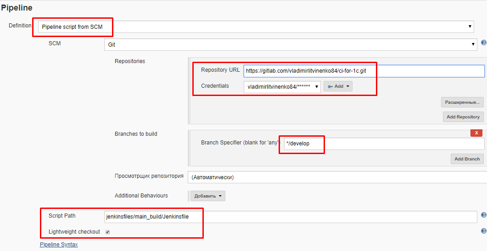

---

#### Про какие системы управления конфигурации слышал (ansible, puppet, chef)
ToDo: ответ

---

## Git
#### Зачем нужна система контроля версий?
Система контроля версий позволяет:
- отслеживать все изменения файлов исходного кода (историчность)
- изменять одни и те же файлы нескольким разработчикам одновременно
- при изменении одного и того-же фрагмента кода разными разработчиками позволяет разрешить конфликты слияния изменений
- иметь несколько версий исходного кода (ветвление)

---

#### Какие есть основные операции в Git?
- Создание репозитория: `git init`
- Добавление существующих файлов: `git add .`
- Клонирование: `git clone https://github.com/myrepo ./`
- Внесение изменений: `git commit -m "Commit message"`
- Создание и переход ветку:
    ```shell
    git branch new-feature
    git checkout new-feature
    ```
- Отправка изменений и приём изменений основной ветки
    ```shell
    git push origin
    git pull origin
    ```
- Слияние веток: `git merge new-feature` (замержит new-feature в текущую ветку)

---

#### Как появляются конфликты merge?
Конфликт возникает, когда в двух ветках была изменена одна и та же строка в файле или когда некий файл удален в одной 
ветке и отредактирован в другой.

---

#### Что такое gitflow?
Gitflow — модель ветвления Git. У нас есть две основные ветки: master и develop.
- В ветке master содержится ровно тот же код, что и в production версии проекта
- Вся работа делается в ветке develop.
- Во время работы на основе develop создаются так называемые feature-ветки. Их может быть неограниченное количество. 
- Далее, у нас есть ветка release, которая используется для подготовки к новому релизу проекта. 
- Наконец, есть ветка hotfix, которая служит для срочного исправления багов, найденных, например, на production.


---

## Контейнеры и микросервисы
#### Зачем нужен Dockerfile?
Dockerfile — это инструкция для сборки образа. Это простой текстовый файл, содержащий по одной команде в каждой строке. 
В нем указываются все программы, зависимости и образы, которые нужны для разворачивания образа.

**Основные команды:**
- `FROM` — задаёт базовый (родительский) образ.
- `LABEL` — описывает метаданные. Например — сведения о том, кто создал и поддерживает образ. 
- `ENV` — устанавливает постоянные переменные среды. 
- `RUN` — выполняет команду и создаёт слой образа. Используется для установки в контейнер пакетов. 
- `COPY` — копирует в контейнер файлы и папки. 
- `ADD` — копирует файлы и папки в контейнер, может распаковывать локальные .tar-файлы. 
- `CMD` — описывает команду с аргументами, которую нужно выполнить когда контейнер будет запущен. Аргументы могут быть переопределены при запуске контейнера. В файле может присутствовать лишь одна инструкция CMD. 
- `WORKDIR` — задаёт рабочую директорию для следующей инструкции. 
- `ARG` — задаёт переменные для передачи Docker во время сборки образа. 
- `ENTRYPOINT` — предоставляет команду с аргументами для вызова во время выполнения контейнера. Аргументы не переопределяются. 
- `EXPOSE` — указывает на необходимость открыть порт. 
- `VOLUME` — создаёт точку монтирования для работы с постоянным хранилищем.

---

#### Отличие виртуализации от контейнеризации
Ответ:

<details><summary markdown="span">Виртуализация и гипервизор (hypervisor)</summary>

Виртуализация - предоставление набора вычислительных ресурсов или их логического объединения, абстрагированное от 
аппаратной реализации, и обеспечивающее при этом логическую изоляцию друг от друга вычислительных процессов, 
выполняемых на одном физическом ресурсе.

Гипервизор (Hypervisor, он же virtual machine monitor / VMM / virtualizer) - это аппаратная схема (native/bare-metal 
hypervisor type 1), либо программа (hosted hypervisor type 2), обеспечивающая или позволяющая одновременное, 
параллельное выполнение нескольких операционных систем на одном и том же хост-компьютере посредством использования 
технологии виртуализации.

Гипервизор обеспечивает изоляцию операционных систем друг от друга, защиту и безопасность, разделение ресурсов 
между различными запущенными ОС и управление ресурсами.

Гипервизор также обязан предоставлять работающим под его управлением на одном хост-компьютере ОС средства связи и 
взаимодействия между собой (например, через обмен файлами или сетевые соединения) так, как если бы эти ОС 
выполнялись на разных физических компьютерах.

Гипервизор сам по себе в некотором роде является минимальной операционной системой (микроядром или наноядром).  
Он предоставляет запущенным под его управлением операционным системам службу виртуальной машины, виртуализируя или 
эмулируя реальное (физическое) аппаратное обеспечение конкретной машины.  
Управляет этими виртуальными машинами, выделением и освобождением ресурсов для них.  
Гипервизор позволяет независимое «включение», перезагрузку, «выключение» любой из виртуальных машин с той или иной ОС.  
При этом операционная система, работающая в виртуальной машине под управлением гипервизора, может, но не обязана «знать», 
что она выполняется в виртуальной машине, а не на реальном аппаратном обеспечении.

Среди гипервизоров аппаратного типа (native/bare-metal
[hypervisor type 1](https://ru.wikipedia.org/wiki/%D0%93%D0%B8%D0%BF%D0%B5%D1%80%D0%B2%D0%B8%D0%B7%D0%BE%D1%80))
можно отметить следующие: VMware ESXi, Hyper-V, Xbox One system software.

Среди гипервизоров программного типа, т.е. работающих поверх ОС (hosted
[hypervisor type 2](https://ru.wikipedia.org/wiki/%D0%93%D0%B8%D0%BF%D0%B5%D1%80%D0%B2%D0%B8%D0%B7%D0%BE%D1%80)),
можно отметить следующие: VirtualBox, Parallels Desktop for Mac, QEMU, VMware Player & Workstation.

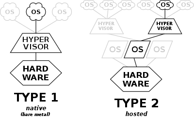

</details>

<details><summary markdown="span">Виртуальные машины (VM)</summary>

Виртуальные машины (VM) работают посредством технологии виртуализации, предоставляемой hypervisor.
Как следствие, каждая VM требует запуск собственной операционной системы (OS), а также виртуальной копии hardware,
которые необходимо OS для запуска и работы.

Операционная система и все приложение, запущенные в рамках одной VM, разделяют hardware ресурсы host'а (физического 
устройство, на котором запущена VM) с учетом квотирования ресурсов между VM на стороне hypervisor. 


К особенностям VM можно отнести следующие:
* возможность запуска любой операционной системы (OS);
* возможность запуска различных OS на одном host'е (физическом устройстве);
* обеспечивается высокий уровень безопасности относительно изоляции между собой несколько VM, запущенных на одном host'е;
* хорошо известная технология:
  * имеет множество надежных средств для управления и контроля уровня безопасности;
* куда более эффективная утилизация ресурсов по сравнению с управлением несколькими физическими устройствами:
  * влечет экономию средств.

</details>

<details><summary markdown="span">Контейнеры (Containers)</summary>

Контейнеры используют несколько иной уровень виртуализации.
Если в случае VM единицей виртуализации было hardware (создавать виртуальное физическое устройство), то в случае
контейнеров единицей виртуализации выступает операционная система.

Другими словами, если VM в качестве средства изоляции использовали hypervisor, то контейнеры поднимаются на уровень выше
и для изоляции используют средства host'ов ОС, поверх которой работают.


Контейнеры размещаются поверх физического сервера и его host'овой операционной системы.  
Каждый контейнер разделяет ядро host'овой операционной системы, а также, обычно, ряд библиотек.

Разделяемые компоненты являются read-only для контейнера.  
Контейнер получает изолированное, а в некоторых случаях виртуализированное, представление системы.  
Например, контейнер может обращаться к виртуализированной версии файловой системы и реестра, но любые изменения 
затрагивают только контейнер и удаляются при его остановке.  
Чтобы сохранить данные, контейнер может подключить постоянное хранилище, например общую папку (монтируемое устройство).

Контейнер собирается поверх ядра, но ядро не предоставляет все интерфейсы API и службы, необходимые для запуска 
приложения. Большинство из них предоставляются системными файлами (библиотеками), которые работают на уровне выше ядра в 
пользовательском режиме. Поскольку контейнер изолирован от среды пользовательского режима сервера, контейнеру требуется 
собственная копия этих системных файлов пользовательского режима, которые упаковываются в базовый образ.
Базовый образ выступает в качестве основного уровня, на котором собирается контейнер, предоставляя ему службы 
операционной системы, не предоставляемые ядром.

К наиболее популярным приложениям для работы с контейнерами, использующими OS-level virtualization можно отности:
* Docker;
* Podman;
* LXC (Linux Containers);
* systemd-nspawn;
* [Windows Containers](https://docs.microsoft.com/ru-ru/virtualization/windowscontainers/).

Рассмотрим средства изоляции различных ОС, на которых базируется работа вышеописанных приложений:

Linux:
* [cgroups](https://en.wikipedia.org/wiki/Cgroups):
  * группа процессов в Linux, для которой механизмами ядра наложена изоляция и установлены ограничения на некоторые 
  вычислительные ресурсы (процессорные, сетевые, ресурсы памяти, ресурсы ввода-вывода);
  * механизм позволяет образовывать иерархические группы процессов с заданными ресурсными свойствами и обеспечивает 
  программное управление ими;
* [namespaces](https://ru.wikipedia.org/wiki/%D0%9F%D1%80%D0%BE%D1%81%D1%82%D1%80%D0%B0%D0%BD%D1%81%D1%82%D0%B2%D0%BE_%D0%B8%D0%BC%D1%91%D0%BD_(Linux)):
  * это функция ядра Linux, позволяющая изолировать и виртуализировать глобальные системные ресурсы множества процессов:
    * примеры ресурсов, которые можно виртуализировать:
      * ID процессов;
      * имена хостов;
      * ID пользователей;
      * доступ к сетям;
      * межпроцессное взаимодействие и файловые системы.

С недавних пор в Windows также появилась поддержка контейнеров, но технология проприетарна, поэтому детали неизвестны,
но вероятнее всего используются технологии аналогичные Linux cgroups и namespaces.
Подробнее см. [здесь](https://docs.microsoft.com/ru-ru/virtualization/windowscontainers/about/) и 
[здесь](https://habr.com/ru/post/465057/).

</details>

<details><summary markdown="span">VM vs Containers</summary>

Чем виртуальные машины отличаются от контейнеров?
Имеется ли смысл в использовании виртуальных машин вместо контейнеров в какой-либо ситуации?

Ответ:
Виртуальные машины могут использоваться вместо контейнеров в ситуации, когда:

Требуется:
* максимальный уровень изоляции с точки зрения безопасности
  (относительно других процессов, запущенных на том же hardware);
* максимальная оптимизация в коде приложения с учетом низкоуровневых особенностей операционной системы и hardware,
  в рамках которого запущено приложения.

Допускается:
* дополнительные затраты ресурсов (каждая VM довольно тяжеловесна, т.к. включает в себя всю
  операционную систему, включая её ядро);
* время старта измеримое в минутах (а не в миллисекундах, как в случае с контейнерами).

</details>

Подробнее см. [здесь](https://www.backblaze.com/blog/vm-vs-containers/).

---

#### Какие инструменты для оркестрации контейнеров использовали. Зачем они нужны?
OpenShift и Kubernetes:
- Мониторинг сервисов и распределение нагрузки Kubernetes может обнаружить контейнер, используя имя DNS или собственный IP-адрес. 
  Если трафик в контейнере высокий, Kubernetes может сбалансировать нагрузку и распределить сетевой трафик, чтобы развертывание было стабильным.
- Оркестрация хранилища Kubernetes позволяет вам автоматически смонтировать систему хранения по вашему выбору, такую как локальное хранилище, провайдеры общедоступного облака и многое другое.
- Автоматическое развертывание и откаты Используя Kubernetes можно описать желаемое состояние развернутых контейнеров и изменить фактическое состояние на желаемое. 
  Например, вы можете автоматизировать Kubernetes на создание новых контейнеров для развертывания, удаления существующих контейнеров и распределения всех их ресурсов в новый контейнер.
- Автоматическое распределение нагрузки Вы предоставляете Kubernetes кластер узлов, который он может использовать для запуска контейнерных задач. 
  Вы указываете Kubernetes, сколько ЦП и памяти (ОЗУ) требуется каждому контейнеру. Kubernetes может разместить контейнеры на ваших узлах так, чтобы наиболее эффективно использовать ресурсы.
- Самоконтроль Kubernetes перезапускает отказавшие контейнеры, заменяет и завершает работу контейнеров, которые не проходят определенную пользователем проверку работоспособности, и не показывает их клиентам, пока они не будут готовы к обслуживанию.
- Управление конфиденциальной информацией и конфигурацией Kubernetes может хранить и управлять конфиденциальной информацией, такой как пароли, OAuth-токены и ключи SSH. 
  Вы можете развертывать и обновлять конфиденциальную информацию и конфигурацию приложения без изменений образов контейнеров и не раскрывая конфиденциальную информацию в конфигурации стека.

---

#### Сколько запускается рутовых процессов если я на linux-машине разворачиваю 3 контейнера?
Запускается только базовый процесс Docker из под рута, контейнеры не плодят процессы из под рута.
```shell
root     27942  0.0  3.2 743316 32800 ?        Ssl   2021  98:15 /usr/bin/dockerd -H fd:// --containerd=/run/containerd/containerd.sock
```

---

#### Что такое Istio и зачем он нужен?
Istio — Open Source-проект, который решает сложности, возникающие в приложениях, основанных на микросервисной архитектуре 
и предлагает специализированное решение, полностью отделённое от сервисов и функционирующее путём вмешательства в сетевое взаимодействие. Таким образом реализует:
- Отказоустойчивость: опираясь на код статуса в ответе, оно понимает, произошёл ли сбой в запросе, и выполняет его повторно.
- Канареечные выкаты: перенаправляет на новую версию сервиса лишь фиксированное процентом число запросов.
- Мониторинг и метрики: за какое время сервис ответил?
- Трассировка и наблюдаемость: добавляет специальные заголовки в каждый запрос и выполняет их трассировку в кластере.
- Безопасность: извлекает JWT-токен, аутентифицирует и авторизует пользователей.

---

#### Что такое Service, Route, Pod?
- `Pod`: Pod это группа контейнеров с общими разделами, запускаемых как единое целое.
- `Service`: Сервис в Kubernetes это абстракция, которая определяет логический объединённый набор pod и политику доступа к ним.
- `Route (Ingress)`: Ресурс для добавления правил маршрутизации трафика из внешних источников в службы в кластере kubernetes. Выпускает сервис во внешнюю сеть путем выделения DNS имени.

---

#### Зачем нужен replica set?
`ReplicaSet` гарантирует, что определенное количество экземпляров подов будет запущено в кластере Kubernetes в любой момент времени.

---

#### У меня есть новая версия приложения, возможно с багами, я хочу только 10% нагрузки передать на новую версию, что мне делать?
Сделать можно с помощью Istio, для этого необходимо создать `VirtualService`:
```yaml
apiVersion: networking.istio.io/v1alpha3
kind: VirtualService
metadata:
  name: backend
  namespace: default
spec:
  gateways: []
  hosts:
  - "backend.default.svc.cluster.local"
  http:
  - match:
    - {}
    route:
    - destination:
        host: backend.default.svc.cluster.local
        subset: v1
        port:
          number: 80
      weight: 90 # 90% нагрузки
    - destination:
        host: backend.default.svc.cluster.local
        subset: v2
        port:
          number: 80
      weight: 10 # 10% нагрузки
```

---

#### Мне нужно закрыть обмен между микросервисами tls. Как я могу это реализовать?
С помощью Istio можно закрыть все взаимодействия mTLS, путем добавления `PeerAuthentication`:
```yaml
kind: PeerAuthentication
metadata:
  name: "default"
spec:
  mtls:
    mode: STRICT
```

---


## БД
#### Какие существуют нормальные формы?
- Первая нормальная форма (1NF) - Отношение находится в 1NF, если значения всех его атрибутов
атомарны (неделимы). 
- Вторая нормальная форма (2NF) - Отношение находится в 2NF, если оно находится в 1NF, и при
этом все неключевые атрибуты зависят только от ключа целиком, а не от какой-то его части.
- Третья нормальная форма (3NF) - Отношение находится в 3NF, если оно находится в 2NF и все
неключевые атрибуты не зависят друг от друга.
- Нормальная форма Бойса-Кодда, усиленная 3 нормальная форма (BCNF) - Отношение находится в
BCNF, когда каждая её нетривиальная и неприводимая слева функциональная зависимость имеет в
качестве своего детерминанта некоторый потенциальный ключ.
- Четвёртая нормальная форма (4NF) - Отношение находится в 4NF , если оно находится в 3NF и
если в нем не содержатся независимые группы атрибутов, между которыми существует отношение
«многие-ко-многим».
- Пятая нормальная форма (5NF) - Отношение находится в 5NF, когда каждая нетривиальная зависимость 
соединения в ней определяется потенциальным ключом (ключами) этого отношения.
- Шестая нормальная форма (6NF) - Отношение находится в 6NF, когда она удовлетворяет всем нетривиальным зависимостям соединения, 
т.е. когда она неприводима, то есть не может быть подвергнута дальнейшей декомпозиции без потерь. 
Каждая переменная отношения, которая находится в 6NF, также находится и в 5NF. Введена как обобщение пятой нормальной 
формы для хронологической базы данных.
- Доменно-ключевая нормальная форма (DKNF) - Отношение находится в DKNF, когда каждое наложенное на неё 
ограничение является логическим следствием ограничений доменов и ограничений ключей, наложенных на данное отношение.

---

#### Дайте определение терминам «простой», «составной», «потенциальный» и «альтернативный» ключ.
- **Простой** ключ состоит из одного атрибута (поля). 
- **Составной** - из двух и более. 
- **Потенциальный** ключ - простой или составной ключ, который уникально идентифицирует каждую запись набора данных. 
При этом потенциальный ключ должен обладать критерием неизбыточности: при удалении любого из полей набор полей перестает уникально идентифицировать запись.
Из множества всех потенциальных ключей набора данных выбирают первичный ключ, все остальные ключи называют **альтернативными**.

---

#### Какие существуют индексы?
Индекс — объект базы данных, создаваемый с целью повышения производительности выборки данных.

**По порядку сортировки**
- упорядоченные — индексы, в которых элементы упорядочены;
- возрастающие;
- убывающие;
- неупорядоченные — индексы, в которых элементы неупорядоченны.

**По источнику данных**
- индексы по представлению;
- индексы по выражениям.

**По воздействию на источник данных**
- кластерный индекс - при определении в наборе данных физическое расположение данных перестраивается 
  в соответствии со структурой индекса. Логическая структура набора данных в этом
  случае представляет собой скорее словарь, чем индекс. Данные в словаре физически упорядочены,
  например по алфавиту. Кластерные индексы могут дать существенное увеличение производительности 
  поиска данных даже по сравнению с обычными индексами. Увеличение производительности
  особенно заметно при работе с последовательными данными.
- некластерный индекс — наиболее типичные представители семейства индексов. В отличие от
  кластерных, они не перестраивают физическую структуру набора данных, а лишь организуют ссылки 
  на соответствующие записи. Для идентификации нужной записи в наборе данных некластерный
  индекс организует специальные указатели, включающие в себя: информацию об идентификационном 
  номере файла, в котором хранится запись; идентификационный номер страницы соответствующих данных; 
  номер искомой записи на соответствующей странице; содержимое столбца.

**По структуре**
- B*-деревья; 
- B+-деревья; 
- B-деревья; 
- Хэши.

[Подробнее можно посмотреть здесь](https://github.com/enhorse/java-interview/blob/master/db.md#%D0%9A%D0%B0%D0%BA%D0%B8%D0%B5-%D1%82%D0%B8%D0%BF%D1%8B-%D0%B8%D0%BD%D0%B4%D0%B5%D0%BA%D1%81%D0%BE%D0%B2-%D1%81%D1%83%D1%89%D0%B5%D1%81%D1%82%D0%B2%D1%83%D1%8E%D1%82)

---

#### Почему нельзя перегружать таблицу индексами?
Каждый индекс тратит дополнительное дисковое место, а также замедляет операции модификации данных.

---

#### Что такое транзакции?
Транзакция - это воздействие на базу данных, переводящее её из одного целостного состояния в
другое и выражаемое в изменении данных, хранящихся в базе данных.

**Свойства транзакций:**
- Атомарность (atomicity) гарантирует, что никакая транзакция не будет зафиксирована в системе
частично. Будут либо выполнены все её подоперации, либо не выполнено ни одной.
- Согласованность (consistency). Транзакция, достигающая своего нормального завершения и, тем самым, фиксирующая свои результаты, 
сохраняет согласованность базы данных.
- Изолированность (isolation). Во время выполнения транзакции параллельные транзакции не должны оказывать влияние на её результат.
- Долговечность (durability). Независимо от проблем на нижних уровнях (к примеру, обесточивание системы или сбои в оборудовании) 
изменения, сделанные успешно завершённой транзакцией, должны остаться сохранёнными после возвращения системы в работу.

---

#### Какие существуют уровни изоляции транзакций?
В порядке увеличения изолированности транзакций и, соответственно, надёжности работы с данными:

- Чтение неподтверждённых данных (грязное чтение) (read uncommitted, dirty read) — чтение не зафиксированных изменений как своей транзакции, 
так и параллельных транзакций. Нет гарантии, что данные, изменённые другими транзакциями, не будут в любой момент изменены в результате 
их отката, поэтому такое чтение является потенциальным источником ошибок. Невозможны потерянные изменения, возможны неповторяемое чтение и фантомы.
- Чтение подтверждённых данных (read committed) — чтение всех изменений своей транзакции и зафиксированных изменений параллельных транзакций. 
Потерянные изменения и грязное чтение не допускается, возможны неповторяемое чтение и фантомы.
- Повторяемость чтения (repeatable read, snapshot) — чтение всех изменений своей транзакции, любые изменения, внесённые параллельными транзакциями 
после начала своей, недоступны. Потерянные изменения, грязное и неповторяемое чтение невозможны, возможны фантомы.
- Упорядочиваемость (serializable) — результат параллельного выполнения сериализуемой транзакции с другими транзакциями должен быть логически 
эквивалентен результату их какого-либо последовательного выполнения. Проблемы синхронизации не возникают.

---

#### Что такое фантомное чтение?
Фантомное чтение (phantom reads) — одна транзакция в ходе своего выполнения несколько раз выбирает множество записей по одним и тем же критериям. 
Другая транзакция в интервалах между этими выборками добавляет или удаляет записи или изменяет столбцы некоторых записей, используемых в критериях 
выборки первой транзакции, и успешно заканчивается. В результате получится, что одни и те же выборки в первой транзакции дают разные множества записей.

---


ToDo: нужно добавить что-то по нерелеационным бд

## Сети

Для полноты понимания рекомендуется посмотреть обучающий [видео курс](https://www.youtube.com/watch?v=OLFA0soYGhw&list=PLtPJ9lKvJ4oiNMvYbOzCmWy6cRzYAh9B1).

#### Чем tcp отличается от udp?
Протоколы TCP и UDP находятся на транспортном уровне модели OSI, но имеют следующие различия:

TCP:
* `+` обеспечивает гарантию доставки;
* `+` обеспечивает сохранение порядка сообщений на стороне получателя;
* `-` имеет накладные расходы:
  * на создание соединения (доп запросы на установку и разрыв соединения с обеих сторон общения);
  * на доп заголовки (20 байт, необходимые для упорядочивания сообщений, отслеживания не полученных TCP сегментов, 
  управлением TCP окном и так далее):
    * особенно актуально, с учетом наличия доп запросов на установку соединения.

UDP:
* `+` не имеет накладных расходов:
  * имеет очень простое устройство, каждая UDP datagram содержит только следующие данные:
    * порт отправителя;
    * порт получателя;
    * длина UDP datagram;
    * контрольная сумма UDP datagram;
* `-` не обеспечивает гарантию доставки;
* `-` не обеспечивает сохранение порядка сообщений на стороне получателя.

Подробнее:
* сравнение см. в [видео уроке](https://www.youtube.com/watch?v=g7vq-JVId58&list=PLtPJ9lKvJ4oiNMvYbOzCmWy6cRzYAh9B1);
* обзор UDP см. в [видео уроке](https://www.youtube.com/watch?v=GBrLfZvRrd8&list=PLtPJ9lKvJ4oiNMvYbOzCmWy6cRzYAh9B1);
* обзор TCP см. в [видео уроке](https://www.youtube.com/watch?v=CKUOb4htnB4&list=PLtPJ9lKvJ4oiNMvYbOzCmWy6cRzYAh9B1).

---

#### Чем отличается Unicast / Multicast / Broadcast?
Ответ:
* unicast (юникаст) – процесс отправки пакета от одного хоста к другому хосту;
* multicast (мультикаст) – процесс отправки пакета от одного хоста к некоторой ограниченной группе хостов;
* broadcast (бродкаст) – процесс отправки пакета от одного хоста ко всем хостам в сети.
Эти 3 типа передачи данных используются для различных целей, давайте рассмотрим более подробно.

Подробнее см. [здесь](http://infocisco.ru/types_communication.html) или в рамках [видео урока](https://www.youtube.com/watch?v=hSnXwFE0dqU).

---

#### Уровни модели OSI и модели TCP/IP

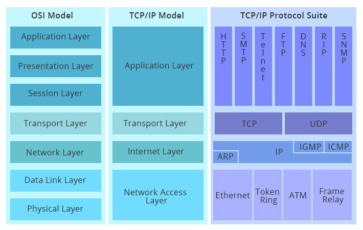

Подробнее см. [здесь](https://community.fs.com/ru/blog/tcpip-vs-osi-whats-the-difference-between-the-two-models.html),
либо в рамках кратких видео уроков по [модели OSI](https://www.youtube.com/watch?v=Tt8BTkxz_Vc&list=PLtPJ9lKvJ4oiNMvYbOzCmWy6cRzYAh9B1)
и [модели TCP/IP](https://www.youtube.com/watch?v=UZo4ffQ-aAc&list=PLtPJ9lKvJ4oiNMvYbOzCmWy6cRzYAh9B1).

---

#### Балансировщик имеет маркировку L4 и L7, какой мне нужно использовать если я хочу терминировать ssl трафик через балансировщик?
TLS/SSL относится к 6-му уровню модели OSI (presentation layer), как следствие, потребуется использование L7 балансировщика,
т.к. L4 "не поднимается" выше 4-го уровня модели OSI (transport layer).

---

#### Какие существуют способы указания длины тела сообщения
Ответ:
* посредством указания в заголовке Content-Length количества байт, которые следует прочитать после окончания заголовков 
(после пустой строки):
  * при этом тело сообщения может состоять как из одной единой части (в случае с Content-Type: application/*), 
  так и из нескольких (multipart/*), причем в случае наличия нескольких частей:
    * Content-Length на уровне заголовков всего сообщения указывает суммарную длину
      всех частей тела сообщения (включая разделители);
    * для разделения частей сообщения используются разделитель (который указывается в заголовке boundary);
* [посредством использования механизма chunked encoding](https://developer.mozilla.org/en-US/docs/Web/HTTP/Headers/Transfer-Encoding):
  * указывается заголовок `Transfer-Encoding: chunked`;
  * тело сообщения разбивается на куски (chunk'и):
    * первая строка chunk - это длина данных этого chunk (в байтах), которые начинаются со следующей строки;
* посредством закрытия TCP соединения:
  * не удастся воспользоваться в ситуации, когда в рамках одного TCP соединения последовательно отправляется 
  несколько HTTP запросов.

Подробнее см. [здесь](https://www.w3.org/Protocols/rfc2616/rfc2616-sec4.html#sec4.4).

---

#### Расскажите про TCP Back Pressure (он же TCP Sliding Window Flow Control)
Ответ: Протокол TCP используется механизм управления потоком пакетов под названием "скользящее окно" (sliding window).

Данный механизм используется для избежания "простоя" в интервалы между завершением отправки пакета и получением уведомления о его получении
(со стороны получателя), что обусловлено тем, что между отправкой и получением уведомления имеется некоторая задержка,
вызванная накладными расходами на передачу данных по всем звеньям сети (например, по маршрутизаторам).

Механизм базируется на идее отправки нескольких последовательных пакетов данных не дожидаясь уведомления от 
получателя (TCP ACK), вместо этого, ожидается получение одного уведомления, аккумулирующего информацию обо всех 
(или части) ранее отправленных TCP пакетах.

Количество пакетов, которые могут быть отправлены не дожидаясь ACK называются TCP окном (TCP window).

Окно называется "скользящим", т.к. оно как бы скользит (движется) по потоку данных, которые нужно передать.
Если было получено уведомление о получении N пакетов (ACK), то отправляются следующие N пакетов, т.е. окно "сдвигается" 
на следующую часть потока данных:

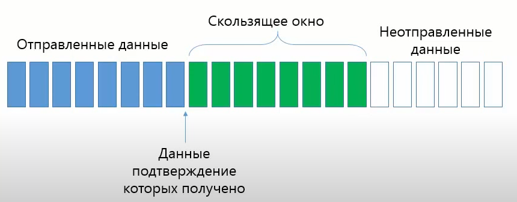

Back Pressure осуществляется за счет управления размером окна со стороны получателя:
* при отправке кумулятивного уведомления о получении TCP пакетов (ACK), в заголовке TCP ответа также указывается 
максимальное количество байт полезной нагрузки (payload), которое готов принять получатель:
  * значение заголовка рассчитывается на основании размера буфера данных:
    * поступающие по сети данные извлекаются из TCP сегментов и складываются в буфер;
    * объем свободного места в буфере и является размеров окна;
* данный заголовок должен прочитать отправитель и учесть его значение при расчете количества TCP сегментов, которые он
будет отправлять в рамках TCP окна, например:
  * если получатель в TCP ACK указал значение 10220, а на канальном уровне (модели OSI) используется сеть Ethernet 
  (где мо умолчанию максимальный размер кадра составляет 1500 байт, он же MTU), то максимальное количество пакетов, 
  которые отправителю имеет смысл отправлять можно рассчитать примерно следующим образом:
    * 10220 / 1460 == 7, пояснение:
      * 1460 - это MSS (Maximum TCP segment size), где
        * MSS = MTU - (TCP headers size + IP headers size), где
          * MTU (Maximum transmission unit) для Ethernet, по умолчанию, составляет 1500 байт;
          * TCP headers size == 20 байт;
          * IP headers size == 20 байт.

Если получателю будет отправлено больше данных, чем он готов сохранить в буфер, то он просто будет откидывать такие 
TCP сегменты.

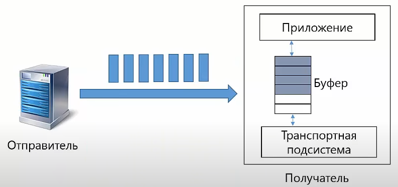

Подробнее см. [здесь](https://blog.wallaroolabs.com/2018/04/how-the-end-to-end-back-pressure-mechanism-inside-wallaroo-works/) 
или в двух видео уроков:
1. [Sliding TCP Window](https://www.youtube.com/watch?v=hd6QNXK5rPk&list=PLtPJ9lKvJ4oiNMvYbOzCmWy6cRzYAh9B1);
2. [Flow Control Over Sliding TCP Window](https://www.youtube.com/watch?v=YCW4fLqFlME&list=PLtPJ9lKvJ4oiNMvYbOzCmWy6cRzYAh9B1).

---

#### Что такое HTTP pipelining
Ответ: Особенность HTTP/1.1, позволяющая последовательно передавать несколько HTTP запросов в рамках одного TCP канала,
без ожидания ответа на них.

После завершения передачи всех HTTP запросов, начинается получение ответов, порядок которых должен соответствовать 
порядку отправки запросов.


Подробнее см. [здесь](https://en.wikipedia.org/wiki/HTTP_pipelining) или в рамках [видео урока](https://youtu.be/7DitlqcesKI?list=PLtPJ9lKvJ4oiNMvYbOzCmWy6cRzYAh9B1&t=401).
[Пример использования](https://github.com/apache/httpcomponents-core/blob/5.0.x/httpcore5/src/test/java/org/apache/hc/core5/http/examples/AsyncPipelinedRequestExecutionExample.java).

---

#### Что такое TCP no delay или что такое алгоритма Нейгла (Nagle algorithm)
Ответ:
Это алгоритм буферизации отправляемых данных в рамках TCP пакета, являющийся средством повышения эффективности работы 
сетей TCP/IP, позволяющим уменьшить количество пакетов, которые должны быть отправлены по сети.

Он используется, когда размер отправляемых данных в рамках TCP пакета очень маленький, т.е. когда служебная информации
(например, TCP заголовки) по размеру сильно превышает полезную нагрузку (сами передаваемые данные).

Данный алгоритм скапливает данные в своем буфере до тех пор, пока не будет получено уведомление об успешно получении
предыдущего TCP пакета (TCP ACK).

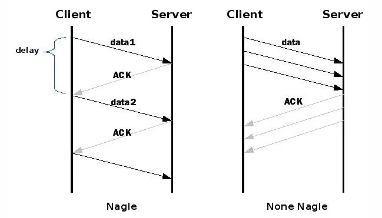

Параметр TCP_NODELAY используется для отключения данного механизма поведения.

Подробнее см. [здесь](https://ru.wikipedia.org/wiki/%D0%90%D0%BB%D0%B3%D0%BE%D1%80%D0%B8%D1%82%D0%BC_%D0%9D%D0%B5%D0%B9%D0%B3%D0%BB%D0%B0) 
или [здесь](https://stackoverflow.com/questions/3761276/when-should-i-use-tcp-nodelay-and-when-tcp-cork).

---

## Linux
#### Что такое рут и почему опасно сидеть под ним?
ToDo: ответ

---

#### Как убить процесс?
ToDo: ответ

---

#### Как отобразить содержимое каталога?
ToDo: ответ

---

#### Что за команда nohup?
ToDo: ответ

---

#### В чем смысл команды chmod +x file и chmod 777 file?
ToDo: ответ

---

#### Нужно посмотреть какие коннекты открыты до определенного хоста в настоящий момент. Как это сделать?
ToDo: ответ

---

#### Что такое crontab и для чего используется?
ToDo: ответ

---


## MQ, kafka
расскажите про kafka. Что используется для управления кластером кафки
как я могу получить splitBrain в кафке?
расскажите про zero copy. Какие есть требования к передаваемым данным, что бы мы могли ускорить передачу с использованием zero copy
что произойдет если продьюсер отправит данные в топик, который в кластере не существует (с настройками по умолчанию).
в топике несколько партиций. продьюсер пишет сразу во все. Как будет читать данные консумер?

работали ли с MQ.
что такое кластерная очередь?
если из одной очереди читает сразу много потребителей, как я могу обеспечить корректную работу очереди?
потребитель не умеет работать с заголовками, а нам нужно заголовки сохранить и вернуть скоррелированный и обогащенный заголовками ответ. Могу ли я это сделать?
расскажите в чем роль брокера? какие я на нем действия могу сделать?
мне нужно на одном менеджере разграничить права для разных потребителей (разные наборы очередей) и закрыть все это тлс. Умеет ли это WebSphrere MQ?

## процесс
работали ли в эджайле? расскажите есть ли у вас негативный или наоборот позитивный опыт
что такое спринт, история, эпик, таска?
кто решает что в спринт берет команда?
что должно быть итогом спринта?
что такое планирование и демо?