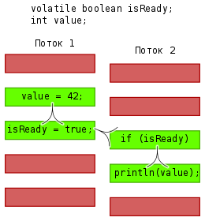
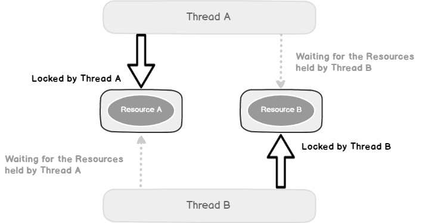
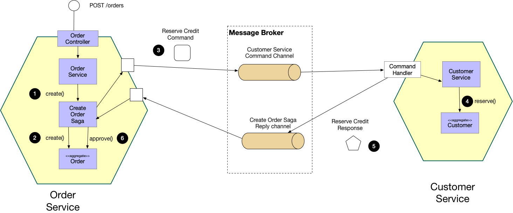
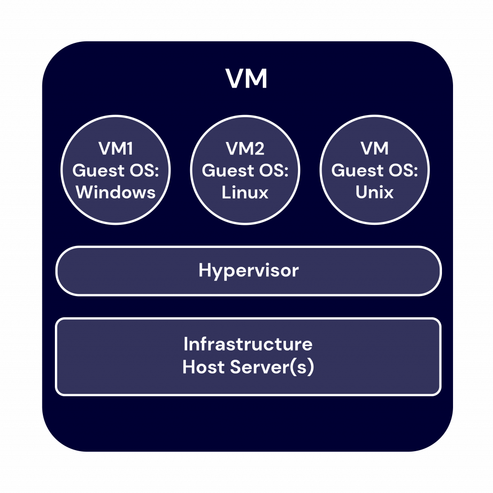
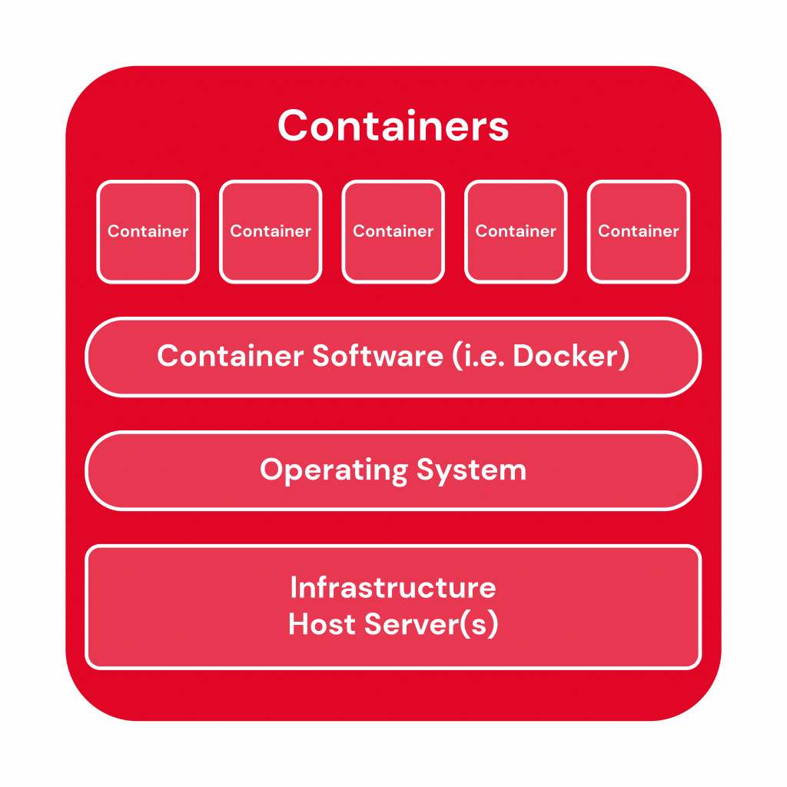

# JavaDeveloper

Материалы для собеседования на позицию java developer.

<!--ts-->
<!--te-->

## Общие вопросы

#### Если нажать поиск в гугл, что происходит под капотом?
<details><summary markdown="span">Ответ</summary>

ToDo: развернутый большой ответ

</details>

---

#### Расскажите про клиент-серверную архитектуру
Ответ:
Архитектура "Клиент-Сервер" предусматривает разделение сетевой нагрузки между потребителем услуг (*клиентом*) и
поставщиком услуг (*сервером*) на разных компьютерах сети, каждый из которых работает независимо от других.

<details><summary markdown="span">Типы реализаций</summary>:

1. **Одноуровневая архитектура (1-Tier)**: клиенты через интерфейс взаимодействуют с общим <u>сервером баз данных</u>
   или <u>файловым сервером</u> (только предоставление данных);
2. **Двухуровневая архитектура (2-Tier)**: клиенты через интерфейс взаимодействуют с общим <u>сервером приложений с
   БД</u>:
  1. *fat client thin server* - данные хранятся на сервере, а логика их обработки и бизнес-логика - на клиенте;
  2. *thin client fat server* - на сервере хранятся и данные, и логика их обработки, и бизнес-логика;
3. **Трёхуровневая архитектура (3-Tier)**: клиенты через интерфейс взаимодействуют с общемим сервером, который
   использует результат взаимодействия с сервером БД.
4. **Многоуровневая архитектура (N-Tier)**: клиенты через интерфейс взаимодействуют с одним из несколько серверов
   приложений, использующих результаты работы друг друга, а также данные от различных серверов БД, файловых серверов и
   других видов серверов.
   
</details>

<details><summary markdown="span">Практические примеры</summary>

* веб-сайт;
* автомобильный навигатор;
* корпоративная сеть (нпр. почтовый сервер);
* и др.
  
</details>

<details><summary markdown="span">Преимущества</summary>

* *Масштабируемость* - количество клиентов и серверов можно изменять независимо друг от друга;
* *Централизованность* - управление и данные сосредоточены на центральном сервере;
* *Информационная безопасность* - ресурсы общего пользования администрируются централизованно;
* *Производительность* - использование выделенного сервера повышает скорость работы ресурсов общего пользования;
  
</details>

<details><summary markdown="span">Недостатки</summary>

* *Перегрузку трафика в сети* - когда большое число клиентов одновременно запрашивают одну услугу на сервере, то число
  запросов может создать перегрузку в сети;
* *Наличие единой точки отказа* в небольших сетях с одним сервером. Если он отказывает, все клиенты остаются без
  обслуживания;
* *Превышение пределов ресурсов сервера*, когда новые клиенты, запрашивающие услугу, остаются без обслуживания. В таких
  случаях, требуется срочное расширение ресурсов сервера;
* Потенциально специфический интерфейс клиента, для использования которого требуются дополнительные настройки.

</details>

---

#### Что такое XML, как он связан с XSD?

**XML** расшифровывается как Extensible Markup Language. В качестве языка разметки он помогает создавать документы в
формате, понятном как людям, так и компьютеру. Он был разработан World Web Consortium (W3C). XML хранит данные в
текстовом формате и не зависит от платформы.

**XSD** — это язык описания структуры XML документа. Его также называют XML Schema. При использовании XML Schema XML
парсер может проверить не только правильность синтаксиса XML документа, но также его структуру, модель содержания и типы
данных.

---

#### Чем удобен JSON, есть ли у него инструменты для проведения валидации?

JSON - простой, основанный на использовании текста, способ хранить и передавать структурированные данные. С помощью
простого синтаксиса вы можете легко хранить все что угодно, начиная от одного числа до строк, массивов и объектов, в
простом тексте. Также можно связывать между собой массивы и объекты, создавая сложные структуры данных.

JSON имеет следующие преимущества:
- он компактен по сравнению с XML;
- его предложения легко читаются и составляются как человеком, так и компьютером;
- его легко преобразовать в структуру данных для большинства языков программирования (числа, строки, логические
  переменные, массивы и так далее).

Для валидации JSON существует стандарт [JSON Schema](http://json-schema.org/) (аналог XSD для XML).

---

#### Что такое сериализация и десериализация?
**Сериализация** - процесс преобразования структуры данных в линейную последовательность байтов для дальнейшей передачи
или сохранения.  
В Java, согласно спецификации Java Object Serialization существует два стандартных способа сериализации:
стандартная сериализация, через использование интерфейса `java.io.Serializable` и «расширенная» сериализация -
`java.io.Externalizable`.

**Десериализация** - это процесс восстановления сериализованного (см. "сериалиация") объекта из массива байтов.

---

#### Какие знаете HTTP методы?
- `GET` - получение ресурса (без изменения состояния);
- `HEAD` - получение информации о ресурсе без получения body (аналог `GET`, но без получения body);
- `PUT` - создание ресурса;
- `POST` / `PATCH` - обновление ресурса;
- `DELETE` - удаление ресурса;
- `OPTIONS` - получить список поддерживаемых методов ресурса.

---

#### Зачем нужны cookies?
Cookies -небольшой фрагмент данных, отправленный веб-сервером и хранимый на компьютере пользователя. 
Веб-клиент (обычно веб-браузер) всякий раз при попытке открыть страницу соответствующего сайта пересылает этот фрагмент 
данных веб-серверу в составе HTTP-запроса. 
Применяется для сохранения данных на стороне пользователя, на практике обычно используется для:
- аутентификации пользователя;
- хранения персональных предпочтений и настроек пользователя;
- отслеживания состояния сеанса доступа пользователя;
- сведения статистики о пользователях.

---

#### идентификация / аутентификация / авторизация
- идентификация:
  - процесс распознавания пользователя по его идентификатору (проверка на наличие пользователя с таким логином);
- аутентификация:
  - процедура проверки подлинности, доказательство, что пользователь именно тот, за кого себя выдает (проверка на 
  достоверность логина и пароля);
- авторизация:
  - проверка, либо предоставление определённых пользователю (проверка наличия прав доступа на выполнение той или иной
  операции прошедшему аутентификацию пользователю).

Каждый их последующих шагов включает в себя предыдущий:
- аутентификация включает в себя идентификацию;
- авторизация включает в себя аутентификацию, как следствие, транзитивно включает и идентификацию.

---

#### REST vs SOAP
REST — это архитектурный стиль. SOAP — это формат обмена сообщениями.

Специфика SOAP — это формат обмена данными. С SOAP это всегда SOAP-XML, который представляет собой XML, включающий:
- Envelope (конверт) – корневой элемент, который определяет сообщение и пространство имен, использованное в документе,
- Header (заголовок) – содержит атрибуты сообщения, например: информация о безопасности или о сетевой маршрутизации,
- Body (тело) – содержит сообщение, которым обмениваются приложения,
- Fault – необязательный элемент, который предоставляет информацию об ошибках, которые произошли при обработке сообщений. И запрос, и ответ должны соответствовать структуре SOAP.

Специфика REST — использование HTTP в качестве транспортного протокола. Он подразумевает наилучшее использование функций, 
предоставляемых HTTP — методы запросов, заголовки запросов, ответы, заголовки ответов итд.

- SOAP не накладывает никаких ограничений на тип транспортного протокола. Вы можете использовать либо Web протокол HTTP, либо MQ.
- REST подразумевает наилучшее использование транспортного протокола HTTP
- SOAP использует WSDL (Web Services Description Language) — язык описания веб-сервисов и доступа к ним, основанный на языке XML. 
- REST не имеет стандартного языка определения сервиса. Несмотря на то, что WADL был одним из первых предложенных стандартов, 
он не очень популярен. Более популярно использование Swagger или Open API.

---

#### RESTful api и JSON-pure api в чем отличие?

RESTful api и JSON-pure - это архитектурные стили взаимодействия компонентов распределённого приложения в сети 
(распределенных веб-сервисов).

Не существует «официального» стандарта для RESTful веб-API. Несмотря на то, что REST не является стандартом сам по себе, 
большинство RESTful-реализаций придерживаются следующих требований:
- в качестве средства интеграции использовать протокол HTTP:
  - явное указание ресурсов, над которыми выполняется действие (см. использование методов) в рамках URL;
  - явное использование методов HTTP в качестве глаголов (действия над ресурсом):
    - GET - для получения данных без изменения их состояния;
    - PUT - для добавления (создания/вставки) данных;
    - POST - для обновления данных;
    - DELETE - для удаления данных;
- в качестве структуры для передачи данных используетя JSON (реже XML);
- по возможности приложение не должно иметь состояния;
- отображает структуру папок как URls.

JSON-pure API 
- использует только один метод для передачи данных — обычно POST для HTTP и SEND в случае использования Web Sockets;
- механизм передачи и содержимое запроса полностью независимы:
  - все ошибки, предупреждения и данные передаются в теле запроса, в формате JSON;
- механизм передачи и содержимое ответа полностью независимы:
  - все ошибки, предупреждения и данные передаются в теле ответа, в формате JSON;
  - используется лишь один код ответа, чтобы подтвердить успешную передачу, обычно это 200 ОК.

Из таких концепций JSON-pure API вытекают очень важные следствия:
- взаимодействие легко перенести на любой канал связи, например, HTTP/S, WebSockets, XMPP, telnet, SFTP, SCP, or SSH:
  - в связи с тем, что вся логика (включая ошибки) находится именно в теле запроса/ответа, а не в заголовках 
  используемых сетевых протоколов.

---

#### Расскажите про CRUD
CRUD - аббревиатура от:
- Create - создать;
- Read - прочитать;
- Update - обновить;
- Delete - удалить.

Это не что иное, как основные операции для подавляющего большинства данных.

CRUD нужен для того, чтобы разделить программный код на отдельные части, каждая из которых отвечает за свои действия.

---

#### Как согласно CAP теореме я должен выбирать элементы для front и back систем (Базы данных, системы резервирования и проч)?

<details><summary markdown="span">Теорема CAP</summary>

Теорема CAP (теорема Брюера) - эвристическое утверждение о том, что в любой реализации распределённых вычислений
возможно обеспечить не более двух из трёх следующих свойств:
- согласованность данных (англ. consistency) — во всех вычислительных узлах в один момент времени данные не противоречат
  друг другу;
- доступность (англ. availability) — любой запрос к распределённой системе завершается корректным откликом, однако без
  гарантии, что ответы всех узлов системы совпадают;
- устойчивость к разделению (англ. partition tolerance) — расщепление распределённой системы на несколько изолированных
  секций не приводит к некорректности отклика от каждой из секций.

</details>

Согласно концепции из теоремы CAP best-practice можно обозначить следующим образом:
* фронтальные системы должны быть AP (доступна и устойчива к разделению);
* back системы должны быть CP (консистентна и устойчива к разделению).

---

## Сервера приложений

#### Чем сервер приложений отличается от web сервера?
Web-сервер — это разновидность сервера приложений.

|     | Web-сервер | Сервер приложений |
| --- | :--------: | :---------------: |
| Включает в себя | только контейнер сервлетов | контейнер сервлетов + контейнер EJB (Enterprise JavaBeans) |
| Типы контента | статический контент | динамический контент |
| Расход ресурсов | меньше  | больше |
| Организует среду выполнения | для веб-приложений  | для корпоративных приложений |
| Многопоточность  | не поддерживается  | поддерживается  |
| Мощность | ниже  | выше |
| Протоколы | HTML и HTTP  | GUI, HTTP и RPC / RMI |
| Примеры реализаций | Nginx, Apache Tomcat | IBM WebSphere, Glassfish |

---

#### Какие упрощения для приложения предоставляет app server?
ToDo: ответ

---

#### Вам нужно настроить TLS в вашем приложении. Какие есть способы реализации этого, если приложение установлено не standalone?
ToDo: ответ

---

#### Чем отличается jar от war?
Ответ:
|     |  JAR  |  WAR  |
| --- | :--- | :--- |
| Расшифровка | Java Archive | Web Archive |
| Содержит | общие библиотеки классов Java, ресурсы, вспомогательные файлы и т. д. | jar-ы с реализацией, JSP, статические файлы фронт-энда, и мета-информацию для сервлет-контейнера (web.xml) |
| Структура архива | любая | предопределенная - с каталогами WEB-INF и META-INF |
| Расширение | `.jar` | `.war`  |
| Запуск | возможность запуска из командной строки | необходим сервер |
| Использование | в качестве библиотеки, плагина или любого приложения | в качестве веб-приложения |

---

#### Зачем нужен в общем случае кластер WAS? могу ли я использовать кластер для распределения нагрузки?
ToDo: ответ

---

## Java EE

#### Назовите принципы ООП (с примерами)

<details><summary markdown="span">Наследование</summary>

Наследование - это механизм, который позволяет описать новый класс на основе существующего (родительского).
Свойства и функциональность родительского класса заимствуются новым классом.

Это главный механизм для повторного использования кода. Наследственное отношение классов четко определяет их иерархию.

</details>

<details><summary markdown="span">Инкапсуляция</summary>

Инкапсуляция в Java означает ограничение доступа к данным и возможностям их изменения.

В его основе лежит слово «капсула». В эту «капсулу» мы прячем какие-то важные для нас данные, которые не хотим, чтобы
кто-то менял.

</details>

<details><summary markdown="span">Полиморфизм</summary>

Полиморфизм - это возможность работать с несколькими типами так, будто это один и тот же тип.

При этом поведение объектов будет разным в зависимости от типа, к которому они принадлежат.

</details>

<details><summary markdown="span">Абстракция</summary>
Абстракция - это принцип выделение главных, наиболее значимых характеристик предмета и наоборот - отбрасывание 
второстепенных, незначительных.

Скажем, мы создаем картотеку работников компании. Для создания объектов «работник» мы написали класс `Employee`. Какие
характеристики важны для их описания в картотеке компании? ФИО, дата рождения, номер социального страхования, ИНН. Но
вряд ли в карточке такого типа нам нужны его рост, цвет глаз и волос. Компании эта информация о сотруднике ни к чему.

</details>

Подробнее см. [здесь](https://javarush.ru/groups/posts/1966-principih-obhhektno-orientirovannogo-programmirovanija).

---

#### Расскажите про Object Pools (Boolean/Short/Integer/Long/String)
Ответ:

Для более эффективного использования памяти, в Java используются так называемые пулы (`Boolean`, `Short`, `Integer`, 
`Long` и `String`). Когда мы создаем объект, не используя оператор `new` (посредством литералов, либо с использованием 
механизма autoboxing), объект помещается в пул, и в последствии, если мы захотим создать такой же объект (опять же, 
без использования оператора `new`), то новый объект создан не будет, а мы просто получим ссылку на наш объект из пула, 
т.е. по факту один и тот же объект будет переиспользован в нескольких местах (такое поведение допустимо для объектов 
вышеописанных типов, т.к. они являются immutable).

Стоит заметить, что использование любого Pool'а за исключением `String` будет осуществляться при любой автоупаковке 
(если, конечно, значение соответсвует определенному диапазону, зависящему от типа, см. autoboxing). 
В случае же Pool'а String интернирование (intern) работает только для литералов.

<details><summary markdown="span">Boolean pool</summary>

Boolean pool хранит оба возможных значения, т.е. объектные Wrapper'ы для обоих примитивов (true и false).

Контрольный пример:

```java
Boolean valueFromPool1 = true; // произойдет вызов: Boolean.valueOf(true);
Boolean valueFromPool2 = true; // произойдет вызов: Boolean.valueOf(true);

System.out.println(valueFromPool1 == valueFromPool2); // true
System.out.println(true == valueFromPool1);           // true (произойдет вызов: valueFromPool1.booleanValue();)
System.out.println((Boolean) true == valueFromPool1); // true (произойдет вызов: Boolean.valueOf(true);)
```

</details>

<details><summary markdown="span">Short / Integer / Long pool</summary>

Особенность целочисленных (`Short`, `Integer` и `Long`) pool'ов состоит в том, что, по умолчанию, они хранят только 
числа, которые помещаются в тип данных `byte`, т.е. числа в интервале от `-128` до `127` (который начиная с Java 7 
(раньше это было захардкожено внутри классов `java.lang.Short`, `java.lang.Integer` и `java.lang.Long`, соответственно) 
можно расширить с помощью опции JVM, пример для Integer: `-Djava.lang.Integer.IntegerCache.high=<size>` или 
`-XX:AutoBoxCacheMax=<size>`). Для остальных чисел данных типов pool не работает.

**Контрольный пример**

```java
Integer valueFromPool1 = 127;    // произойдет вызов: Integer.valueOf(127);
Integer valueFromPool2 = 127;    // произойдет вызов: Integer.valueOf(127);
Integer valueNotFromPool1 = 128; // произойдет вызов: Integer.valueOf(128);
Integer valueNotFromPool2 = 128; // произойдет вызов: Integer.valueOf(128);

System.out.println(valueFromPool1 == valueFromPool2);       // true
System.out.println(valueNotFromPool1 == valueNotFromPool2); // false

System.out.println(127 == valueFromPool1);              // true  (произойдет вызов: valueFromPool1.intValue();)
System.out.println(128 == valueNotFromPool1);           // true  (произойдет вызов: valueNotFromPool1.intValue();)
System.out.println((Integer) 127 == valueFromPool1);    // true  (произойдет вызов: Integer.valueOf(127);)
System.out.println((Integer) 128 == valueNotFromPool1); // false (произойдет вызов: Integer.valueOf(128);)
```

</details>

<details><summary markdown="span">String pool</summary>

Выделим основные нюансы строкового пула в Java:
* строковые литералы (в одном/разных классе(ах) и в одном/разных пакете(ах)) представляют собой ссылки на один и 
тот же объект;
* строки, получающиеся сложением констант, вычисляются во время компиляции и далее смотри пункт первый;
* строки, создаваемые во время выполнения НЕ ссылаются на один и тот же объект;
* метод intern(), в любом случае, возвращает объект из пула, вне зависимости от того, когда создается строка, 
на этапе компиляции или выполнения (если на этапе выполнения, то объект сначала принудительно разместится в pool, 
а затем на него будет получена ссылка).

В контексте данных пунктов речь шла об "одинаковых" строковых литералах.

**Контрольный пример**

```java
String hello = "Hello", hello2 = "Hello";
String hel = "Hel", lo = "lo";

System.out.println("Hello" == "Hello");           // true
System.out.println("Hello" == "hello");           // false
System.out.println(hello == hello2);              // true
System.out.println(hello == ("Hel" + "lo"));      // true
System.out.println(hello == (hel + lo));          // false
System.out.println(hello == (hel + lo).intern()); // true
```

</details>

<details><summary markdown="span">Почему отсутствуют `Float` и `Double` pool</summary>

Для чисел с плавающей точкой (`Float` и `Double`) отсутствуют специфичные pool'ы вследствие особенностей хранения таких 
чисел согласно стандарту [IEEE 754](https://habr.com/ru/post/112953/). 
Использование для них pool'ов оказалось бы крайне неэффективно (хотя бы, в виду огромного количества чисел с плавающей 
точкой, находящихся в интервале от `-128.0` до `127.0`).

</details>

---

#### Расскажите про контракт между методами equals() и hashCode()

Для сравнения двух экземпляров объектных типов в Java помимо оператора `==` также существуют такие методы как: 
`equals()` и `hashCode()`, определенные на уровне класса `java.lang.Object`, который является родительским классом 
для объектов Java, поэтому все Java-объекты наследуют от этих методов реализацию по умолчанию.

Метод equals(), как и следует из его названия, используется для простой проверки равенства двух объектов.
Реализация этого метода, по умолчанию, проверяет равенство ссылок двух объектов, т.е. по умолчанию, 
поведение идентично работе оператора `==` за исключением того, что оператор `==` не позволяет сравнивать операнды 
неприводимых друг к другу типов.

Метод `hashCode()` обычно используется для получения уникального целого числа, что на самом деле не является правдой, 
т.к. результат работы данного метода - это целое число примитивного типа `int` (называемое хеш-кодом), полученное 
посредством работы хэш-функции входным параметром которой является объект, вызывающий данный метод, но множество 
возможных хеш-кодов ограничено примитивным типом `int` (всего `2^32` вариантов значений), а множество объектов 
ограничено только нашей фантазией.

Из вышеописанного между методами `hashCode()` и `equals()` следует следующий контракт:
* если хеш-коды разные, то и объекты гарантированно разные;
* если хеш-коды равны, то входные объекты могут быть неравны (это обусловленно тем, что множество объектов мощнее 
множества хеш-кодов, т.к. множество возможных хеш-кодов ограничено размером примитивного типа `int`).

Создавая пользовательский класс следует переопределять методы `hashCode()` и `equals()`, чтобы они корректно работали 
и учитывали необходимые для вас данные (поля) объекта. Кроме того, если не переопределить реализацию из `Object`, то, 
например, при использовании таких объектов в `java.util.HashMap` у вас наверняка возникнут проблемы, поскольку `HashMap` 
активно использует `hashCode()` и `equals()` в своей работе (подробнее см. [здесь](https://habr.com/ru/post/168195/)).

Подробнее про данные методы можно прочитать [здесь](https://ru.stackoverflow.com/questions/493576/%D0%9C%D0%B5%D1%82%D0%BE%D0%B4%D1%8B-equals-%D0%B8-hashcode).

---

#### Как следует сравнивать вещественные примитивы

Вещественные примитивы (`float` и `double`) стоит сравнивать с определенной точностью.
Например, округлять их до 6-го знака после запятой (`1E-6` для double, либо `1E-6F` для `float`), либо, 
что предпочтительнее, проверять абсолютное значение разницы между ними.

**Контрольный пример**

```java
float float1 = 0.7F;
float float2 = 0.3F + 0.4F;
final float EPS = 1E-6F;

System.out.println(Math.abs(float1 - float2) < EPS); // true
```

Стоит понимать, что существуют и [другие более точные](https://randomascii.wordpress.com/2012/02/25/comparing-floating-point-numbers-2012-edition/), 
но при этом куда более изощренные варианты сравнения чисел с плавающей точкой.

---

#### Что будет если вызвать String#intern() у строки, которой еще нет в пуле?
Ответ: Строка будет размещена в String Pool.

Если в String Pool уже присутствовала данная строка, то будет возвращена ссылка на строку из Pool, а текущая позднее
будет "собрана" GC.

Стоит заметить, что область памяти (PermGen / Heap) размещения String Pool зависит от JDK.
Например, в рамках Oracle HotSpot JDK:
* до JDK 7 (не включая) Pool хранился в PermGen;
* [начиная с JDK 7](https://www.oracle.com/java/technologies/javase/jdk7-relnotes.html) (включая) Pool 
хранится в Heap (в области old generation).

Подробнее см. [здесь](https://www.baeldung.com/string/intern) и [здесь](https://stackoverflow.com/questions/10578984/what-is-java-string-interning).

---

#### Что хранится в Stack, Heap, PermGen / MetaSpace

<details><summary markdown="span">Stack</summary>

Стек (stack) - область ОЗУ, выделенная под поток и содержащая список элементов (стек вызовов / stack frames), 
организованных по принципу LIFO (Last In First Out).

Содержимое элемента стека вызова (stack frame):
* примитивы:
  * `byte`, `char`, `boolean`, `short`, `int`, `long`, `float`, `double`;
* ссылки на объекты и кучи, используемые в методе:
  * наследники класса `Object`.

Основные опции JVM, отвечающие за размер стека:
* `-Xss` - объем выделяемый под стек памяти.

</details>

<details><summary markdown="span">Heap</summary>

Куча (heap) – область памяти в ОЗУ, выделенная под процесс и используемая для размещения создаваемых на этапе 
выполнения объектов.

Содержимое объекта кучи:
* заголовок объекта:
  * ссылка на таблицу виртуальных методов, hashCode, ...;
* примитивы:
  * поля объектов, имеющие один из следующих типов: `byte`, `char`, `boolean`, `short`, `int`, `long`, `float`, `double`;
* ссылки на другие объекты:
  * поля наследники класса Object.

Основные опции JVM, отвечающие за размер кучи:
* `-Xms` - исходный/минимальный размер heap;
* `-Xmx` - максимальный размер heap.

</details>

<details><summary markdown="span">PermGen / MetaSpace</summary>

PermGen (до JDK 8) / MetaSpace (с JDK 8) – область памяти в ОЗУ, выделенная под процесс и используемая
ClassLoader’ами для загрузки мета-информации о классах.

Содержимое PermGen/MetaSpace:
* экземпляры классов: `Class`, `Constructor`, `Method`, `Field`, `Modifier`, ...;
* до JDK 7 (Oracle HotSpot) в PermGen хранился String Pool.

Основные опции JVM, отвечающие за размер Permanent Generation:
* `-XX:PermSize` - исходный/минимальный размер PG;
* `-XX:MaxPermSize` - максимальный размер PG.

Основные опции JVM, отвечающие за размер MetaSpace:
* `-XX:MetaspaceSize` - исходный/минимальный размер MT;
* `-XX:MaxMetaspaceSize` - максимальный размер MT.

</details>

---

#### Расскажите, как работает GC

Сборщик мусора – часть JVM, отвечающая за освобождение и перераспределение памяти,
которая занята более неиспользуемыми объектами (мусором).

Что считается мусором?
* мусор (минорная сборка мусора) – объект младшего поколения (young generation),
недоступный/недостижимый из корней (roots), либо из ссылок на объекты старшего
поколения (old generation);
* мусор (мажорная сборка мусора) - объект, недоступный/недостижимый из корней
(roots).

Что является корнем?
* ссылка на объект из стека потока;
* ссылка на объект из статического поля класса.

Когда запускается сборка мусора?
* когда становится недостаточно памяти для создания нового объекта.

Большая часть сборщиков мусора опирается на «слабую гипотезу о поколениях».

В общем виде, гипотеза о поколениях гласит, что вероятность смерти как функция от возраста снижается очень быстро. 
Ее приложение к сборке мусора в частности означает, что подавляющее большинство объектов живут крайне недолго. 
По людским меркам, большинство даже в детский сад не пойдут. Также это означает, что чем дольше прожил объект, 
тем выше вероятность того, что он будет жить и дальше.

Большинство приложений имеют распределение времен жизни объектов, схематично описываемое примерно такой кривой:


Подавляющее большинство объектов создаются на очень короткое время, они становятся ненужными практически сразу после 
их первого использования. Итераторы, локальные переменные методов, результаты боксинга и прочие временные объекты, 
которые зачастую создаются неявно, попадают именно в эту категорию, образуя пик в самом начале графика.

Далее идут объекты, создаваемые для выполнения более-менее долгих вычислений. Их жизнь чуть разнообразнее — они обычно 
гуляют по различным методам, трансформируясь и обогащаясь в процессе, но после этого становятся ненужными и 
превращаются в мусор. Благодаря таким объектам возникает небольшой бугорок на графике следом за пиком временных объектов.

И, наконец, объекты-старожилы, переживающие почти всех — это постоянные данные программы, загружаемые часто в самом 
начале и проживающие долгую и счастливую жизнь до остановки приложения.

Все это навело разработчиков на мысль, что в первую очередь необходимо сосредотачиваться на очистке тех объектов, 
которые были созданы совсем недавно. Именно среди них чаще всего находится бóльшее число тех, кто уже отжил свое, 
и именно здесь можно получить максимум эффекта при минимуме трудозатрат.

Вот тут и возникает идея разделения объектов на младшее поколение (young generation) и старшее поколение (old generation). 
В соответствии с этим разделением и процессы сборки мусора разделяются на малую сборку (minor GC), затрагивающую только 
младшее поколение, и полную сборку (full GC), которая может затрагивать оба поколения. Малые сборки выполняются 
достаточно часто и удаляют основную часть мертвых объектов. Полные сборки выполняются тогда, когда текущий объем 
выделенной программе памяти близок к исчерпанию и малой сборкой уже не обойтись.

При этом разделение объектов по поколениям не просто условное, они физически размещаются в разных регионах памяти. 
Объекты из младшего поколения по мере выживания в сборках мусора переходят в старшее поколение. 
В старшем поколении объект может прожить до окончания работы приложения, либо будет удален в процессе одной из 
полных сборок мусора.


Особенности работы сборки мусора зависят от конкретного GC, поэтому подробнее смотрите в серии статей 
[здесь](https://habr.com/ru/post/269621/).

Сборщики мусора HotSpot VM:
1. Serial (последовательный);
2. Parallel (параллельный);
3. Concurrent Mark Sweep (CMS);
4. Garbage-First (G1);
5. ZGC (экспериментальный);
6. Epsilon.

Опция JVM для явного использования определенного GC (на примере Serial):
* `-XX:+UseSerialGC`

---

#### Назовите методы класса Object
ToDo: ответ

---

### Многопоточность

Краткое изложение основных моментов можно найти [здесь](https://habr.com/ru/company/otus/blog/353414/).

#### Расскажите про принципы happens before

В JMM (java memory model) существует отношение happens before («Выполняется прежде») - отношение строгого частичного 
порядка, введённое между атомарными командами (++ и -- не атомарны), придуманное не означающее «физически прежде».
Оно значит, что вторая команда будет «в курсе» изменений, проведённых первой.

Согласно этому отношению:

Синхронизация и мониторы:
- Захват монитора (начало synchronized, метод lock) и всё, что после него в том же потоке.
- Возврат монитора (конец synchronized, метод unlock) и всё, что перед ним в том же потоке. 
  - Таким образом, оптимизатор может заносить строки в синхроблок, но не наружу.
- Возврат монитора и последующий захват другим потоком.

Чтение и запись:
- Любые зависимости по данным (то есть запись в любую переменную и последующее чтение её же) в одном потоке.
- Всё, что в том же потоке перед записью в volatile-переменную, и сама запись.
- volatile-чтение и всё, что после него в том же потоке.
- Запись в volatile-переменную и последующее считывание её же.
  - Таким образом, volatile-запись делает с памятью то же, что возврат монитора, а чтение — то же, что захват. А значит:
    если один поток записал в volatile-переменную, а второй обнаружил это, всё, что предшествует записи, выполняется
    раньше всего, что идёт после чтения; см. иллюстрацию.
  - Для объектных переменных (например, `volatile List x;`) столь сильные гарантии выполняются для ссылки на объект, но
    не для его содержимого.

Обслуживание объекта:
- Статическая инициализация и любые действия с любыми экземплярами объектов.
- Запись в final-поля в конструкторе и всё, что после конструктора. Как исключение из всеобщей транзитивности, это
  соотношение happens-before не соединяется транзитивно с другими правилами и поэтому может вызвать межпоточную гонку.
- Любая работа с объектом и finalize().

Обслуживание потока:
- Запуск потока и любой код в потоке.
- Зануление переменных, относящихся к потоку, и любой код в потоке.
- Код в потоке и join(); код в потоке и isAlive() == false.
  - interrupt() потока и обнаружение факта останова.



---

#### Как я могу создать поток?

Существует два способа создать поток, оба из которых базируются на оперировании классом `java.lang.Thread`.

<details><summary markdown="span">Использование Runnable</summary>

```java
// создаем экземпляр потока, передавая ему в качестве аргумента конструктора реализацию Runnable(), в методе run() которого находится наш код
// (поток на уровне ОС еще пока не создается и не запускается)
Thread thread = new Thread(new Runnable() {
    @Override
    public void run() {
        // some code
    }
});
        
// стартуем поток (будет выделен поток в ОС, и уже в рамках него вызван метод Runnable#run())
thread.start();
```

</details>

<details><summary markdown="span">Переопределение метода Thread.run()</summary>

```java
// создаем экземпляр класса наследника Thread, переопределяя у него метод run(), в который помещаем наш код
// (поток на уровне ОС еще пока не создается и не запускается)
Thread thread = new Thread() {
    @Override
    public void run() {
        // some code
    }
};

// стартуем поток (будет выделен поток в ОС, и уже в рамках него вызван метод Runnable#run())
thread.start();
```

</details>

---

#### Что такое race condition и thread-safe?

<details><summary markdown="span">Race condition</summary>

Состояние гонки (англ. race condition), также конкуренция — ошибка проектирования многопоточной системы или
приложения, при которой работа системы или приложения зависит от того, в каком порядке выполняются части кода.

Race condition происходит, когда два или более потока обращаются к общим ресурсам и пытаются их изменить одновременно.

В связи с тем, что планировщик потоков ОС (thread scheduler) может переключаться между потоками в любой момент времени,
то вы не знаете в каком порядке каждый из потоков будет обращаться к общим данным. Как следствие, результат изменения
данных будет зависеть от алгоритма планировщика потоков ОС.

Другими словами, потоки "соревнуются" (racing) за доступ и изменение данных.

Проблема обычно происходит, когда один поток выполняет над общими данными "check-then-act" (сначала проверяет значение
таких данных, а затем изменяет его в зависимости от него), а в это время другой поток выполняет какое-то действие
над этими данными в промежутке между "check" и "act", например:

```java
if (x == 5) // The "Check"
{
   y = x * 2; // The "Act"

   // If another thread changed x in between "if (x == 5)" and "y = x * 2" above,
   // y will not be equal to 10.
}
```

Самый простой способ для предотвращения race condition в такой ситуации - это, например, выстраивание блокировки вокруг
всего блока "check-then-act":

```java
// Obtain lock for x
if (x == 5)
{
   y = x * 2; // Now, nothing can change x until the lock is released. 
   // Therefore y = 10
}
// release lock for x
```

</details>

<details><summary markdown="span">Thread-safety</summary>

Потоковая безопасность (англ. thread-safety) — это концепция программирования, применимая к многопоточным программам.
Код потокобезопасен, если он функционирует исправно при использовании его из нескольких потоков одновременно.

Это означает, что разные потоки могут обращаться к одним и тем же ресурсам без выявления ошибочного поведения или
получения непредсказуемых результатов.

Давайте рассмотрим основные подходы, которые позволяют достигнуть потоко-безопасности.

<details><summary markdown="span">Stateless Implementations</summary>

В большинстве случаев ошибки в многопоточных приложениях являются результатом неправильного разделения состояния между
несколькими потоками.

Поэтому первый подход, заключается в обеспечении потоко-безопасности с помощью реализаций без сохранения состояния.

Чтобы лучше понять этот подход, давайте рассмотрим простой служебный класс со статическим методом, вычисляющим факториал
числа:

```java
public class MathUtils {
    public static BigInteger factorial(int number) {
        BigInteger f = new BigInteger("1");
        for (int i = 2; i <= number; i++) {
            f = f.multiply(BigInteger.valueOf(i));
        }
        return f;
    }
}
```

Какие особенности мы наблюдаем:
- метод не сохраняет/изменяет состояние;
- метод не полагается на внешнее состояние.

Как следствие, метод является идемпонетным (на одни и те же входные данные, он всегда возвращает одни и те же
результаты).

Все потоки могут безопасно вызывать метод factorial() и получать ожидаемый результат, не мешая друг другу и не изменяя
выходные данные, генерируемые методом для других потоков.

Следовательно, реализации без сохранения состояния — это самый простой способ обеспечить потокобезопасность.

</details>

<details><summary markdown="span">Immutable Implementations</summary>

Если нам нужно разделить состояние между разными потоками, мы можем создать потоко-безопасные классы, сделав их
состояние неизменяемым. Экземпляр класса является неизменяем, если его внутреннее состояние не может быть изменено после
его создания.

Самый простой способ создать неизменяемый класс в Java - объявить все поля private final и не предоставлять сеттеры:

```java
public class MessageService {
    private final String message;

    public MessageService(String message) {
        this.message = message;
    }
    
    // standard getter
}
```

Так как состояние экземпляра класса не может быть изменено после его создания, то такая реализация является 
потоко-безопасной.

</details>

<details><summary markdown="span">Thread-Local Fields</summary>

Если нам в действительности нужно поддерживать состояние объекта, мы можем создать потоко-безопасные классы, которые не
разделяют состояние между потоками, сделав их поля локальными для потока.

Мы можем легко создавать классы, поля которых являются thread-local (определены в виде private полей у класса Thread).

```java
public class StateHolder {
    private final String state;
    // standard constructors / getter
}

// вариант 1: посредством использования private поля у экземпляра класса Thread
public class MyThread extends Thread {
  public static final StateHolder statePerThread =  new StateHolder("active");
}

// вариант 2: посредством использования готового класса ThreadLocal (делает примерно тоже самое)
public class ThreadState {
  public static final ThreadLocal<StateHolder> statePerThread = new ThreadLocal<StateHolder>() {
    @Override
    protected StateHolder initialValue() {
      return new StateHolder("active");
    }
  };

  public static StateHolder getState() {
    return statePerThread.get();
  }
}
```

Thread-local поля очень похожи на обычные поля класса, за исключением того, что каждый поток, который обращается к
ним через getter/setter, получает независимо инициализированную копию поля, так что каждый поток имеет свое собственное
состояние.

</details>

<details><summary markdown="span">Synchronized Methods & Statements</summary>

**Synchronized Methods**

Если нам требуется, чтобы только один поток могу получить доступ к методу одновременно, блокируя доступ к этому методу
из других потоков, то можно воспользоваться модификатором метода - `synchronized`. Другие потоки останутся
заблокированными до тех пор, пока не завершится первый поток или пока метод не вызовет исключение.

Например, таким образом мы можем создать потоко-безопасную версию `incrementCounter()`:

```java
public synchronized void incrementCounter() {
    counter += 1;
}
```

Так как один поток за раз может получить доступ к `synchronized` методу, один поток будет выполнять метод
`incrementCounter()`, а другие, в свою очередь, будут делать то же самое. Никакого перекрывающегося выполнения не
произойдет.

`synchronized` методы основаны на использовании «внутренних блокировок» или «блокировок монитора». Внутренняя
блокировка - это неявный внутренний объект, связанный с конкретным экземпляром класса.

В многопоточном контексте термин «монитор» — это просто ссылка на экземпляр объекта, используемый в качестве сущности,
к которой привязывается блокировка, обеспечивая монопольный доступ к набору указанных методов или операторов,
заключенных в рамки конструкции синхронизации.

Когда поток вызывает `synchronized` метод, он выполняет блокировк (захватывает монитор). После того, как поток завершает
выполнение метода, он освобождает блокировку (отпускает монитор), позволяя другим потокам получить блокировку и доступ к
методу.

Мы можем реализовать синхронизацию в методах экземпляра класса, статических методах класса и операторах (см. далее
synchronized statements).

**Synchronized Statements**

Иногда синхронизация всего метода может быть излишней, если нам просто нужно сделать сегмент метода потокобезопасным.
Синхронизация стоит дорого, поэтому выгоднее синхронизировать только соответствующие части метода.

Чтобы проиллюстрировать этот вариант использования, давайте несколько изменим метод `incrementCounter()`:

```java
public void incrementCounter() {
    // additional unsynced operations
    synchronized(this) {
        counter += 1; 
    }
}
```

В отличие от синхронизированных методов, синхронизированные операторы должны указывать объект, обеспечивающий встроенную
блокировку. В пример выше используется ссылка на текущий объект класса (`this`).

Мы можем немного улучшить потокобезопасную реализацию класса `Counter`, используя вместо этого другой объект в качестве
блокировки монитора:

```java
public class ObjectLockCounter {
    private int counter = 0;
    private final Object lock = new Object();
    
    public void incrementCounter() {
        synchronized(lock) {
            counter += 1;
        }
    }
    
    // standard getter
}
```

Мы используем ничего не делающий экземпляр класса `Object` в качестве монитора, т.е. для построения блокировки поверх 
него.

**Предостережения**

Несмотря на то, что мы можем использовать любой объект Java в качестве встроенной блокировки, следует избегать
использования String для целей блокировки:

```java
public class Class1 {
    private static final String LOCK  = "Lock";

    // uses the LOCK as the intrinsic lock
}

public class Class2 {
    private static final String LOCK  = "Lock";

    // uses the LOCK as the intrinsic lock
}
```

На первый взгляд кажется, что эти два класса используют в качестве блокировки два разных объекта. Однако из-за эффекта
оптимизирующего работу со строками, интернирования строк (String interning), эти два значения `Lock` могут на самом
деле ссылаться на один и тот же объект в пуле строк. То есть `Class1` и `Class2` используют одну и ту же блокировку.

Это, в свою очередь, может привести к неожиданному поведению в параллельных контекстах.

В дополнение к `String` мы должны избегать использования каких-либо кэшируемых или повторно используемых объектов в
качестве мониторов для блокировок. Например, метод `Integer.valueOf()` кэширует небольшие числа (на отрезке от `-128`
до `127`). Поэтому вызов
`Integer.valueOf(1)` возвращает один и тот же объект даже в разных классах.

</details>

<details><summary markdown="span">Locks</summary>

**Reentrant Lock**

Java предоставляет улучшенный набор реализаций блокировки, чье поведение несколько сложнее, чем встроенные блокировки,
рассмотренные выше.

Со встроенными блокировками (см. `synchronized`) модель получения блокировки довольно жесткая: один поток получает
блокировку, затем выполняет метод или блок кода и, наконец, снимает блокировку, чтобы другие потоки могли получить ее и
получить доступ к методу.

Нет базового механизма, который проверяет потоки в очереди и предоставляет приоритетный доступ к потокам с наибольшим
временем ожидания. Экземпляры `ReentrantLock` позволяют нам делать именно это, тем самым предотвращая нехватку ресурсов у
потоков в очереди:

```java
public class ReentrantLockCounter {
    private int counter;
    private final ReentrantLock reLock = new ReentrantLock(true);
    
    public void incrementCounter() {
        reLock.lock();
        try {
            counter += 1;
        } finally {
            reLock.unlock();
        }
    }
    
    // standard constructors / getter
}
```

Конструктор `ReentrantLock` принимает необязательный логический параметр `fairness` (справедливая блокировка). Если
установлено значение `true` и несколько потоков пытаются получить блокировку, JVM отдаст приоритет самому долго
ожидающему потоку и предоставит доступ к блокировке.

Тем не менее, использование данного параметра оказывает отрицательное влияние на производительность механизма
блокировки.

**Read/Write Locks**

Другой мощный механизм, который можно использовать для достижения потоко-безопасности — это использование реализаций
`ReadWriteLock`. 

Блокировка `ReadWriteLock` фактически использует пару связанных блокировок, одну только для операций чтения, а другую
только для операций записи. В результате может быть много потоков, читающих ресурс, пока нет ни одного потока,
записывающего в него. Более того, поток, пишущий в ресурс, не позволит другим потокам прочитать его.

Мы можем использовать блокировку `ReadWriteLock` следующим образом:

```java
public class ReentrantReadWriteLockCounter {
    private int counter;
    private final ReentrantReadWriteLock rwLock = new ReentrantReadWriteLock();
    private final Lock readLock = rwLock.readLock();
    private final Lock writeLock = rwLock.writeLock();
    
    public void incrementCounter() {
        writeLock.lock();
        try {
            counter += 1;
        } finally {
            writeLock.unlock();
        }
    }
    
    public int getCounter() {
        readLock.lock();
        try {
            return counter;
        } finally {
            readLock.unlock();
        }
    }

   // standard constructors
}
```

</details>

<details><summary markdown="span">Volatile Fields</summary>

Синхронизированные методы и блоки удобны для решения проблем с видимостью переменных среди потоков. Даже в этом случае
значения обычных полей класса могут кэшироваться процессором (в регистры процессора). Следовательно, последующие
обновления определенного поля, даже если они синхронизированы, могут быть невидимы для других потоков.

Для предотвращения такой ситуации можно использовать модификатор volatile у поля класса. С помощью ключевого слова
volatile мы указываем JVM и компилятору хранить переменную в основной памяти (в heap). Таким образом, мы гарантируем,
что каждый раз, когда JVM считывает значение переменной, она фактически будет считывать его из основной памяти (heap), а
не из кеша ЦП. Аналогично, каждый раз, когда JVM записывает в переменную, значение будет записываться в основную
память (heap).

Кроме того, использование volatile-переменной гарантирует, что все переменные, видимые данному потоку, также будут
считаны из основной памяти, рассмотрим пример:

```java
public class User {
    private String name;
    private volatile int age;

    // standard constructors / getters
}
```

Каждый раз, когда JVM записывает volatile переменную age в основную память, она также записывает
не volatile переменную name в основную память. Это гарантирует, что последние значения обеих переменных будут
храниться в основной памяти, поэтому последующие обновления переменных будут автоматически видны другим потокам.

Если поток считывает значение volatile переменной, все переменные, видимые потоку, также будут считаны из основной
памяти.

Эта расширенная гарантия, которую обеспечивают переменные volatile,
известна [full volatile visibility guarantee](http://tutorials.jenkov.com/java-concurrency/volatile.html).

</details>

<details><summary markdown="span">Thread-safe Collections</summary>

Мы можем использовать потоко-безопасные реализации коллекций.

**Synchronized Collections**

Например, мы можем обернуть любую существующую коллекцию в потоко-безопасную обертку (synchronization wrapper):

```java
Collection<Integer> syncCollection = Collections.synchronizedCollection(new ArrayList<>());
Thread thread1 = new Thread(() -> syncCollection.addAll(Arrays.asList(1, 2, 3, 4, 5, 6)));
Thread thread2 = new Thread(() -> syncCollection.addAll(Arrays.asList(7, 8, 9, 10, 11, 12)));
thread1.start();
thread2.start();
```

Стоит понимать, что синхронизированные коллекции используют внутреннюю блокировку в каждом методе (делают метод
synchronized) без анализа необходимости или минимальных блоков кода, на самом деле, подлежащих синхронизации, что может
приводить к значительному падению производительности.

Тем не менее, это означает, что к методам может обращаться только один поток за раз, в то время как другие потоки будут
заблокированы до тех пор, пока метод не будет разблокирован первым потоком.

**Concurrent Collections**

В качестве альтернативы Synchronized Collections мы можем использовать Concurrent Collections для создания
потокобезопасных коллекций.

Java в рамках пакета `java.util.concurrent` предоставляет ряд concurrent collections, например `ConcurrentHashMap`:

```java
Map<String,String> concurrentMap = new ConcurrentHashMap<>();
concurrentMap.put("1", "one");
concurrentMap.put("2", "two");
concurrentMap.put("3", "three");
```

В отличие от своих Synchronized Collections, Concurrent Collections обеспечивают потокобезопасность за счет
разделения своих данных на сегменты. Например, в `ConcurrentHashMap` несколько потоков могут получать блокировки на разных
сегментах `Map`, поэтому несколько потоков могут получить доступ к `Map` одновременно.

Concurrent Collections намного более эффективны, чем Synchronized Collections, благодаря неотъемлемым преимуществам
параллельного доступа к потокам, достигнутым за счет суженеия сегментов блокировки данных до реально необходимых и 
выполнения ряды иных оптимизаций.

Стоит отметить, что как Synchronized, так и Concurrent Collections делают потокобезопасной только саму коллекцию, а не
ее содержимое.

</details>

<details><summary markdown="span">Atomic Objects</summary>

Также возможно обеспечить потоко-безопасность с помощью набора атомарных классов, предоставляемых Java, включая
`AtomicInteger`, `AtomicLong`, `AtomicBoolean` и `AtomicReference`.

Атомарные классы позволяют нам выполнять атомарные операции, которые являются потокобезопасными, без использования
синхронизации. Атомарная операция выполняется в рамках единой, неделимой операции на машинном уровне.

Рассмотрим пример:

```java
public class Counter {
    private int counter = 0;
    
    public void incrementCounter() {
        counter++;
    }
    
    public int getCounter() {
        return counter;
    }
}
```

Предположим, следующий race condition: два потока одновременно обращаются к методу `incrementCounter()`. В теории,
значение поля счетчика должно бы стать равным 2. Но мы просто не можем быть уверены в результате, потому что потоки
одновременно выполняют один и тот же блок кода, а приращение (incrementation) не является атомарным.

Дело в том, что на машинном уровне оператор `++` не является атомарным, т.е. выполняет более одной последовательной
операции:
1. сначала вычитывает текущее значение переменной;
2. затем увеличивает на 1 вычитанное значение;
3. записывает увеличенное значение обратно в соответствующую область памяти. 

Давайте создадим потоко-безопасную реализацию счетчика, используя `AtomicInteger`:

```java
public class AtomicCounter {
    private final AtomicInteger counter = new AtomicInteger();
    
    public void incrementCounter() {
        counter.incrementAndGet();
    }
    
    public int getCounter() {
        return counter.get();
    }
}
```

Это потокобезопасно, потому что incrementAndGet() является атомарным, т.к. он для выполнения этой операции использует 
специальную атомарную инструкцию процессора - CAS (compare and swap).

</details>

Подробнее см. [здесь](https://www.baeldung.com/java-thread-safety) и [здесь](https://shipilev.net/blog/2014/safe-public-construction/).

</details>

---

#### Будет ли ошибка, если вызвать wait не из блока synchronize?

Будет сгенерировано исключение `java.lang.IllegalMonitorStateException`.

---

#### Использовали ли Вы что-то из пакета java.concurrent.atomic?

<details><summary markdown="span">Ответ</summary>

Набор атомарных классов, предоставляемых Java в рамках пакета `java.concurrent.atomic` (`AtomicInteger`, `AtomicLong`,
`AtomicBoolean` и `AtomicReference`) являются одним из возможных механизмов реализации потоко-безопасности.

Атомарные классы позволяют нам выполнять атомарные операции, которые являются потокобезопасными, без использования
синхронизации. Атомарная операция выполняется в рамках единой, неделимой операции на машинном уровне.

Рассмотрим пример:

```java
public class Counter {
    private int counter = 0;
    
    public void incrementCounter() {
        counter++;
    }
    
    public int getCounter() {
        return counter;
    }
}
```

Предположим, следующий race condition: два потока одновременно обращаются к методу `incrementCounter()`. В теории,
значение поля счетчика должно бы стать равным 2. Но мы просто не можем быть уверены в результате, потому что потоки
одновременно выполняют один и тот же блок кода, а приращение (incrementation) не является атомарным.

Дело в том, что на машинном уровне оператор `++` не является атомарным, т.е. выполняет более одной последовательной
операции:
1. сначала вычитывает текущее значение переменной;
2. затем увеличивает на 1 вычитанное значение;
3. записывает увеличенное значение обратно в соответствующую область памяти.

Давайте создадим потоко-безопасную реализацию счетчика, используя `AtomicInteger`:

```java
public class AtomicCounter {
    private final AtomicInteger counter = new AtomicInteger();
    
    public void incrementCounter() {
        counter.incrementAndGet();
    }
    
    public int getCounter() {
        return counter.get();
    }
}
```

Это потоко-безопасно, потому что incrementAndGet() является атомарным, т.к. он для выполнения этой операции использует
специальную атомарную инструкцию процессора - CAS (compare and swap).

</details>

---

#### optimistic vs pessimistic lock

Существует два различных механизма блокировки ресурсов для их консистентного обновления (обновления без каких-либо
обновленных данных).

<details><summary markdown="span">Pessimistic Lock</summary>

Оптимистическая блокировка - это стратегия, при которой:
1. выполняет захват записи (в БД) на write (для работы с ней в монопольном режиме);
2. выполняется обновление записи (в БД);
3. выполняется освобождение захваченной на write записи (в БД).

</details>

<details><summary markdown="span">Optimistic Lock</summary>

Оптимистическая блокировка - это стратегия, при которой:
1. вычитается запись (из БД);
2. запоминается версия (должна храниться в одном из полей записи в БД);
3. выполняются какие-то действия над записью (обновляется запись);
4. записывается обновленная версия записи (в БД):
  - у записи увеличивается значение счетчика в поле версии:
    - `version = version + 1`;
  - при записи используется фильтрация по полю версии, где указывается значение на момент чтения записи:
    - `where version = yourEarlyReadVersion`.

В итоге имеем два возможных результата:

- запись была успено обновлена (успешно попала под условие `where`):
  - значит все действия между чтением и записью данных в БД выполнились атомарно (никто не изменял данные в БД в этот
    интервал времени):
    - благоприятный исход, двигаемся дальше;
- запись не была обновлена (не попала под под условие `where`):
  - значит где-то между нашим чтением и записью данных в БД кто-то изменил данные:
    - неблогоприятный исход, требуется либо снова вычитать запись из БД и повторить все выполненные действия, либо 
    откатывать все выполненные действия в этот промежуток времени.

Другими словами, данный вид блокировки вовсе никогда и не блокирует данные, он лишь оптимистично надеется, что данные не
будут изменены в промежуток времени между его операцией чтения и записи.

</details>

---

#### Расскажите про synchronize блоки и методы, чем отличаются? Что такое монитор?

<details><summary markdown="span">Synchronized Methods & Statements</summary>

**Synchronized Methods**

Если нам требуется, чтобы только один поток могу получить доступ к методу одновременно, блокируя доступ к этому методу
из других потоков, то можно воспользоваться модификатором метода - `synchronized`. Другие потоки останутся
заблокированными до тех пор, пока не завершится первый поток или пока метод не вызовет исключение.

Например, таким образом мы можем создать потоко-безопасную версию `incrementCounter()`:

```java
public synchronized void incrementCounter() {
    counter += 1;
}
```

Так как один поток за раз может получить доступ к `synchronized` методу, один поток будет выполнять метод
`incrementCounter()`, а другие, в свою очередь, будут делать то же самое. Никакого перекрывающегося выполнения не
произойдет.

`synchronized` методы основаны на использовании «внутренних блокировок» или «блокировок монитора». Внутренняя
блокировка - это неявный внутренний объект, связанный с конкретным экземпляром класса.

В многопоточном контексте термин «монитор» — это просто ссылка на экземпляр объекта, используемый в качестве сущности,
к которой привязывается блокировка, обеспечивая монопольный доступ к набору указанных методов или операторов,
заключенных в рамки конструкции синхронизации.

Когда поток вызывает `synchronized` метод, он выполняет блокировк (захватывает монитор). После того, как поток завершает
выполнение метода, он освобождает блокировку (отпускает монитор), позволяя другим потокам получить блокировку и доступ к
методу.

Мы можем реализовать синхронизацию в методах экземпляра класса, статических методах класса и операторах (см. далее
synchronized statements).

**Synchronized Statements**

Иногда синхронизация всего метода может быть излишней, если нам просто нужно сделать сегмент метода потокобезопасным.
Синхронизация стоит дорого, поэтому выгоднее синхронизировать только соответствующие части метода.

Чтобы проиллюстрировать этот вариант использования, давайте несколько изменим метод `incrementCounter()`:

```java
public void incrementCounter() {
    // additional unsynced operations
    synchronized(this) {
        counter += 1; 
    }
}
```

В отличие от синхронизированных методов, синхронизированные операторы должны указывать объект, обеспечивающий встроенную
блокировку. В пример выше используется ссылка на текущий объект класса (`this`).

Мы можем немного улучшить потокобезопасную реализацию класса `Counter`, используя вместо этого другой объект в качестве
блокировки монитора:

```java
public class ObjectLockCounter {
    private int counter = 0;
    private final Object lock = new Object();
    
    public void incrementCounter() {
        synchronized(lock) {
            counter += 1;
        }
    }
    
    // standard getter
}
```

Мы используем ничего не делающий экземпляр класса `Object` в качестве монитора, т.е. для построения блокировки поверх
него.

**Предостережения**

Несмотря на то, что мы можем использовать любой объект Java в качестве встроенной блокировки, следует избегать
использования String для целей блокировки:

```java
public class Class1 {
    private static final String LOCK  = "Lock";

    // uses the LOCK as the intrinsic lock
}

public class Class2 {
    private static final String LOCK  = "Lock";

    // uses the LOCK as the intrinsic lock
}
```

На первый взгляд кажется, что эти два класса используют в качестве блокировки два разных объекта. Однако из-за эффекта
оптимизирующего работу со строками, интернирования строк (String interning), эти два значения `Lock` могут на самом
деле ссылаться на один и тот же объект в пуле строк. То есть `Class1` и `Class2` используют одну и ту же блокировку.

Это, в свою очередь, может привести к неожиданному поведению в параллельных контекстах.

В дополнение к `String` мы должны избегать использования каких-либо кэшируемых или повторно используемых объектов в
качестве мониторов для блокировок. Например, метод `Integer.valueOf()` кэширует небольшие числа (на отрезке от `-128`
до `127`). Поэтому вызов
`Integer.valueOf(1)` возвращает один и тот же объект даже в разных классах.

</details>

---

#### Как я могу пустить не один поток в синхронизированный блок, а например не больше пяти?

Использовать класс `java.util.concurrent.Semaphore`:

```java
public class Example {
  public static void main(String[] args) {
    Semaphore semaphore = new Semaphore(5);
    startThread(semaphore); // 1
    startThread(semaphore); // 2
    startThread(semaphore); // 3
    startThread(semaphore); // 4
    startThread(semaphore); // 5
    startThread(semaphore); // 6
  }

  public static void startThread(Semaphore semaphore) {
    new Thread(new Runnable() {
      @Override
      @SneakyThrows
      public void run() {
        semaphore.acquire();
        try {
          TimeUnit.SECONDS.sleep(1); // здесь должен быть ваш код
        } finally {
          semaphore.release();
        }
      }
    }).start();
  }
}
```

Подробнее см. [здесь](https://habr.com/ru/post/277669/).

---

#### Влияет ли как то volatile на оптимизации, выполняемые JVM?

В JMM (java memory model) существует отношение happens before, согласно которому при чтении и записи:

- Любые зависимости по данным (то есть запись в любую переменную и последующее чтение её же) в одном потоке.
- Всё, что в том же потоке перед записью в volatile-переменную, и сама запись.
- volatile-чтение и всё, что после него в том же потоке.
- Запись в volatile-переменную и последующее считывание её же.
  - Таким образом, volatile-запись делает с памятью то же, что возврат монитора, а чтение — то же, что захват. А значит:
    если один поток записал в volatile-переменную, а второй обнаружил это, всё, что предшествует записи, выполняется
    раньше всего, что идёт после чтения; см. иллюстрацию.
  - Для объектных переменных (например, `volatile List x;`) столь сильные гарантии выполняются для ссылки на объект, но
    не для его содержимого.


Другими словами, согласно данной концепции потокам запрещено кэшировать значения volatile переменных в рамках своих 
регистрах (они обязаны при каждом чтении заново вычитывать значение из основной памяти (heap)).

---

#### Назовите concurrent коллекцию

Существуют synchronized и concurrent collections.

Synchronized коллекции - это просто обертки над обычными коллекциями, которые используют внутреннюю блокировку в каждом
методе (делают метод synchronized) без анализа необходимости или минимальных блоков кода, на самом деле, подлежащих
синхронизации, что может приводить к значительному падению производительности.

Например, мы можем обернуть любую существующую коллекцию в потоко-безопасную обертку (synchronization wrapper):

```java
Collection<Integer> syncCollection = Collections.synchronizedCollection(new ArrayList<>());
```

В качестве альтернативы Synchronized Collections мы можем использовать Concurrent Collections для создания
потокобезопасных коллекций.

Java в рамках пакета `java.util.concurrent` предоставляет ряд concurrent collections, например:
- `ConcurrentHashMap`;
- `ConcurrentSkipListMap`;
- `CopyOnWriteArrayList`;
- `ArrayBlockingQueue`;
- `LinkedBlockingQueue`.

ToDo: описать в двух словах каждую коллекцию. 

---

#### Как осуществляется распараллеливание в ConcurrentHashMap?

При необходимости изменения/вставки данных блокировка выполняется лишь на уровне bucket (корзины), а не всей коллекции.

Подробнее см. концепцию устройства обычной `HashMap`.

---

#### Что такое livelock и deadlock

<details><summary markdown="span">Deadlock</summary>

Deadlock или взаимная блокировка — это ошибка, которая происходит когда процессы имеют циклическую зависимость от пары
синхронизированных объектов.

Deadlock — это программа, в которой все параллельные процессы ожидают друг друга. В этом состоянии программа никогда не
восстановится без вмешательства извне.




</details>

<details><summary markdown="span">Livelock</summary>

Livelock- это программы, которые активно выполняют параллельные операции, но эти операции никак не влияют на продвижение
состояния программы вперед.

Ситуация, в которой два или более процессов непрерывно изменяют свои состояния в ответ на изменения в других процессах
без какой-либо полезной работы. Это похоже на deadlock, но разница в том, что процессы становятся “вежливыми” и
позволяют другим делать свою работу.

Выполнение алгоритмов поиска удаления взаимных блокировок может привести к livelock — взаимная блокировка образуется,
сбрасывается, снова образуется, снова сбрасывается и так далее.

Жизненный пример такой ситуации:

> Двое встречаются лицом к лицу. Каждый из них пытается посторониться, но они не расходятся, а несколько секунд сдвигаются в одну и ту же сторону. 
> Вы делаете телефонный звонок, но человек на другом конце тоже пытается вам позвонить. 
> Вы оба повесите трубку и попробуйте снова через одно и то же время, что снова создаст такую же ситуацию. 
> Это может продолжаться вечность.

</details>

Подробнее см. [здесь](https://medium.com/german-gorelkin/deadlocks-livelocks-starvation-ccd22d06f3ae).

---

#### Расскажите про структуру исключений. Что значит обрабатываемые и необрабатываемые исключения?

Исключением в java считается любой класс, наследник класса Throwable. Тем не мене, кроме Throwable в java имеется
некоторая предопределенная иерархия наследования классов исключений от Throwable.

Базовая часть иерархии стандартных классов исключений:
- Throwable
  - Exception
    - RuntimeException
  - Error
    - VirtualMachineError
    - AssertionError
    - ThreadDeath

Логически исключения делятся на два типа:
- непроверяемые:
  - RuntimeException и все его наследники;
  - Error и все его наследники;
- проверяемые:
  - все остальные (Throwable, а также Exception и все его наследники).

Эти два типа исключения имеют несколько отличающуюся семантику обработки в java:
- проверяемые:
  - на этапе компиляции кода проверяется, если в рамках метода генерируется проверяемое исключение, то оно либо должно
    быть явным образом отловлено и обработано (try / catch), либо должно быть явным образом объявлено в сигнатуре
    метода (сигнализируя о том, что из данного метода может "вылететь" исключение);
- непроверяемые:
  - не накладывают никаких требований к их обработке на этапе компиляции.

---

#### Могу ли я создавать свои исключения?

Да, для этого достаточно создать наследника от любого из классов исключений (см. ответы выше про иерархию исключений).

---

#### Как в коде мне получить StackOverflow и OutOfMemory намеренно?

StackOverflowError (переполнение stack):
- в рамках одного потока устроить бесконечную рекурсию (вызвать метод, который бесконечно вызывает сам себя):
  - в итоге в stack рано или поздно закончится память (по умолчанию, в java на stack потоку выделяется 512 KiB):
    - в stack будут бесконечно вложено размещаться stack frame'ы (т.е. шаги исполнения кода и состояния переменных в них).

OutOfMemoryError (переполнение heap):
- бесконечно создавать крупные байтовые массивы, при этом не теряя ссылки на них (например, размещая их в List):
  - рано или поздно доступный Heap у JVM закончится и будет получена ошибка.

---


## Коллекции

####  Какие существуют коллекции?
ToDo: ответ

---

#### Какую коллекцию мне нужно использовать для хранения отсортированного набора данных?
ToDo: ответ

---

#### Каким образом мы понимаем, в какой бакет положить элемент в HashMap?
ToDo: ответ

---

#### Что будет, если в один бакет попали элементы equals которых вернул true. Перезапишется ключ или значение? Останется старое value или новое?
ToDo: ответ

---

#### Что лучше ArrayList или LinkedList, если мне нужно будет в большой массив вставлять много элементов в середину?
ToDo: ответ

---

#### У array copy стоит нотация native, что значит эта нотация?
ToDo: ответ

---

#### Какие есть способы пройтись по коллекции?
ToDo: ответ

---

#### Что такое функциональный интерфейс? В чем его основное назначение?
ToDo: ответ

---

#### Сколько может быть терминальных операторов внутри стрима?
ToDo: ответ

---

#### Что внутри парралел стрима?
ToDo: ответ

---

#### Сколько тредов внутри парралел стрима по умолчанию? Могу ли я как-то сам задать их количество?
ToDo: ответ

---

## Reactive programming

#### Расскажите что такое проблема 10к и как реактивное программирование позволяет ее решить

C10k (10k connections — проблема 10 тысяч соединений) — условное название задачи конфигурирования и обслуживания
высокопроизводительного сервера, способного обслуживать порядка 10 тыс. соединений одновременно.

<details><summary markdown="span">История</summary>

Возникло в 1999 году в рамках задачи обслуживания популярного в то время публичного FTP-сервера Simtel, его
администратор Ден Кегель обратил внимание, что обслуживающий узел на гигабитном канале по аппаратным показателям должен
был бы справляться с нагрузкой в 10 тыс. соединений, но программное обеспечение этого не позволяло.

По состоянию на середину 2010-х годов серверный аппаратный узел среднего уровня способен обрабатывать до 10 млн
соединений, в связи с чем появились требования к программному обеспечению обеспечивать соответствующий уровень
производительности по количеству одновременных подключений, обозначаемые как C10M.

Другими словами, в современных реалиях это уже совсем не проблема 10 тысяч соединений, а проблема 10 млн соединений.

</details>

<details><summary markdown="span">Синхронный сервер приложений</summary>

В рамках привычного синхронного сервера приложений (Tomcat / Undertow / ...) для поддержания каждого TCP connection
выделяется отдельный поток, в рамках которого полностью обрабатывается HTTP запрос (приема / обработка с учетом 
обращений к БД или внешним сервисам / отправка ответа), что имеет следующие последствия для таких объемов трафика:

- большое количество потребляемых ресурсов ОЗУ:
  - каждый поток имеет свой stack (область ОЗУ, выделенная под поток и содержащая список элементов (стек вызовов / stack
    frames), организованных по принципу LIFO (Last In First Out)):
    - по умолчанию, в большинстве JVM размер stack составляет 512 KiB, т.е. для поддержания 10 тысяч потоков (это еще не
      считая служебных) потребуется 5 GiB памяти;
- накладные расходы на очень частое переключение контекста для ядер процессора (при переключении каждого ядра ЦПУ между
  потоками шедурером (планировщиком) операционной системы);

</details>

<details><summary markdown="span">Асинхронный сервер приложений</summary>

В рамках асинхронных серверов приложений (Netty и frameworks над ним, например, Spring WebFlux) работа, обычно, 
представлена в рамках парадигмы реактивного программирования.

<details><summary markdown="span">Reactive programming (реактивное программирование)</summary>

По своей сути, реактивное программирование - это модель разработки, построенная поверх асинхронных потоков данных.

При использовании реактивного программирования потоки данных станут основой вашего приложения. События, сообщения,
вызовы и даже сбои будут передаваться в виде потока данных. При реактивном программировании вы "наблюдаете/следите" за
этими потоками и реагируете, когда значение в потоке изменяется (что и является основной причиной получаения названия 
"реактивное программирование").

Потоки данных ("наблюдаемые объекты") бывают двух типов:
- cold (холодные):
  - потоки данного типа не выполняют никаких действий до тех пор, пока на него отсутствуют подписчики (Subscribers),
  запрашивающие данные (создающие back pressure):
    - другими словами, поток представляет собой асинхронное действие, которое не будет исполняться до тех пор, пока
    никто не заинтересован в получении результата (т.е. явно не запрашивает результат);
    - например, если представить чтение файла с диска для передачи его клиенту в виде cold stream, то очередная порция
    байт не будет вычитана до тех пор, пока на уровне TCP пакета не будет получено уведомление о получении предыдущей 
    порции данных в рамках TCP window (подробнее см. вопрос про TCP back pressure);
- hot (горячие):
  - горячие потоки активируются вне зависимости от наличия подписчиков:
    - данные независимы от отдельно взятого подписчика: когда Subscriber подписывается на данные такого потока, то он 
    получит все данные сгенерированные потоком уже после его подписки.

Подробнее см. [здесь](https://developers.redhat.com/blog/2017/06/30/5-things-to-know-about-reactive-programming) или
[здесь](https://spring.io/blog/2016/06/07/notes-on-reactive-programming-part-i-the-reactive-landscape).

</details>

Если говорить о вариантах реализации парадигмы реактивного программирования, то обычно используется ограниченный 
небольшой thread pool (например, равный количеству ядер процессора), потоки которого занимаются обработкой данных
на разных этапах stream'а (в общем случае, на каждом этапе стрима могут использоваться различные thread pool'ы).

Другими словами, вне зависимости от поступающей на сервер нагрузки всегда используется небольшой набор потоков, который
занимается обработкой данных на разных этапах stream'а при появлении back pressure (запросом данных в конце stream'а).

Реактивное программирование не увеличивает скорость обработки данных (относительно синхронного стиля обработки), оно
лишь призвано увеличить пропускную способность посредством оптимизации использования ресурсов (потоков и механизма их
обработки запросов, т.е. в данной парадигме - это механизм работы с потоком данных).

</details>

#### Почему получить DDoS легче именно при использовании реактивного программирования

Потому что, по умолчанию, он никак не ограничивает количество поступающих на обработку запросов, в отличие от 
синхронного сервера, у которого в качестве ограничения может выступать заранее выделенный Thread Pool определенного 
размера (конфигурируемый лимит в количестве потоков на обработку, ведь для обработки каждого запроса требуется 
использовать отдельный поток).

Пояснение: При реактивном программировании можно взять в обработку ограниченное лишь ОЗУ количество запросов, но:
- упасть из-за OutOfMemory;
- получить эффект "бутылишного горлышка" на одном из участков потока:
  - например, если где-то перед этим используется hot stream (т.е. стрим, который активируется вне зависимости от 
  подписчиков на него, т.е. не зависит от back pressure), который слишком сильно нагружает последующую часть стрима 
  (обработка на разных этапах потока может иметь различную сложность и трудозатратность).

#### Можно ли анализировать ошибки по стектрейсу в реактивном приложении

Если говорить про Spring WebFlux, то возможно при использовании `.checkpoint()` в интересующих нас местах потока данных.

#### У меня небольшой веб сервер со сложной логикой на бэке. Запрос в среднем занимает 100мс. При нагрузке 1к запросов в секунду есть ли мне смысл переписывать свое приложение под реакт?

Если учесть, что обработка запроса занимает 100мс (0.1 сек), а среднее количество запросов в секунду 1000, то в среднем 
одновременно на сервере исполняется 1000 * 0.1 = 100 запросов, т.е. в рамках синхронного сервера приложений параллельно
работает около 100 потоков, обрабатывающих запросы.

С такой нагрузкой и любой приличный синхронный сервер приложений должен справляться без проблем.

#### Существует ли у Spring модуль для реактива?
Spring WebFlux.

Реализуются интерфейсы reactive streams (Publisher / Subscriber и их комбинации).

#### Что общего у SEDA архитектуры и Akka

Обеспечение высокого уровня конкурентности, при этом изолируя вас от работы с многопоточностью.
Изоляция от работы с многопоточностью реализуется посредством использования концепций Event-Driven Architecture.

Обе концепции реализуют высокий уровень конкурентности посредством разбиения процесса обработки на шаги, каждый из 
которых обрабатывает поступающие в него данные (или сигналы), генерируя новые данные (или сигналы), которые поступают
на следующий этап обработки используя те или иные "каналы" для передачи данных (или сигналов) между этапов (т.е. между 
обработчиками, связанными с этапами).

SEDA реализует данный подход посредством:
- выделения каждого этапа в отдельный микросервис;
- выстраивания микросервисы в последовательную цепочку, между каждым из которых имеется асинхронный канал общения,
  представленный в виде Broker'а сообщений (например, Kafka / JMS).

Akka реализует данный подход посредством использования [модели акторов](https://ru.wikipedia.org/wiki/%D0%9C%D0%BE%D0%B4%D0%B5%D0%BB%D1%8C_%D0%B0%D0%BA%D1%82%D0%BE%D1%80%D0%BE%D0%B2)
в рамках одного приложения:
- выделяются объекты (акторы), считающиеся универсальным примитивом параллельного исполнения;
- актор в данной модели взаимодействует путём передачи сообщений с другими акторами;
- актор в ответ на получаемые сообщения может принимать локальные решения:
  - создавать новые акторы;
  - посылать свои сообщения;
  - устанавливать, как следует реагировать на последующие сообщения.

## Паттерны проектирования/разработки

#### Какие вы знаете способы реализации pattern Singleton в java?

<details><summary markdown="span">By static method</summary>

```java
public class Singleton {
  private static volatile Singleton instance;

  public static Singleton getInstance() {
    if (instance == null) { // double checked locking для оптимизации
      synchronized (Singleton.class) {
        if (instance == null) {
          instance = new Singleton();
        }
      }
    }
    return instance;
  }

  private Singleton() {
  }
}
```

Особенности:
- `+` возможность работы с runtime ресурсами:
  - например, присутствует возможность передачи spring bean в аргументах конструктора;
- `+` возможность получения ранее созданного экземпляра Singleton.

</details>

<details><summary markdown="span">By initialize on demand holder idiom</summary>

```java
public class Singleton {
  private static class LazyHolder {
    private static final Singleton INSTANCE = new Singleton();
  }

  public static Singleton getInstance() {
    return LazyHolder.INSTANCE;
  }

  private Singleton() {
  }
}
```

Особенности:
- `+` возможность получения ранее созданного экземпляра Singleton;
- `-` отсутствие возможности работы с runtime ресурсами:
  - например, отсутствует возможность передачи spring bean в аргументах конструктора.

</details>

<details><summary markdown="span">By enum</summary>

```java
public enum Singleton {
  INSTANCE
}
```

Особенности:
- `+` возможность получения ранее созданного экземпляра Singleton;
- `-` отсутствие возможности работы с runtime ресурсами:
  - например, отсутствует возможность передачи spring bean в аргументах конструктора.

</details>

<details><summary markdown="span">By constructor</summary>

Возможно, данную реализацию не стоит даже считать Singleton, т.к. она лишь занимается контролем количества созданных
экземпляров, но не предоставляет возможность как-то получить ранее созданный экземпляр, но в образовательных целям мы
её рассмотрим:

```java
public class Singleton {
    private static volatile boolean alreadyExist;

    public Singleton() {
        if (!alreadyExist) { // double checked locking для оптимизации
            synchronized (Singleton.class) {
                if (alreadyExist) {
                    throw new IllegalArgumentException();
                }
                alreadyExist = true;
            }
        }
    }
}
```

Особенности:
- `+` возможность работы с runtime ресурсами:
  - например, присутствует возможность передачи spring bean в аргументы конструктора;
- `-` отсутствие возможности получения ранее созданного экземпляра Singleton.

</details>

---

#### Какие существуют типы паттернов проектирования?

- Порождающие:
  - отвечают за удобное и безопасное создание новых объектов или даже целых семейств объектов, например:
    - Singleton, Factory Method, Abstract Factory, Builder, Prototype;
- Структурные:
  - отвечают за построение удобных в поддержке иерархий классов, например:
    - Adapter, Bridge, Facade, Decorator, Composite, Proxy, Flyweight;
- Поведенческие:
  - решают задачи эффективного и безопасного взаимодействия между объектами программы, например:
    - Iterator, Observer, Strategy, Command, Mediator, State, Visitor, Template Method, Memento, Chain of Responsibility.

Подробнее см. [здесь](https://refactoring.guru/ru/design-patterns/catalog).

---

#### Чем отличается абстрактная фабрика от фабричного метода?

[Абстрактная фабрика](https://refactoring.guru/ru/design-patterns/abstract-factory) — это порождающий паттерн
проектирования, который позволяет создавать семейства связанных объектов, не привязываясь к конкретным классам
создаваемых объектов.

[Фабричный метод](https://refactoring.guru/ru/design-patterns/factory-method) — это порождающий паттерн проектирования,
который определяет общий интерфейс для создания объектов в суперклассе, позволяя подклассам изменять тип создаваемых
объектов.

Отличия:

- фабричный метод используется для создания только одного объекта, а абстрактная фабрика предназначена для создания
  семейств связанных или зависимых объектов:
  - например, отдельная фабрика UI объектов для Windows / Linux / Mac (предоставляет методы для создания: окна, кнопки,
    ...);
  - объекты, которые создает абстрактная фабрика, сами по себе, могут состоять из фабричных методов;
- абстрактная фабрика использует композицию для делегирования ответственности за создание объекта другому классу, в
  то время как фабричный метод использует наследование и опирается на производный класс или
  подкласс для создания объекта:
  - пример фабричного метода:
    - класс, в котором имеется абстрактный (или доступный для переопределения в наследниках) метод для создания
      экземпляров какого-либо объекта, при этом этот метод используется внутри этого же класса, а не предназначен для
      вызова за пределами иерархии наследования данного класса (например, другими классами, использующими данный в
      качестве композиции, т.е. хранящими у себя в поле), т.е. он сам же и является его потребителем (вот здесь и
      проявляется концепция переопределения поведения в создании объекта наследниками);
  - пример абстрактной фабрики:
    - класс, в котором имеется один и более абстрактный метод для создания экземпляров какого-либо объекта (или
      связанных типов объектов в случае нескольких методов), при этом экземпляры наследников этого класса (реализующих
      методы) используются в виде композиции (например, подтягиваются в виде зависимостей к Spring bean'ам через
      механизм DI).

Подробнее см. [здесь](https://stackoverflow.com/questions/5739611/what-are-the-differences-between-abstract-factory-and-factory-design-patterns).

---

#### Почему Singleton считается анти-паттерном?

Главная проблема синглтона в том, что это первый паттерн описанный в GoF (Gang Of Four):

1. Синглтон нарушает SRP (Single Responsibility Principle) — класс синглтона, помимо того чтобы выполнять свои
   непосредственные обязанности, занимается еще и контролированием количества своих экземпляров (в отличие от фабрики).

2. Глобальное состояние. Про вред глобальных переменных вроде бы уже все знают, но тут та же самая проблема. Когда мы
   получаем доступ к экземпляру класса, мы не знаем текущее состояние этого класса, и кто и когда его менял, и это
   состояние может быть вовсе не таким, как ожидается. Иными словами, корректность работы с синглтоном зависит от
   порядка обращений к нему, что вызывает неявную зависимость подсистем друг от друга и, как следствие, серьезно
   усложняет разработку.

3. Зависимость обычного класса от синглтона не видна в публичном контракте класса. Так как обычно экземпляр синглтона не
   передается в параметрах метода, а получается напрямую, через GetInstance(), то для выявления зависимости класса от
   синглтона надо залезть в тело каждого метода — просто просмотреть публичный контракт объекта недостаточно.

4. Наличие синглтона понижает тестируемость приложения в целом и классов, которые используют синглтон, в частности.
   Во-первых, вместо синглтона нельзя подпихнуть Mock-объект, а во-вторых, если синглтон имеет интерфейс для изменения
   своего состояния, то тесты начинают зависеть друг от друга. Говоря же проще — синглтон повышает связность, и все
   вышеперечисленное, в том или ином виде, есть следствие повышения связности.

Подробнее см. [здесь](https://refactoring.guru/ru/design-patterns/singleton).

---

#### Назовите примеры паттернов которые недавно использовали и какие были задачи

---

#### Какие паттерны использует Spring?

**Dependency injection (в качестве реализации inversion of control (IOC))**

IoC-контейнер в Spring, отвечает за создание объекта, связывание объектов вместе, конфигурирование объектов и обработку
всего их жизненного цикла от создания до полного уничтожения. В контейнере Spring используется инъекция зависимостей
(Dependency Injection, DI) для управления компонентами приложения. Эти компоненты называются "Spring-бины" (Spring
Beans).

**Service Locator (Локатор служб)**

ServiceLocatorFactoryBean сохраняет информацию обо всех бинах в контексте. Когда клиентский код запрашивает сервис (бин)
по имени, он просто находит этот компонент в контексте и возвращает его. Клиентскому коду не нужно писать код, связанный
со Spring, чтобы найти бин.

Паттерн Service Locator используется, когда мы хотим найти различные сервисы, используя JNDI. Учитывая высокую стоимость
поиска сервисов в JNDI, Service Locator использует кеширование. При запросе сервиса первый раз Service Locator ищет его
в JNDI и кэширует объект. Дальнейший поиск этого же сервиса через Service Locator выполняется в кэше, что значительно
улучшает производительность приложения.

**Singleton (Одиночка)**

Паттерн Singleton гарантирует, что в памяти будет существовать только один экземпляр объекта, который будет
предоставлять сервисы.

В Spring область видимости бина (scope) по умолчанию равна singleton и IoC-контейнер создаёт ровно один экземпляр
объекта на Spring IoC-контейнер. Spring-контейнер будет хранить этот единственный экземпляр в кэше синглтон-бинов, и все
последующие запросы и ссылки для этого бина получат кэшированный объект.

Данная область видимости (singleton) обычно используется для бинов без состояния. Область видимости бина можно
определить как singleton или как prototype (создаётся новый экземпляр при каждом запросе бина).

Если не придираться к деталям, то можно сказать, что Spring также использует паттерн Singleton (Одиночка). Почему я 
акцентирую на этом внимание? Потому, что референсная реализация singleton предполагает, что объект сам контролирует
создание своего экземпляра посредством статического метода `getInstance()`, в то время как Spring поступает иначе, ведь
он использует IoC-контейнер для этих целей (он контролирует создание и жизненный цикл всех бинов).

**Observer-Observable (Наблюдатель)**

Используется в механизме событий `ApplicationContext`. Определяет зависимость "один-ко-многим" между объектами, чтобы
при изменении состояния одного объекта все его подписчики уведомлялись и обновлялись автоматически.

**Factory (Фабрика)**

Этот паттерн позволяет инициализировать объект через публичный статический метод, называемый фабричным методом. Spring
использует паттерн Factory для создания объекта бина с использованием следующих двух подходов.

Такой подход, обычно, используется при создании бинов декларативно посредством XML конфигурации (а не аннотаций):

```xml
<bean id="someBean" class="ru.example.SomeBean" factory-method="create"/>
```

```java
public class SomeBean {
  public static SomeBean create() {
    return new SomeBean();
  }
}
```

**Proxy (Заместитель)**

Паттерн Proxy широко используется в AOP и remoting.

Пример использования:
- генерация наследника (через cglib или Java Dynamic Proxy) класса для оборачивания методов, помеченных аннотацией
`@Transactional` в транзакции (init транзакции перед вызовом метода и commit после выхода из него).

Подробнее см. [здесь](https://habr.com/ru/company/otus/blog/451516/).

## архитектура

#### Критерии mission critical систем

Для достижения уровня доступности mission critical систем (99.99%) должны выполняться следующие минимальные требования:
* приложение должно быть георезервировано:
  * во избежание проблем (отключение электричества / любое происшествие) с отдельно взятым ЦОД (центром обработки данных,
    т.е. местом, где находятся сервера), необходимо диплоить приложение сразу в несколько ЦОД, желательно достаточно
    разнесенных друг от друга (например, находящихся в разных городах);
* в рамках каждого ЦОД приложение должно быть развернуто в необходимом количестве инстансов:
  * количество инстансов приложения рассчитывается по формуле: (EL / SL) * MF:
    * EL (expected load) - ожидаемая нагрузка на сервис со стороны потребителей;
    * SL (service load) - максимально выдерживаемая инстансом сервиса нагрузка, количественный показатель которой
      должен быть получен по результатам проведения НТ (нагрузочного тестирования);
    * MF (multiplication factor) - коэффициент умножения, точный количественный показатель которого может зависеть от
      особенностей приложения:
      * например, приложения использующие принципы кворума рекомендуется развертывать в нечетное количество инстансов:
        * стоит заметить, что в таком случае также следует использовать нечетное количество ЦОД'ов, т.к. например,
          при разрыве сети между двумя ЦОД'ами будет наблюдаться эффект split brain (при одинаковом количестве инстансов
          сервиса в каждом ЦОД), который может иметь крайне сложно разрешимые (даже в ручном режиме) последствия
          после восстановления сети;
      * обычно, данный коэффициент >= 2 даже в условиях, когда один инстанс сервиса с запасом выдерживает заявленную
        нагрузку (на случай всплесков и возникновения неожиданных проблем с одним из инстансов).

_Примечание:_

Я специально выше использовал слово "нагрузка" (load), а не "пропускная способность" (throughput) в единицу времени,
чтобы избежать некоторых тонкостей при оперировании данным понятием.

Понятие пропускной способности (throughput) удобно использовать в ситуациях, когда все поступающие запросы и
действия, необходимые для их обработки одинаковы по размеру и сложности, соответственно:
* запросы могут сильно отличаться по размеру:
  * например, особенно актуально для файловых запросов;
    * для обработки крупных файловых запросов может потребоваться:
      * больше оперативной памяти:
        * если содержимое запроса обрабатывается не потоком;
      * больше места во временном каталоге:
        * если перед обработкой содержимого запроса необходимо выполнить какую-либо проверку
          (например, проверить на соответствие ЭЦП);
      * больше времени на потоковую обработку запроса;
* запросы могут сильно отличаться по количеству действий, необходимых для их обработки:
  * продолжим пример с файловыми запросами, если в рамках файлового запроса может опционально (будет указываться
    в параметрах запроса) требоваться шифрование/дешифрование и/или наложение/проверка подписи на серверной стороне.

Таким образом, в общем случае, сначала потребуется определить специфику ожидаемой нагрузки, после чего можно будет
рассчитать минимальное количество инстансов сервиса, необходимое для того, чтобы выдержать данную нагрузку
(см. выше EL / SL), после чего это количество уже можно будет домножить на коэффициент (см. выше (EL / SL) * MF).

#### DDD. Расскажите в чем основная суть подхода

Ответ: DDD (Domain Driven Design) - это подход, который нацелен на изучение предметной области предприятия в целом или 
каких-то отдельных бизнес-процессов. Это отличный подход для проектов, в которых сложность (запутанность) бизнес-логики 
достаточно велика. Его применение призвано снизить эту сложность, насколько возможно.

**Единый язык (Ubiquitous language)**

Вне подхода DDD, когда программист пишет код, больше внимания он уделяет технологиям и инфраструктуре, например, 
как отправить сообщение, как его получить, закодировать, сохранить в базу данных, в какую именно базу данных.

Подход DDD говорит о том, что всё это, конечно, важно, но вторично. Бизнес главнее и должен стоять на первом месте.
И чтобы все это заработало вместе, DDD учит нас (разработчиков) разговаривать с бизнесом на одном языке.
Не на языке программирования, а на языке бизнеса.
Это называется в DDD "Единый язык (Ubiquitous language)".

**Ограниченный Контекст (Bounded Context)**

Ограниченный Контекст (Bounded Context) — ключевой инструмент DDD, это явная граница, внутри которой существует модель 
предметной области. Она отображает единый язык в модель программного обеспечения. Именно на основании контекстов можно 
разделить код на модули/пакеты/компоненты таким образом, чтобы изменения в каждом из них оказывали минимальное 
(или нулевое) влияние на других.

Для разработчиков такой подход позволяет вносить изменения в код не опасаясь, что где-то в другом месте что-то сломается 
(например, менять что-то в кассе и не переживать, что из-за этого что-то отвалится у курьеров).

Для тимлидов такой подход позволяет в значительной степени распараллелить работу команд(ы), что может значительно 
ускорить работу по проекту.

**Как понять, что пора применять DDD**

Посчитайте количество сценариев использования вашей системы. Если их в районе 10-15, значит бизнес-логика не такая 
сложная, и вы можете никакого DDD не применять.

Если у вас 30-50 и более UX-кейсов, и они очень сильно пересекаются, имеет смысл задуматься над применением DDD хотя 
бы в какой-то части системы.

Подробнее см. [здесь](https://habr.com/ru/company/dododev/blog/489352/).

#### Принцип CQRS

<details><summary markdown="span">Ответ</summary>

CQRS расшифровывается как Command Query Responsibility Segregation (разделение ответственности на команды и запросы), 
т.е. принцип гласит, что точка доступа (endpoint) сервиса, либо сервис целиком является либо командой, выполняющей 
какое-то действие, либо запросом, возвращающим данные, но не является одновременно и тем и тем.

Другими словами:
* запрос на получение данных (Query) не должен изменять состояние сервиса;
* запрос на изменение данных (Command) не должен возвращать данные, не связанные со статусом/результатом выполнения записи.

При реализации принципа CQRS поверх протокола HTTP можно достаточно легко вывести соответствие с методами последнего:
* Query соответствует метод GET;
* Command соответствуют методы POST / PUT / DELETE.

В более высокоуровневой архитектурной интерпретации данный принцип декларирует разделение операций чтения и записи.

Одной из естественных причин появления CQRS в системе является несимметричность нагрузки и/или сложности бизнес-логики, 
закладываемой в рамках операций чтения и записи.

В частности, обычно, большая часть бизнес-логики и нетривиальных проверок сосредоточены именно вокруг операции записи. 
При всем этом, операция чтения, в среднем, вызывается намного чаще операции записи.

Эта разнотипность профилей работы и использования операций чтения и записи является основной причиной внедрения 
принципа CQRS в рамках сервиса.

При его внедрении акцентируется внимание на двух основных моментах:
* разделение доменных моделей, используемых в рамках операций чтения и записи;
* разделение областей хранения данных (например, БД), используемых в рамках операций чтения и записи.

В простейшем варианте реализации допустимо разделение только доменной модели, без разделения используемых хранилищ. 
Такой подход сильно упрощает реализацию, но, по факту, не позволяет полноценно разделить операции чтения и записи, 
как следствие, не позволяет воспользоваться всеми преимуществами, привносимыми принципом CQRS.


В противном случае, для операций чтения и записи выделяются отдельные персистентные хранилища, каждое из которых
адаптировано под выполняемые над ним действия. Как следствие, каждое хранилища могут быть разных типов. Например, одно
из них может быть реляционной БД, а другое - чем-то иным.

Хранилище, используемое в рамках доменной модели на получение данных (т.е. для чтения, далее Read Store) насколько
возможно адаптировано под эту модель, т.е. структура хранения данных строится, ориентируясь на формат запросов данных. В
дополнение к этому под запросы полностью адаптируются навешиваемые на данные индексы (что особенно актуально в случае
использования реляционных БД).

Хранилище, используемое в рамках доменной модели на обновление (запись/изменение) данных (далее, Write Store), может
быть представлено во множестве различных вариантов. Начиная от обычной реляционной БД, адаптированной соответствующим
образом под операции записи, заканчивая персистентным хранилищем event’ов, отражающих изменение состояния данных (дельту
относительно предыдущего состояния).

Особенности использования последнего типа хранения мы, как раз, подробнее рассмотрим далее в этом уроке.

Вследствие наличия двух несвязанных хранилищ требуется некоторый механизм синхронизации хранилища, используемого в
рамках операций записи, с хранилищем, используемым в рамках операций чтения, т.к. первое всегда будет являться
“источником истины” для второго.

Механизм может быть реализован множеством различных вариантов. Например, за счет откидывания событий (event’ов),
отражающих изменения состояния данных во Write Store, в доменную модель, работающую с Read Store, чтобы та сама
необходимым образом обновила модель данных в Read Store.

Потенциально, дополняя этот механизм периодическим перестроением модели данных (всей или её части) в Read Store за счет
данных из Write Store.

Стоит заметить, что подход, заключающийся в представлении данных одной доменной модели, в виде иной структуры
соответствует одному из паттернов Domain-Driven Design (DDD) под названием Projector.

</details>

#### Принцип Event Notification

<details><summary markdown="span">Ответ</summary>

Данный принцип предполагает, что при сколько-нибудь значимом изменении состояния системы (в нашем текущем контексте, под
системой подразумевается отдельно взятый сервис) происходит отправка в Event Channel (событийный канал) уведомления (
notification’а), содержащего информацию о произошедшем событии (event’е).

Таким образом, события являются зарегистрированными фактами произошедших действий, как следствие, события не могут (по
крайней мере, не должны) быть изменены.

В качестве event channel может выступать как web service endpoint (т.е. обычный http endpoint), так и message
queue/topic (т.е. некоторый канал сообщений).

Рассмотрим на примере:
* клиент изменяет данные в своем профиле (прикладывает/изменяет аватар или обогащает иные личные данные), отправляя
  запрос в сервис клиентского профиля;
* сервис клиентского профиля изменяет свое состояние (за счет обновления информации о клиенте в соответствующем
  хранилище сервиса, например, в БД);
* сервис клиентского профиля отправляет уведомление в event channel об изменении состояния в профиле клиента после чего
  успешно отвечает клиенту; сервис аудита вычитывает уведомление из event channel и записывает к себе во внутреннее
  хранилище информации о действиях клиента.

Последние два пункта могут меняться места в зависимости от типа используемого event channel (web endpoint или message
queue/topic).

Стоит заметить, что при использовании message queue/topic в качестве event channel, то в большинстве случаев, в качестве
синхронного ответа при размещении уведомления (о событии) ожидается лишь “отбивка” о том, что уведомление было принято,
т.е. используется асинхронный механизм обработки уведомления.

</details>

#### Pattern Event Sourcing

<details><summary markdown="span">Ответ</summary>

Концепция event sourcing заключается в сохранении состояния бизнес сущностей в виде последовательности событий,
изменивших их состояние.

Данный принцип базируется на системе уведомлений о событиях, заложенной принципом Event Notification, но при этом обязывает:
* отправлять уведомления о событиях на любое изменение, происходящее в системе и влияющее на ее состояние;
* последовательно сохранять уведомления в некотором персистентном хранилище.

Причем, уведомления о событиях обязательно должны отправляться в event channel в той же последовательности, в которой
происходило обновление данных согласно бизнес-логике. Все уведомления, отправленные в event channel, асинхронно
вычитываются отдельным сервисом и сохраняются в персистентное хранилище (например, в БД).

В частном случае, непосредственно event channel может являться тем самым персистентным хранилищем (например, при
использовании Kafka в качестве event channel). В таком случае, для персистирования (долгосрочного хранения) последовательности событий не требуется никаких
дополнительных действий. Разве что, настроить соответствующим образом времени жизни сообщений (retention period) в
рамках этого персистентного event channel.


Имея в персистентном хранилище все события (event’ы) об изменении состояния системы, сохраненные в порядке логического
их исполнения (далее, event log’а), открываются удивительные возможности.

Event log становится “источником истины”, т.к. состояние системы становится полностью воссоздаваемо (выводимо) за счет
последовательного воспроизведения событий (“replay events”) event log’а.

Стоит заметить, что подход, заключающийся в группировке изменений данных и применению их к некоторому агрегированному (
т.е. собирательному) состоянию соответствует одному из паттернов Domain-Driven Design (DDD) под названием Aggregator.

Вследствие наличия таких особенностей, у приложения появляется возможность хранить свое состояние в любом из удобных ему
вариантов:

* полностью in-memory (за счет replicated или distributed cache, рассмотренные на предыдущем уроке в рамках
  архитектурного стиля Space-Based);
* полность персистентно (на диске, либо в специальном хранилище по типу БД);
* гибридно (каким-либо образом совмещать вариант хранения in-memory с персистентностью).


В случае хранения состояния системы полностью in-memory при рестарте её In-Memory Data Grid (штатном или после падения)
потребуется восстановление состояния, в котором находилась система в момент падения.

Состояние системы (“пустой на момент старта”) может быть восстановлено за счет последовательного извлечения из event
log (в естественном порядке) событий и “накатывания” изменений из них друг за другом на систему (на ее IMDG).

Стоит заметить, что таким же образом может быть полностью восстановлено состояние системы на любой момент времени (не
обязательно на последний) за счет прекращения вычитывания событий после определенной временной метки.

Такая возможность может быть весьма полезной в ряде ситуаций. Например, для точного воссоздания на тестовой среде
состояния системы на определенный момент времени при определении причины возникновения сложно
воспроизводимого/фантомного дефекта.

Стоит заметить, что в такой ситуации в случае работы с конфиденциальными данными также может возникнуть необходимость их
обезличивания в случае предоставления такой восстановленной среды разработчику/тестировщику, который не должен иметь
доступ к данным такого типа (во избежание потенциальных утечек данных или иных проблемных ситуаций). Тем не менее, это
не является темой нашего урока, поэтому не станем сильно акцентировать на этом внимание и будем двигаться дальше.


Очевидно, что в рамках крупного высоконагруженного сервиса производить процедуру восстановления состояния системы за
счет последовательного “накатывания” на систему абсолютно всех событий с самого первого является крайне расточительным и
может занимать неприемлемое количество времени (в зависимости от количества ивентов и объема изменений, выполняемых в
рамках каждого из них).

В качестве решения проблемы может использоваться подход, заключающийся в периодическом создании snapshot’ов, т.е.
образов, хранящих состояние системы на определенный момент времени.

Например, каждый день в 03:00 ночи может создаваться snapshot, полностью отражающий состояние системы на тот момент.
Snapshot сохраняется в отдельное персистентное хранилище (например, в БД или даже Kafka). Сама же система в процессе
работы (при возникновении новых изменений в системе) продолжает отправлять события в event channel.


В случае рестарта / падения системы, работающей в режиме in-memory (или гибридном с ним), для восстановления состояния:

* извлекается последний snapshot;
* в систему подгружается его состояние;
* из event log последовательно вычитываются все event’ы начиная с момента времени, в который был сделан использованный
  snapshot (он тем или иным образом должен содержать метку времени);
* изменения из каждого вычитанного event’а “накатываются” на систему.

Принципы CQRS и Event Sourcing довольно хорошо комбинируются вместе, например, следующим образом:


Сервис разбивается на две части:
* одна для обработки commands (запросов на изменение данных);
* вторая для обработки queries (запросов на получение данных).

При обработке запроса на изменение данных (command) компонент сервиса под названием aggregator (реализующий один 
из одноименных паттернов DDD, упомянутых ранее):
* извлекает из Event Store (он же event log) все event’ы, связанные с изменяемыми данными;
* последовательно применяет упорядоченные в естественном порядке события к агрегированному (т.е. собирательному) 
состоянию модели данных (первое событие применяется к пустой модели):
  * этот и предыдущий этап могут быть оптимизированы либо за счет применения ранее рассмотренных snapshot’ов, либо за
    счет использования консистентного варианта IMDG (in-memory data grid);
* применяет новое событие (из command) на получившуюся модель данных;
* проверяет соблюдение бизнес-ограничений (constraints), накладываемых на данные:
  * если какое-либо из ограничений не выполняется, то процесс обработки прекращается, клиенту возвращается ошибка;
* добавляет новый event в Event Store;
* отправляет клиенту успешный ответ.

Компонент под названием Projector (реализующий один из одноименных паттернов DDD, упомянутых ранее):
* вычитывает из Event Store новый event, добавленный другой частью сервиса в процессе обработки command:
  * реализуется за счет подписки на новые event’ы в Event Store;
* вычитывает из БД entity (текущее состояние объекта) по ID, присутствующему в event’е;
* применяет изменения из event’а к entity;
* записывает обновленный entity обратно в БД.

При обработке запроса на получение данных (query) соответствующий компонент сервиса просто вычитывает из БД entity, 
связанную с запрошенными данными и возвращает её в ответе:
* обычно перед возвращение ответа происходит минимальное преобразование формата данных, полученных из БД, в формат
  запрошенной доменной модели (либо преобразования не происходит вовсе, если они полностью совпадают), т.к. база данных
  для запросов проектировалась именно ориентируясь на данную доменную модель.

</details>

Подробнее см. [здесь](https://microservices.io/patterns/data/event-sourcing.html).

#### Pattern SAGA

Принцип SAGA является одним из вариантов решения вопроса: "Как реализовать транзакции, охватывающие несколько сервисов?"

SAGA - это последовательность локальных транзакций (в рамках каждого сервиса). Каждая локальная транзакция обновляет
базу данных и публикует событие (об изменении объекта), что является тригером для начала другой локальной транзакции 
(в рамках другого сервиса).

Если транзакция завершается неудачно (например, из-за нарушения какого-либо бизнес ограничения), то в рамках сервисов,
участвующих в SAGA, выполняется серия компенсирующих транзакций (транзакций отката), т.е. действий которые отменяют 
изменения состояния, внесенные предыдущими локальными транзакциями.

Другими словами, каждая локальная транзакция должна снабжаться инструкцией по её откату (undo / rollback).

<details><summary markdown="span">Пример Choreography-based saga</summary>


1. Order Service (сервис заказов) получает запрос POST /orders и создает Order (заказ) в статусе PENDING (в ожидании);
2. Затем Order Service публикует event (событие) Order Created (о создании заказа);
3. Customer Service (сервис обслуживания клиентов) вычитывает event и пытается зарезервировать средства на сумму заказа;
4. Затем Customer Service публикует event, содержащий результат попытки резервирования средств;
5. Order Service вычитывает event и либо принимает, либо отклоняет Order (заказ) в зависимости от содержимого 
вычитанного события.

</details>

<details><summary markdown="span">Пример Orchestration-based saga</summary>



1. Order Service (сервис заказов) получает запрос POST /orders и вызывает Create Order в Saga Orchestrator;
2. Saga Orchestrator создает Order (заказ) в статусе PENDING (в ожидании);
3. Затем Saga Orchestrator отправляет Reserve Credit (запрос на резервирование средства) в Customer Service (сервис 
обслуживания клиентов);
4. Customer Service вычитывает event и пытается зарезервировать средства на сумму заказа;
5. Затем Customer Service публикует event, содержащий результат попытки резервирования средств;
6. Saga Orchestrator вычитывает event и либо принимает, либо отклоняет Order (заказ) в зависимости от содержимого
вычитанного события.

</details>

Подробнее см. [здесь](https://microservices.io/patterns/data/saga.html).

#### Screaming architecture
Термин "кричащая архитектура" применяется в тех случаях, когда мы можем просто взглянув на проект сразу же получить
основное представление о том, что делает проект и о чем он, а не о том, какие фреймворки в нем используются.

Например, такого эффекта можно достичь, если при построении структуры каталогов сосредоточиться на не технологических
аспектах, а постараться отразить бизнес структуру:


Подробнее см. в [оригинальной статье](https://blog.cleancoder.com/uncle-bob/2011/09/30/Screaming-Architecture.html) или 
[её интерпретации](https://levelup.gitconnected.com/what-is-screaming-architecture-f7c327af9bb2).

#### Clean Architecture & Onion architecture

<details><summary markdown="span">Ответ</summary>

Clean Architecture объединила в себе идеи нескольких других архитектурных подходов, которые сходятся в том, что архитектура должна:
* быть тестируемой;
* не зависеть от UI;
* не зависеть от БД, внешних фреймворков и библиотек.

Это достигается разделением на слои и следованием Dependency Rule (правилу зависимостей).

Dependency Rule говорит нам, что внутренние слои не должны зависеть от внешних. То есть наша бизнес-логика и логика
приложения не должны зависеть от презентеров, UI, баз данных и т.п. На оригинальной схеме это правило изображено
стрелками, указывающими внутрь.

Имена сущностей (классов, функций, переменных, чего угодно), объявленных во внешних слоях, не должны встречаться в коде 
внутренних слоев. Это правило позволяет строить системы, которые будет проще поддерживать, потому что изменения во внешних слоях не
затронут внутренние слои.

Такой способ представления уровней абстрации в виде слоев получил название слоистой архитектуры (onion architecture),
и визуализировался примерно следующим образом:


Более удобное для восприятия линейное представление этой же схемы:


А теперь давайте рассмотрим схему с точки зрения потока обработки:


Событие пользователя идет в Presenter, тот передает в Use Case. Use Case делает запрос в Repository. Repository получает
данные где-то, создает Entity, передает его в UseCase. Так Use Case получает все нужные ему Entity. Затем, применив их и
свою логику, получает результат, который передает обратно в Presenter. А тот, в свою очередь, отображает результат в UI.

Как видите, согласно этой схеме UseCases взаимодействует с Repositories, т.е. из внутреннего слоя присутствует 
взаимодействие с внешним. На первый взгляд, в этом месте кажется, что нарушается правило зависимостей снаружи вовнутрь.

Чтобы зависимость была направлена в сторону обратную потоку данных, применяется принцип инверсии зависимостей (буква D
из аббревиатуры SOLID). То есть, вместо того чтобы UseCase напрямую зависел от Repositories’a (что нарушало бы 
Dependency Rule), он зависит от интерфейса в своём слое, а Repositories должен этот интерфейс реализовать.

Подробнее см. в [оригинальной статье](https://blog.cleancoder.com/uncle-bob/2012/08/13/the-clean-architecture.html) или
[её интерпретации](https://habr.com/ru/company/mobileup/blog/335382/).

</details>

#### SOA архитектура

SOA – это модульный подход в разработке приложений, основанный на использовании распределенных, слабо связанных,
заменяемых компонентов, доступных по сети и предоставляющих четко-определенный формат общения, никоим образом не
диктующий способ реализации.

В 2009 году был опубликован манифест (soa-manifesto.org), описывающий шесть наиболее значимых положений SOA, гласящих следующее:

* ценность бизнеса важнее технологических средств;
* стратегические цели важнее, чем выгода конкретных проектов (иначе говоря, стратегические цели важнее тактических);
* внутренняя совместимость важнее, чем точечная интеграция;
* общие (распределенные и переиспользуемые) сервисы важнее, чем узкоспециализированные;
* гибкость важнее, чем оптимизация;
* усовершенствование в развитии важнее, чем стремление к изначальному совершенству.

Звучат они так же абстрактно, как и сам SOA. Давайте рассмотрим эти принципы подробнее.

<details><summary markdown="span">Ценность бизнеса важнее технологических средств</summary>

Необходимость адаптации под изменения в бизнесе является важнейшей стратегической целью. Следовательно, основополагающий
принцип SOA заключается в ориентации на бизнес.

Речь идет не о технологиях, определяющих направление бизнеса, а о видении бизнеса, определяющем допустимый стек
технологий для решения его задач.

Если совсем просто, то принцип говорит нам о том, что не нужно гнаться за техническим хайпом и внедрять новую
технологию, потому что вы услышали о ней на конференции. В первую очередь нужно понять, а какую ценность для бизнеса
принесет эта технология и принесет ли она ценность вообще?

Все остальные положения (ценности и принципы) манифеста, так или иначе, поддерживают реализацию данного положения.

</details>

<details><summary markdown="span">Стратегические цели важнее выгоды конкретных проектов</summary>

Исторически так сложилось, что многие IT проекты были сосредоточены исключительно на создании приложений, проектируемых
специально для автоматизации бизнес процессов, которые были актуальны в то время.

Такой подход позволял удовлетворять насущные потребности отдельно взятого проекта (т.е. тактические, но не
стратегические потребности), но по мере того, как появлялось все больше и больше таких приложений, в результате,
оказывалось, что все состоит из таких “изолированных островков”, наполненных логикой и данными, которые, фактически,
являются полностью изолированным приложениями.

По мере поступления новых бизнес требований, либо появлялись новые изолированные приложения, либо устанавливались связи
между уже существующими, которые абсолютно не были адаптированы для этих целей.

Со временем (при поступлении очередных бизнес требований) каналы интеграции между такими приложениями приходилось еще
больше расширять, а также создавать новые “изолированные приложения”.

Вскоре, IT ландшафт становился все более:

* сложным;
* дорогим в поддержке;
* медленным в развитии.

Во многих отношениях данное положение SOA возникло самостоятельно в ответ на эти насущные проблемы. Таким образом, эта
парадигма представляет собой альтернативу разработке приложений, специфичных для отдельно взятого проекта, разрозненных
относительно остальных окружающих проектов. Альтернатива предоставляется путем определения приоритетов для достижения
долгосрочных стратегических бизнес-целей.

В целевом виде, предполагается, полное отсутствие “изолированных приложений”, но даже если таковые имеются (например, по
причинам наследования), то они должны быть доведены до такого состояния, в котором они насколько только возможно
лаконично интегрированы с окружением.

</details>

<details><summary markdown="span">Внутренняя совместимость важнее, чем точечная интеграция</summary>

Давайте для начала поймем, что такое точечная интеграция. Как мы уже выяснили, изолированные приложения - это плохая
практика в SOA. Но даже изолированным приложениям в одной системе нет-нет, да и нужно обмениваться данными друг с
другом. Под точечной интеграцией тут понимается реализация функции обмена данными индивидуально под каждую такую задачу.
Системы, которые используют такой подход обычно характерны отсутствием четкой структуры API и наличием множества
протоколов взаимодействия. Поддержка такой системы становиться дорогостоющей и трудемкой, а также может привести к
слабым местам в архитектуре, развитие которой со временем станет обременительно.

Совместимость же, напротив, нацелена на проектирование систем с четкой структурой API и возможностью интегрировать
приложения без доработок или с минимальными доработками.

Одна из целей SOA - свести к минимум необходимость индивидуальных (точечных) интеграций путем формирования приложений (в
рамках одной доменной области) таким образом, чтобы они были изначально совместимы за счет стандартизации протоколов и
базовых форматов взаимодействий.

</details>

<details><summary markdown="span">Общие сервисы важнее, чем узкоспециализированные</summary>

Одна из важных характеристик системы - инкапсуляция логики, которая может быть совместно использована во множестве мест
для поддержки автоматизации различных бизнес-процессов.

Принцип гласит, что вместо того, чтобы реализовывать какую-либо функцию, например, функцию отправки уведомлений отдельно
для каждого сервиса [слайд-13] лучше будет вынести эту функцию в отдельный сервис для возможности его переиспользования.
Переиспользуемый сервис становится ресурсом, который обеспечивает повторяемую ценность для бизнеса, снижая при этом
затраты и усилия для предоставления решений по автоматизации новых бизнес требований.

Традиционные одноцелевые приложения, при этом, отвечают только за решение своих бизнес требований, т.е. отвечают только
за тактические цели, абсолютно не закладываясь на стратегические цели компании.

</details>

<details><summary markdown="span">Гибкость важнее, чем оптимизация</summary>

Оптимизация, в первую очередь, отвечает за извлечение тактических выгод за счет адаптации/настройки отдельно взятого
приложения, либо ускорения процесса его разработки или delivery для удовлетворения текущих потребностей.

В самом этом действии нет ничего плохого, за исключением того, что оно может привести к появлению ранее упомянутых
“изолированных приложений”. Такое может произойти в случае, если при оптимизации не будет в нужной степени выставлен
приоритет относительно повышения, ну или, хотя бы, сохранения гибкости системы.

Это означает, что при изменении существующего бизнес-процесса или при внедрении нового мы должны иметь возможность
добавлять, удалять или расширять сервис с минимальными усилиями.

Для примера возьмем тот самый сервис уведомлений с предыдущего слайда. Вместо того, чтобы делать отправку уведомлений
только по E-mail имеет смысл задуматься о более универсальном механизме, который позволит добавлять в будущем другие
каналы отправки уведомлений. Это может потребовать немного больше времени на разработку, но принесет существенную пользу
в будущем за счет гибкости решения.

</details>

<details><summary markdown="span">Усовершенствование в развитии важнее, чем стремление к изначальному совершенству</summary>

Для обеспечения гибкости организации, IT сервисы должны развиваться параллельно с бизнесом, но проблема в том, что, как
правило, сложно заранее предсказать, как бизнесу следует развиваться с течением времени. В связи с чем, отсутствует
возможность изначально построить сервисы идеально.

Тем не менее, как правило, на основании существующей бизнес аналитики организации можно получить достаточно информации
для проектирования сервисов согласно принципам SOA.

Использование этой информации вместе с принципам SOA, а также проверенными методологиями разработки может помочь
определить набор сервисов, которые отражают то, как бизнес существует и работает сегодня, при этом закладывая уровень
гибкости, необходимый для того, чтобы адаптироваться к возможным изменениям бизнеса с течением времени.

</details>

<details><summary markdown="span">Альтернативные манифесту интерпретации</summary>

Параллельно с формированием манифеста гиганты индустрии (по типу Microsoft) и ряд других активных участников индустриальных стандартов опубликовали свои собственные принципы, базовые из которых звучат следующим образом:

* переиспользуемость сервисов:
  * по факту, является аналогом одного из рассмотренных положений манифеста: “общие (распределенные и переиспользуемые)
    сервисы важнее, чем узкоспециализированные (реализованне для конкретных целей бизнеса)”;
* независимость от технологического стека:
  * также совпадает с одним из рассмотренных положений манифеста: “ценность бизнеса важнее технологических средств”;
* автономность:
  * заключается в независимости сервисов при:
    * эволюционировании/развитии/версионировании;
    * масштабируемости;
    * развертывании;
* ориентированность на пользователей:
  * данная ориентированность также явно прослеживается в ряде положений манифеста, но не выделяется в них в виде
    отдельного пункта.

</details>

Подробнее см. [здесь](https://drive.google.com/drive/u/0/folders/1x5YQLrUcOC6ArRjvRg5_7mm45U5KNYKa).

### SEDA архитектура

SEDA (Staged event-driven architecture) - архитектурный стиль, который разбивает сложное приложение, работающей поверх
концепции event-driven на несколько более маленьких и простых сервисов.

С логической точки зрения каждый сервис является конкретным этапом обработки данных в строго выстроенной 
последовательной цепочке обработчиков (других сервисов), между каждыми из которых используется очередь (JMS / Kafka / ...).

Особенности применения подхода:
* избегание overhead'а, связанного с thread-based concurrency (locking / unlocking / polling for lock);
* низкая связность и четко ограниченный уровень ответственности серисов:
  * каждый сервис четко соответствует концепции Signe Responsibility (из SOLID), не имея представления о том, что с
  данными происходит на последующих этапах.

#### Monolith, MicroServices и ServiceMesh

<details><summary markdown="span">Monolith</summary>

Monolith Architecture - архитектурный стиль, в рамках которого все сервисы (технические и бизнес сервисы) упаковываются 
в единый дистрибутив (UI, бизнес логика и общие переиспользуемые библиотеки) и запускаются на сервере в рамках одного 
процесса.

Стоит заметить, что исходный код различных модулей приложения может находиться в различных репозиториях, но в конечном 
итоге он собирается в единый дистрибутив, который устанавливается на сервер в рамках одного процесса.

Если вы установите несколько серверов с одним и тем же процессом - Это все еще территория монолита. Таким образом, если
вы горизонтально масштабируете монолит - он не перестает быть монолитом.

Такой подход имеет следующие плюсы:
- `+` простота в разработке:
  - вследствие того, что весь код находится в одном репозитории (в большинстве случаев), то любой уровень доработок 
  реализуется не выходя из одного проекта IDE;
- `+` простота в разворачивании:
  - требуется выполнить deploy одного WAR файла (или иерархии каталогов) в соответствующее окружение;
- `+` простота в масштабировании:
  - легко можно запустить несколько инстансов приложения, расположив перед ними балансировщик (если монолит хранит
  состояние in-memory (не stateless), то на уровне балансировщика вероятно потребуется использование механизма 
  sticky session (залипания на конкретный инстанс на основании сессионной Cookie)).

Конечно же, такой подход имеет и ряд очень существенных минусов:
- `-` для сколько-нибудь крупных проектов кодовая база очень сильно разрастается:
  - в ней становится сложно ориентироваться не только новичкам, но и даже опытным разработчикам;
  - в IDE намного проще и удобнее работать с маленькими проектами (IDE работает намного быстрее);
- `-` чем больше приложение, тем больше ему требуется времени для запуска:
  - что помимо непосредственного влияния на установку новых инстансов на стенды оказывает также существенное влияние на
  работу разработчиков из-за времени, которое они тратят впустую на ожидание его запуска;
- `-` CD (continuous delivery) становится затруднительным из-за масштабов проекта:
  - долго диплоится;
  - медленно запускается;
  - для того чтобы обновить один компонент, потребуется выполнить redeploy всего приложения:
    - останавливая работу всех сервисов инстанса монолита, которые даже не были изменены;
      - могут быть затронут процесс обработки фоновых задач (scheduled tasks), что может повлечь проблемы при старте 
      приложения после обновления;
- `-` отсутствие возможности масштабирования каждого сервиса/компонента отдельно в соответствии с его спецификой нагрузки:
  - горизонтальное масштабирование происходит для всех сервисов разом, порождая избыточное потребление ресурсов;
- `-` сложности в масштабировании разработки при больших объемах, которые являются препятствие для масштабируемости 
в развитии сервисов:
  - когда приложение достигает определенного размера полезно выполнить разделение на команды, которые сосредоточены на
  определенных функциональных областях (UI / платформенные сервисы / бизнес сервисы / инфраструктура), но проблема 
  монолитного приложения зачастую заключается в том, что сложно построить процесс таким образом, чтобы команды могли 
  работать независимо друг от друга:
    - командам приходится регулярно координировать свои действия;
- `-` накладывается долгосрочное ограничение в стеке технологий:
  - монолитная архитектура вынуждает вас писать сервисы в рамках уже используемого стека технологий (за исключением 
  внешних интеграций);
  - довольно сложно постепенно внедрять новые технологии;
  - если используемая вами платформа/framework устарели, то довольно сложно постепенно перевести приложение на новую
  платформу/framework.

Подробнее см. [здесь](https://microservices.io/patterns/monolithic.html).

</details>

<details><summary markdown="span">MicroServices</summary>

MicroServices Architecture - это архитектурный стиль построения приложений, как слабо связанных, взаимодействующих
сервисов.

Принцип разделения на сервисы может быть разным, но обычно используется принцип разделения областей ответственности, 
т.е. в каждый сервис выделяется несколько возможно самодостаточная область бизнес логики (либо технологического сервиса).

Данный принцип деления позволяет сделать сервисы максимально независимыми друг от друга.

Если сервису требуется наличие персистентного хранилища, то рекомендуется для каждого сервиса иметь свое собственное
во избежания аффекта одного другим (например, при обновлении СУБД).

Если требуется межсервисное взаимодействие, то обычно используются стандартизированные протоколы:
* синхронное взаимодействие:
  * HTTP в стиле RESTful, либо JSON-pure;
* асинхронное взаимодействие:
  * Kafka / JMS в стиле event notification.

В идеале, между сервисами поддерживается консистентность тем или иным механизмом.
Для этих целей отлично подойдет такой паттерн как Saga, но он потребует дополнительных накладных расходов.

Такой подход имеет следующие плюсы:
- `+` позволяет эффективно выстраивать CD (continuous delivery) любых масштабов:
  - удобство в тестировании;
  - удобство в развертывании:
    - каждый сервис может обновляться и диплоиться независимо от остальных;
  - организация работы под автономные команды, владеющие одним или несколькими сервисами:
    - каждая команда может разрабатывать / тестировать / диплоить и масштабировать свои сервисы независимо от других;
- `+` каждый микросервис относительно невелик:
  - простота в понимании (относительно низкий порог вхождения);
  - IDE работают значительно быстрее, повышая производительность разработчика;
  - приложения стартуют быстро:
    - повышая производительность разработчика;
    - позволяя использовать их в рамках оркестрирующих сред (cloud native);
- `+` изоляция точек отказа:
  - если по какой-либо причине отказал один сервис (например, из-за ошибки, допущенной в новой версии), то это не 
  заденет соседние сервисы;
    - для контр-примера: один отказавший компонент монолите легко может вывести из строю весь инстанс монолитного приложения;
- `+` низкая связность со стеком технологий:
  - возможность использования своего стека технологий в рамках каждого сервиса;
  - возможность относительно безболезненой инкрементальной смены стека технологий в рамках отдельно взятого сервиса;

Такой подход имеет следующие минусы:
- `-` разработчикам приходится сталкиваться с дополнительными сложностями при разработке распределенных систем:
  - требуется проработка межсервисных сетевых взаимодействий и сценарии в случае отказа на том или ином участке 
  взаимодействия:
    - потребуется координация между командами, занимающимися разработкой этих сервисов; 
  - тестирование межсервисных взаимодействий может оказаться на столь простой задачей;
  - 
- `-` потенциальные дополнительные затраты ресурсов:
  - микросервисы заменяют N монолитных приложений, грубо говоря, на N*M микросервисов, каждый из которых может нести
  дополнительные накладные инфраструктурные расходы для своей работы, например:
    - если это Java сервисы, то каждый будет запущен в своей изолированной JVM, потребляющей накладные расходы на свою 
    работу;
    - если каждый сервис работает в рамках своей VM (вирутальной машины), то объем накладных расходов сильно 
    увеличивается (каждая VM стартует свою ОС и виртуальную копию hardware).

Подробнее см. [здесь](https://microservices.io/patterns/microservices.html).

</details>

<details><summary markdown="span">ServiceMesh</summary>

ServiceMesh - выделенный слой инфраструктуры для облегчения связей между сервисами (микросервисами) с использованием
прокси шлюзов.

ServiceMesh состоит из:
- data plane:
  - сетевых прокси-шлюзов, располагающихся в пару к каждому сервису (SideCar proxy, например, Envoy):
    - перехватывают межсервисные вызовы, выполняя их самостоятельно, при этом инкапсулируя в себе выполнение ряда 
    важных функций, к основным из которых можно отнести следующие:
      - load balancing;
      - TLS enabling / offloading;
      - Circuit Breaker;
      - Tracing;
- control plane:
  - набора сервисов по управлению прокси-шлюзами, выполняющих функции:
    - service discovery - отслеживание сервисов (поднятие/остановки/зависание инстансов сервисов), что необходимо для:
      - сообщения актульных данных об инстансах сервисов на уровень data plane (т.е. каждому SideCar proxy) для 
      выполнения их непосредственных функций.

Выделенный коммуникационный слой может предоставить ряд преимущества, таких как обеспечение наблюдения за межсервисными
взаимодействиями, обеспечение безопасных соединений и автоматизация повторных попыток отправки (с учетом использования
механизма Circuit Breaker) для неудачных запросов.

</details>

#### SOLID

Акроним для первых пяти принципов объектно-ориентированного программирования и проектирования:
* S - Принцип единственной ответственности (single responsibility principle):
  * Для каждого класса должно быть определено единственное назначение. Все ресурсы, необходимые для его осуществления,
    должны быть инкапсулированы в этот класс и подчинены только этой задаче.
* O - Принцип открытости/закрытости (open-closed principle):
  * «программные сущности … должны быть открыты для расширения, но закрыты для модификации».
* L - Принцип подстановки Лисков (Liskov substitution principle):
  * «объекты в программе должны быть заменяемыми на экземпляры их подтипов без изменения правильности выполнения
    программы». См. также контрактное программирование.
* I - Принцип разделения интерфейса (interface segregation principle):
  * «много интерфейсов, специально предназначенных для клиентов, лучше, чем один интерфейс общего назначения»;
* D - Принцип инверсии зависимостей (dependency inversion principle):
  * «Зависимость на Абстракциях. Нет зависимости на что-то конкретное».

Подробнее см. [здесь](https://ru.wikipedia.org/wiki/SOLID_(%D0%BE%D0%B1%D1%8A%D0%B5%D0%BA%D1%82%D0%BD%D0%BE-%D0%BE%D1%80%D0%B8%D0%B5%D0%BD%D1%82%D0%B8%D1%80%D0%BE%D0%B2%D0%B0%D0%BD%D0%BD%D0%BE%D0%B5_%D0%BF%D1%80%D0%BE%D0%B3%D1%80%D0%B0%D0%BC%D0%BC%D0%B8%D1%80%D0%BE%D0%B2%D0%B0%D0%BD%D0%B8%D0%B5)).

#### принцип KISS, DRY

Принцип KISS ("Keep it simple, stupid" / "Делай проще, тупица") утверждает, что большинство систем работают лучше всего,
если они остаются простыми, а не усложняются. Поэтому в области проектирования простота должна быть одной из ключевых
целей, и следует избегать ненужной сложности.

Принцип DRY ("Don’t repeat yourself" / "Hе повторяйся") нацеленный на снижение повторения информации различного рода,
особенно в системах со множеством слоёв абстрагирования. Принцип DRY формулируется как: «Каждая часть знания должна
иметь единственное, непротиворечивое и авторитетное представление в рамках системы».

## spring

#### Чем отличается DI от IoC?

Inversion of Control (инверсия управления) — это некий абстрактный принцип, набор рекомендаций для написания слабо
связанного кода. Суть которого в том, что каждый компонент системы должен быть как можно более изолированным от других,
не полагаясь в своей работе на детали конкретной реализации других компонентов.

Dependency Injection (внедрение зависимостей) — это одна из реализаций этого принципа (помимо этого есть еще Factory
Method, Service Locator).

#### Циклические зависимости в Spring

Когда контекст Spring загружает все bean, он пытается создать их в порядке, необходимом для их полноценной работы.

При циклической зависимости Spring не может решить, какой из bean должен быть создан первым, поскольку они зависят друг
от друга. В этих случаях Spring вызовет исключение `BeanCurrentlyInCreationException` при загрузке контекста.

Это может произойти в Spring при использовании constructor dependency injection, т.е. используете передачу зависимостей
через конструктор bean'а.

Способы решения проблемы:

<details><summary markdown="span">Использовать constructor injection с аннотацией @Lazy</summary>

Простой способ разорвать цикл - сказать Spring лениво инициализировать один из bean, то есть вместо полноценной
инициализации bean он создаст proxy для его внедрения в другой bean. Внедренный bean будет полностью инициализирован
только тогда, когда он впервые понадобится.

```java
@Component
public class CircularDependencyA {
  private CircularDependencyB circularDependencyBean;

  @Autowired
  public CircularDependencyA(@Lazy CircularDependencyB circularDependencyBean) {
    this.circularDependencyBean = circularDependencyBean;
  }
}

@Component
public class CircularDependencyB {
  private CircularDependencyA circularDependencyBean;

  @Autowired
  public CircularDependencyB(CircularDependencyA circularDependencyBean) {
    this.circularDependencyBean = circularDependencyBean;
  }
}
```

</details>

<details><summary markdown="span">Использовать Setter/Field injection</summary>

Одним из самых популярных обходных путей - это использование других типов dependency injection. При внедрении
зависимостей поля (field) или setter'ы. При таком подходе зависимости не внедряются до тех пор, пока они не потребуются.

```java
@Component
public class CircularDependencyA {
    private CircularDependencyB circularDependencyBean;

    @Autowired
    public void setCircB(CircularDependencyB circularDependencyBean) {
        this.circularDependencyBean = circularDependencyBean;
    }

    public CircularDependencyB getCircularDependencyBean() {
        return circularDependencyBean;
    }
}

@Component
public class CircularDependencyB {
  private CircularDependencyA circularDependencyBean;

  @Autowired
  public void setCircB(CircularDependencyA circularDependencyBean) {
    this.circularDependencyBean = circularDependencyBean;
  }

  public CircularDependencyA getCircularDependencyBean() {
    return circularDependencyBean;
  }
}
```

</details>

<details><summary markdown="span">Использовать PostConstruct</summary>

Другой способ разорвать цикл - внедрить зависимость с помощью `@Autowired` в один из bean, а затем использовать метод,
аннотированный с помощью `@PostConstruct`, для установки другой зависимости.

```java
@Component
public class CircularDependencyA {
    @Autowired
    private CircularDependencyB circularDependencyBean;

    @PostConstruct
    public void init() {
      circularDependencyBean.setCircularDependencyBean(this);
    }

    public CircularDependencyB getCircularDependencyBean() {
        return circularDependencyBean;
    }
}

@Component
public class CircularDependencyB {
  private CircularDependencyA circularDependencyBean;

  public void setCircularDependencyBean(CircularDependencyA circularDependencyBean) {
    this.circularDependencyBean = circularDependencyBean;
  }
}
```

</details>

<details><summary markdown="span">Использование ApplicationContextAware и InitializingBean</summary>

Если один из bean реализует `ApplicationContextAware`, то он имеет доступ к контексту Spring и может извлечь из него
другой bean. Реализуя `InitializingBean`, мы указываем, что этот bean должен выполнить некоторые действия после того,
как все его свойства были установлены. В этом случае мы хотим вручную установить нашу зависимость.

```java
@Component
public class CircularDependencyA implements ApplicationContextAware, InitializingBean {
  private ApplicationContext context;
  private CircularDependencyB circularDependencyBean;

  public CircularDependencyB getCircularDependencyBean() {
    return circularDependencyBean;
  }

  @Override
  public void setApplicationContext(ApplicationContext context) throws BeansException {
    this.context = context;
  }

  @Override
  public void afterPropertiesSet() throws Exception {
    circularDependencyBean = context.getBean(CircularDependencyB.class);
  }
}

@Component
public class CircularDependencyB {
  private CircularDependencyA circularDependencyBean;

  @Autowired
  public void setCircA(CircularDependencyA circularDependencyBean) {
    this.circularDependencyBean = circularDependencyBean;
  }
}
```

</details>

Подробнее см. [здесь](https://www.baeldung.com/circular-dependencies-in-spring).

#### @Autowired @Qualifier @Conditional

Данные аннотации предназначены для управления процессом внедрения зависимостей в Spring:
- [@Autowired](https://www.baeldung.com/spring-autowire):
  - включает автоматическое внедрение зависимостей для конструктора/поля/метода (там, где навешана);
  - выбор bean кандидата для внедрения происходит на основании типа (т.е. по интерфейсу/классу), при этом может быть 
  сгенерировано исключение в следующих ситуациях:
    - если не был найден ни один подходящий кандидат:
      - `NoSuchBeanDefinitionException`;
    - если было найдено более одного подходящего кандидата (аннотация `@Qualified` помогает в решении данной проблемы):
      - `NoUniqueBeanDefinitionException`;
      - исключением является ситуация, когда имя поля/сеттера полностью соответствует имени одного из bean'ов кандидатов 
      (в этом случае, поведение будет идентично тому, как если бы мы явно использования аннотацию `@Qualified` с 
      указанием имени бина, равному имени поля/сетера);
- [@Qualifier](https://www.baeldung.com/spring-qualifier-annotation):
  - указывает идентификатор/имя bean, который необходимо использовать при внедрении зависимости;
  - необходима в ситуации, когда имеется несколько подходящих по типу (т.е. по интерфейсу/классу) bean кандидатов для
  внедрения зависимости;
- [@Conditional](https://www.baeldung.com/spring-conditional-annotations):
  - указывает на необходимость создания bean на основании условия, указанного в аннотации:
    - наличие property и/или определенное его значение:
      - `@ConditionalOnProperty`;
    - соответствие регулярному значению:
      - `@ConditionalOnExpression`;
    - наличие зарегистрированного bean определенного класса:
      - `@ConditionalOnBean`;
    - наличие определенного класса в classpath:
      - `@ConditionalOnClass`;
    - соответствие определенной версии java:
      - `@ConditionalOnJava`;
    - когда приложение стартует из war (для приложений со встроенным сервером приложений всегда будет `false`):
      - `@ConditionalOnWarDeployment`;
    - соответствие кастомным условиям:
      - `@Conditional`, указывающий на кастомную реализацию интерфейса `Condition` (подробнее см. [здесь](https://russianblogs.com/article/21241481285/)).

#### Расскажите про Transaction

В Spring используется аннотация `@Transactional` для оборачивания метода в транзакцию используемой БД.

Spring для выполнения этого либо используем паттерн проектирования proxy (создает наследника данного класса и проксирует
все вызовы ему, но предварительно оборачивая их в транзакции), либо манипулирует с байткодом классов
(через cglib) для управления созданием, commit и rollback транзакций. В случае использования proxy, Spring
игнорирует `@Transactional` в рамках internal method calls (вызовов внутри самого класса).

Оборачивание в транзакцию выглядит примерно следующим образом:

```java
createTransactionIfNecessary();
try {
    callMethod();
    commitTransactionAfterReturning();
} catch (exception) {
    completeTransactionAfterThrowing();
    throw exception;
}
```

#### Расскажите про Transaction Propagation (распространение транзакций)

Transaction propagation выставляется в виде атрибутов аннотации:

```java
@Transactional(propagation = Propagation.<значение>)
public void someMethod() {
    // some code
}
```

Типы transaction propagation:

- `REQUIRED` - значение по умолчанию:
  - Spring проверяет, существует ли активная транзакция:
    - если транзакция существует, то будет использована существующая транзакция;
    - если транзакции нет, то будет создана новая;
- `SUPPORTS`:
  - Spring проверяет, существует ли активная транзакция:
    - если транзакция существует, то будет использована существующая транзакция;
    - если транзакции нет, то метод выполнится вне транзакции;
- `MANDATORY`:
  - Spring проверяет, существует ли активная транзакция:
    - если транзакция существует, то будет использована существующая транзакция;
    - если транзакции нет, то будет сгенерировано исключение;
- `NEVER`:
  - Spring проверяет, существует ли активная транзакция:
    - если транзакция существует, то будет сгенерировано исключение;
    - если транзакции нет, то метод выполнится вне транзакции;
- `NOT_SUPPORTED`:
  - Spring проверяет, существует ли активная транзакция:
    - если транзакция существует, то будет выполнен suspend (транзакция будет прервана), после чего метод выполнится вне транзакции;
    - если транзакции нет, то метод выполнится вне транзакции;
- `REQUIRES_NEW`:
  - Spring проверяет, существует ли активная транзакция:
    - если транзакция существует, то будет выполнен suspend (транзакция будет прервана), после чего будет создана новая;
    - если транзакции нет, то будет создана новая;
- `NESTED`:
  - Spring проверяет, существует ли активная транзакция:
    - если транзакция существует, то будет выполнено создание save point (точки отката внутри транзакции в случае 
    получения исключения внутри вложенной транзакции);
    - если транзакции нет, то будет создана новая.

Подробнее см. [здесь](https://www.baeldung.com/spring-transactional-propagation-isolation).

#### Сколько существует уровней изоляции транзакций

- `DEFAULT`:
  - уровень изоляции транзакций, используемый СУБД по умолчанию;
- `READ_UNCOMMITTED`:
  - допускает "dirty read";
- `READ_COMMITTED`:
  - предотвращает "dirty read";
- `REPEATABLE_READ`:
  - предотвращает "dirty read" и "non-repeatable read";
- `SERIALIZABLE`:
  - предотвращает "dirty read" и "non-repeatable read" и "phantom reads".

#### Bean scopes
Из коробки Spring поддерживает два базовых scope:
- Singleton:
  - bean создаётся в единственном экземпляре на весь контекст и ссылка на этот экземпляр подсовывается каждому другому
    бину, который просит эту зависимость;
- Prototype:
  - создаётся отдельный для каждого другого бина, который просит его в зависимость.

Spring предоставляет ещё три scope, которые доступны только при использовании web специфичных ApplicationContext:
- Request:
  - bean создаётся для каждого HTTP request и уничтожается после завершения обработки;
- Session:
  - bean создаётся для HTTP сессии и уничтожается, после её завершения;
- GlobalSession:
  - bean создаётся на время существования глобальной сессии всего приложения с Portlets.

#### Опишите Spring Bean Lifecycle

Spring bean factory контролирует создание и уничтожение bean'ов. Для выполнения некоторого пользовательского кода фабрика
компонентов предоставляет методы обратного вызова, которые можно условно разделить на две группы:
- Post-initialization callback methods;
- Pre-destruction callback methods.

Spring framework предоставляет следующие варианты для контроля жизненного цикла бина:
- наследование bean от интерфейсов:
  - `InitializingBean` - метод `afterPropertiesSet()`;
  - `DisposableBean` - метод `destroy()`;
- использование аннотаций для методов:
  - `@PostConstruct` - метод будет вызываться после создания компонента с использованием конструктора по умолчанию и
    непосредственно перед тем, как его экземпляр будет возвращен запрашивающему объекту;
  - `@PreDestroy` - метод вызывается непосредственно перед тем, как bean будет уничтожен bean container'ом;
- указание методов в xml-файле конфигурации:
  - `init()` - аналог `@PostConstract`;
  - `destroy()` - аналог `@PreDestroy`;
- `*Aware` interfaces for specific behavior:
  - `ApplicationContextAware`;
  - `BeanNameAware`;
  - ...

Подробнее см. [здесь](https://howtodoinjava.com/spring-core/spring-bean-life-cycle/).

#### выполнится PreDestroy у bean со Scope=Prototype?

Нет. В отличие от других Scope, Spring не управляет полным life cycle Prototyp bean'а. Другими словами:
- initialization callback методы lifecycle вызываются у bean;
- а destruction lifecycle callbacks не вызываются у bean.

Подробнее см. [здесь](https://docs.spring.io/spring-framework/docs/3.1.x/spring-framework-reference/html/beans.html#beans-factory-scopes-prototype).

#### Как я могу изменить бин перед помещением его в контейнер не изменяя код класса?

Воспользоваться `BeanPostProcessor`, например:

```java
public class CustomBeanPostProcessor implements BeanPostProcessor {
    @Override
    public Object postProcessBeforeInitialization(Object bean, String beanName) {
        // some manipulation under bean
        return bean;
    }

    @Override
    public Object postProcessAfterInitialization(Object bean, String beanName) {
        // some manipulation under bean
        return bean;
    }
}
```

Подробнее см. [здесь](https://stackoverflow.com/questions/29743320/how-exactly-does-the-spring-beanpostprocessor-work).

---

#### где я могу ставить аннотацию autowired
- конструктор bean'а:
  - будет применен для аргументов;
- поля bean'а.

---

#### В чем преимущество спринг для тестирования?

Приложение, ориентированное на инъекцию зависимостей, что предоставляет большие возможности для тестирования:
- ресурсы (например, bean'ы) легко заменяются тестовыми ресурсами (например, заглушками).

---

#### Чем Mock отличается от Spy?

- mock - полная заглушка объекта:
  - вместо всех полей / методов используется заглушка;
- spy - частичная заглушка объекта:
  - для частей полей / методов используется заглушка, а остальные используются из реального объекта.

---

#### В чем преимущество spring boot?

ToDo:

---

что будет результатом работы стартера?
#### чем лучше java 11 перед 8 для контейнеров

С Java 10 JVM теперь распознает ограничения, установленные группами управления контейнерами (cgroups).
Ограничения памяти и ЦП могут использоваться для управления приложениями Java непосредственно в контейнерах, в том
числе:
- соблюдение memory limits, установленных в контейнере;
- установка available cpus в контейнере;
- установка cpu constraints в контейнере.

Также, начиная с Java 11:
- `-XshowSettings` (Container Metrics): display the system or container configuration;
- `JDK-8197867`: improve CPU calculations for both containers and JVM hotspot (see PreferContainerQuotaForCPUCount).

Подробнее см. [здесь](https://www.docker.com/blog/improved-docker-container-integration-with-java-10/).

---

#### Расскажите зачем применяется аннотация Conditional

`@Conditional` позволяет указать условия, при которых должен создаваться bean.

---

работали ли с какими нибудь ORM?
расскажите сколько существует уровней кэширования?
могу как то я сказать JVM что этот объект нужно кэшировать?
какие знаете стратегии кэширования?
может быть с какими то сложными ошибками сталкивались в работе?
что такое уровни кэширования

## DevOps

#### Какими системами сборками пользовались?
**Jenkins** — это сервер непрерывной интеграции, написанный на Java. Он является чрезвычайно расширяемой системой из-за внушительной экосистемы разнообразных плагинов. 
Настройка пайплайна осуществляется в декларативном или императивном стиле на языке Groovy, а сам файл конфигурации (Jenkinsfile) располагается в системе контроля версий вместе с исходным кодом.

---

#### Отличие CI от CD
**Непрерывная интеграция (CI)** — первичный, базовый процесс обновления ПО, в рамках которого все изменения на уровне кода вносятся в единый центральный репозиторий. 
Такое внесение принято называть слиянием. После каждого слияния (которое проходит по несколько раз в день) в изменяемой системе происходит 
- автоматическая сборка (часто приложение упаковывается в Docker) 
- тестирование (проверка конкретных модулей кода, UI, производительности, надёжности API). 

Таким образом разработчики страхуются от слишком поздних обнаружений проблем в обновлениях.

**Непрерывная доставка (CD)** — CI + CD. Следующий после CI уровень. Теперь новая версия не только создаётся и тестируется при каждом изменении кода, регистрируемом в репозитории, 
но и может быть оперативно запущена по одному нажатию кнопки развёртывания. Однако запуск развёртывания всё ещё происходит вручную — ту самую кнопку всё же надо кому-то нажать. 
Этот метод позволяет выпускать изменения небольшими партиями, которые легко изменить или устранить в случае необходимости.

*Дополнительно*
**Непрерывное развёртывание (CD)** — CI +CD + CD. После автоматизации релиза остаётся один ручной этап: одобрение и запуск развёртывания в продакшен. 
Практика непрерывного развёртывания упраздняет и это, не требуя непосредственного утверждения со стороны разработчика. Все изменения развёртываются автоматически.

---

#### Отличие Jenkins от Teamcity
**Jenkins:**

Плюсы:
- бесплатный инструмент CI
- может интегрироваться практически с любой внешней программой, используемой для разработки приложений. Это позволяет использовать контейнерные технологии, такие как Docker и Kubernetes, из коробки.

Минусы:
- устаревший интерфейс
- плохая документация

**Teamcity**

Плюсы:
- Хорошая документация и поддержка
- Простота настройки
- Современный интерфейс

Минусы:
- Платный для Enterprise
- Ручное обновление

Подробнее см. [здесь](https://medium.com/successivetech/teamcity-vs-jenkins-choosing-the-right-ci-cd-tool-ab353b377a37).

---

#### Что такое pipeline в Jenkins
Jenkins Pipeline — набор плагинов, позволяющий определить жизненный цикл сборки и доставки приложения. 
Он представляет собой Groovy-скрипт с использованием Jenkins Pipeline DSL, который хранится в системе контроля версий.

---

#### Все ли Groovy фичи мне доступны в Jenkins pipeline? Могу ли я запретить опасные методы?
В Jenkins применяется не чистый Groovy, а его подмножество с различными ограничениями и надстройками. 
Например, можно создавать объекты, доступные в той JRE (Java-машине) которая у Вас установлена на сборочных узлах. 
Сам Jenkins тоже предоставляет дополнительные Java-классы, расширяя возможности своих Groovy-скриптов.
Но как из-за ограничений самого Jenkins, так и из целей безопасности доступ ко многим возможностям Java ограничен.

---

#### Что такое Jenkins Node и как они используются
Jenkins Node - это машина на которой выполняются сборки.

---

#### Могу ли я скрипт сборки хранить в Git
Да, можно.


---

#### Про какие системы управления конфигурации слышал (ansible, puppet, chef)
ToDo: ответ

---

## Git

#### Зачем нужна система контроля версий?
Система контроля версий позволяет:
- отслеживать все изменения файлов исходного кода (историчность)
- изменять одни и те же файлы нескольким разработчикам одновременно
- при изменении одного и того-же фрагмента кода разными разработчиками позволяет разрешить конфликты слияния изменений
- иметь несколько версий исходного кода (ветвление)

---

#### Какие есть основные операции в Git?
- Создание репозитория: `git init`
- Добавление существующих файлов: `git add .`
- Клонирование: `git clone https://github.com/myrepo ./`
- Внесение изменений: `git commit -m "Commit message"`
- Создание и переход ветку:
    ```shell
    git branch new-feature
    git checkout new-feature
    ```
- Отправка изменений и приём изменений основной ветки
    ```shell
    git push origin
    git pull origin
    ```
- Слияние веток: `git merge new-feature` (замержит new-feature в текущую ветку)

---

#### Как появляются конфликты merge?
Конфликт возникает, когда в двух ветках была изменена одна и та же строка в файле или когда некий файл удален в одной 
ветке и отредактирован в другой.

---

#### Что такое gitflow?
Gitflow — модель ветвления Git. У нас есть две основные ветки: master и develop.
- В ветке master содержится ровно тот же код, что и в production версии проекта
- Вся работа делается в ветке develop.
- Во время работы на основе develop создаются так называемые feature-ветки. Их может быть неограниченное количество. 
- Далее, у нас есть ветка release, которая используется для подготовки к новому релизу проекта. 
- Наконец, есть ветка hotfix, которая служит для срочного исправления багов, найденных, например, на production.


---

## Контейнеры и микросервисы

#### Зачем нужен Dockerfile?
Dockerfile — это инструкция для сборки образа. Это простой текстовый файл, содержащий по одной команде в каждой строке. 
В нем указываются все программы, зависимости и образы, которые нужны для разворачивания образа.

Основные команды:
- `FROM` - задаёт базовый (родительский) образ;
- `LABEL` - описывает метаданные:
  - например, сведения о том, кто создал и поддерживает образ;
- `ENV` - устанавливает постоянные переменные среды;
- `RUN` - выполняет команду и создаёт слой образа. Используется для установки в контейнер пакетов;
- `COPY` - копирует в контейнер файлы и папки;
- `ADD` - копирует файлы и папки в контейнер, может распаковывать локальные ".tar"-файлы;
- `CMD` - описывает команду с аргументами, которую нужно выполнить когда контейнер будет запущен:
  - аргументы могут быть переопределены при запуске контейнера. В файле может присутствовать лишь одна инструкция CMD;
- `WORKDIR` - задаёт рабочую директорию для следующей инструкции;
- `ARG` - задаёт переменные для передачи Docker во время сборки образа;
- `ENTRYPOINT` - предоставляет команду с аргументами для вызова во время выполнения контейнера. Аргументы не
  переопределяются;
- `EXPOSE` - декларирует о "выставляемых" из контейнера портах:
  - данная инструкция, на самом деле, не публикует порт(ы), а лишь является best practice для декларирования публикуемых 
  из контейнера портах;
- `VOLUME` - создаёт точку монтирования для работы с постоянным хранилищем.

Подробнее см. [здесь](https://docs.docker.com/engine/reference/builder/).

---

#### Отличие виртуализации от контейнеризации
Ответ:

<details><summary markdown="span">Виртуализация и гипервизор (hypervisor)</summary>

Виртуализация - предоставление набора вычислительных ресурсов или их логического объединения, абстрагированное от 
аппаратной реализации, и обеспечивающее при этом логическую изоляцию друг от друга вычислительных процессов, 
выполняемых на одном физическом ресурсе.

Гипервизор (Hypervisor, он же virtual machine monitor / VMM / virtualizer) - это аппаратная схема (native/bare-metal 
hypervisor type 1), либо программа (hosted hypervisor type 2), обеспечивающая или позволяющая одновременное, 
параллельное выполнение нескольких операционных систем на одном и том же хост-компьютере посредством использования 
технологии виртуализации.

Гипервизор обеспечивает изоляцию операционных систем друг от друга, защиту и безопасность, разделение ресурсов 
между различными запущенными ОС и управление ресурсами.

Гипервизор также обязан предоставлять работающим под его управлением на одном хост-компьютере ОС средства связи и 
взаимодействия между собой (например, через обмен файлами или сетевые соединения) так, как если бы эти ОС 
выполнялись на разных физических компьютерах.

Гипервизор сам по себе в некотором роде является минимальной операционной системой (микроядром или наноядром).  
Он предоставляет запущенным под его управлением операционным системам службу виртуальной машины, виртуализируя или 
эмулируя реальное (физическое) аппаратное обеспечение конкретной машины.  
Управляет этими виртуальными машинами, выделением и освобождением ресурсов для них.  
Гипервизор позволяет независимое «включение», перезагрузку, «выключение» любой из виртуальных машин с той или иной ОС.  
При этом операционная система, работающая в виртуальной машине под управлением гипервизора, может, но не обязана «знать», 
что она выполняется в виртуальной машине, а не на реальном аппаратном обеспечении.

Среди гипервизоров аппаратного типа (native/bare-metal
[hypervisor type 1](https://ru.wikipedia.org/wiki/%D0%93%D0%B8%D0%BF%D0%B5%D1%80%D0%B2%D0%B8%D0%B7%D0%BE%D1%80))
можно отметить следующие: VMware ESXi, Hyper-V, Xbox One system software.

Среди гипервизоров программного типа, т.е. работающих поверх ОС (hosted
[hypervisor type 2](https://ru.wikipedia.org/wiki/%D0%93%D0%B8%D0%BF%D0%B5%D1%80%D0%B2%D0%B8%D0%B7%D0%BE%D1%80)),
можно отметить следующие: VirtualBox, Parallels Desktop for Mac, QEMU, VMware Player & Workstation.


</details>

<details><summary markdown="span">Виртуальные машины (VM)</summary>

Виртуальные машины (VM) работают посредством технологии виртуализации, предоставляемой hypervisor.
Как следствие, каждая VM требует запуск собственной операционной системы (OS), а также виртуальной копии hardware,
которые необходимо OS для запуска и работы.

Операционная система и все приложение, запущенные в рамках одной VM, разделяют hardware ресурсы host'а (физического 
устройство, на котором запущена VM) с учетом квотирования ресурсов между VM на стороне hypervisor. 



К особенностям VM можно отнести следующие:
* возможность запуска любой операционной системы (OS);
* возможность запуска различных OS на одном host'е (физическом устройстве);
* обеспечивается высокий уровень безопасности относительно изоляции между собой несколько VM, запущенных на одном host'е;
* хорошо известная технология:
  * имеет множество надежных средств для управления и контроля уровня безопасности;
* куда более эффективная утилизация ресурсов по сравнению с управлением несколькими физическими устройствами:
  * влечет экономию средств.

</details>

<details><summary markdown="span">Контейнеры (Containers)</summary>

Контейнеры используют несколько иной уровень виртуализации.
Если в случае VM единицей виртуализации было hardware (создавать виртуальное физическое устройство), то в случае
контейнеров единицей виртуализации выступает операционная система.

Другими словами, если VM в качестве средства изоляции использовали hypervisor, то контейнеры поднимаются на уровень выше
и для изоляции используют средства host'ов ОС, поверх которой работают.



Контейнеры размещаются поверх физического сервера и его host'овой операционной системы.  
Каждый контейнер разделяет ядро host'овой операционной системы, а также, обычно, ряд библиотек.

Разделяемые компоненты являются read-only для контейнера.  
Контейнер получает изолированное, а в некоторых случаях виртуализированное, представление системы.  
Например, контейнер может обращаться к виртуализированной версии файловой системы и реестра, но любые изменения 
затрагивают только контейнер и удаляются при его остановке.  
Чтобы сохранить данные, контейнер может подключить постоянное хранилище, например общую папку (монтируемое устройство).

Контейнер собирается поверх ядра, но ядро не предоставляет все интерфейсы API и службы, необходимые для запуска 
приложения. Большинство из них предоставляются системными файлами (библиотеками), которые работают на уровне выше ядра в 
пользовательском режиме. Поскольку контейнер изолирован от среды пользовательского режима сервера, контейнеру требуется 
собственная копия этих системных файлов пользовательского режима, которые упаковываются в базовый образ.
Базовый образ выступает в качестве основного уровня, на котором собирается контейнер, предоставляя ему службы 
операционной системы, не предоставляемые ядром.

К наиболее популярным приложениям для работы с контейнерами, использующими OS-level virtualization можно отности:
* Docker;
* Podman;
* LXC (Linux Containers);
* systemd-nspawn;
* [Windows Containers](https://docs.microsoft.com/ru-ru/virtualization/windowscontainers/).

Рассмотрим средства изоляции различных ОС, на которых базируется работа вышеописанных приложений:

Linux:
* [cgroups](https://en.wikipedia.org/wiki/Cgroups):
  * группа процессов в Linux, для которой механизмами ядра наложена изоляция и установлены ограничения на некоторые 
  вычислительные ресурсы (процессорные, сетевые, ресурсы памяти, ресурсы ввода-вывода);
  * механизм позволяет образовывать иерархические группы процессов с заданными ресурсными свойствами и обеспечивает 
  программное управление ими;
* [namespaces](https://ru.wikipedia.org/wiki/%D0%9F%D1%80%D0%BE%D1%81%D1%82%D1%80%D0%B0%D0%BD%D1%81%D1%82%D0%B2%D0%BE_%D0%B8%D0%BC%D1%91%D0%BD_(Linux)):
  * это функция ядра Linux, позволяющая изолировать и виртуализировать глобальные системные ресурсы множества процессов:
    * примеры ресурсов, которые можно виртуализировать:
      * ID процессов;
      * имена хостов;
      * ID пользователей;
      * доступ к сетям;
      * межпроцессное взаимодействие и файловые системы.

С недавних пор в Windows также появилась поддержка контейнеров, но технология проприетарна, поэтому детали неизвестны,
но вероятнее всего используются технологии аналогичные Linux cgroups и namespaces.
Подробнее см. [здесь](https://docs.microsoft.com/ru-ru/virtualization/windowscontainers/about/) и 
[здесь](https://habr.com/ru/post/465057/).

</details>

<details><summary markdown="span">VM vs Containers</summary>

Чем виртуальные машины отличаются от контейнеров?
Имеется ли смысл в использовании виртуальных машин вместо контейнеров в какой-либо ситуации?

Ответ:
Виртуальные машины могут использоваться вместо контейнеров в ситуации, когда:

Требуется:
* максимальный уровень изоляции с точки зрения безопасности
  (относительно других процессов, запущенных на том же hardware);
* максимальная оптимизация в коде приложения с учетом низкоуровневых особенностей операционной системы и hardware,
  в рамках которого запущено приложения.

Допускается:
* дополнительные затраты ресурсов (каждая VM довольно тяжеловесна, т.к. включает в себя всю
  операционную систему, включая её ядро);
* время старта измеримое в минутах (а не в миллисекундах, как в случае с контейнерами).

</details>

Подробнее см. [здесь](https://www.backblaze.com/blog/vm-vs-containers/).

---

#### Какие инструменты для оркестрации контейнеров использовали. Зачем они нужны?
OpenShift и Kubernetes:
- Мониторинг сервисов и распределение нагрузки Kubernetes может обнаружить контейнер, используя имя DNS или собственный IP-адрес. 
  Если трафик в контейнере высокий, Kubernetes может сбалансировать нагрузку и распределить сетевой трафик, чтобы развертывание было стабильным.
- Оркестрация хранилища Kubernetes позволяет вам автоматически смонтировать систему хранения по вашему выбору, такую как локальное хранилище, провайдеры общедоступного облака и многое другое.
- Автоматическое развертывание и откаты Используя Kubernetes можно описать желаемое состояние развернутых контейнеров и изменить фактическое состояние на желаемое. 
  Например, вы можете автоматизировать Kubernetes на создание новых контейнеров для развертывания, удаления существующих контейнеров и распределения всех их ресурсов в новый контейнер.
- Автоматическое распределение нагрузки Вы предоставляете Kubernetes кластер узлов, который он может использовать для запуска контейнерных задач. 
  Вы указываете Kubernetes, сколько ЦП и памяти (ОЗУ) требуется каждому контейнеру. Kubernetes может разместить контейнеры на ваших узлах так, чтобы наиболее эффективно использовать ресурсы.
- Самоконтроль Kubernetes перезапускает отказавшие контейнеры, заменяет и завершает работу контейнеров, которые не проходят определенную пользователем проверку работоспособности, и не показывает их клиентам, пока они не будут готовы к обслуживанию.
- Управление конфиденциальной информацией и конфигурацией Kubernetes может хранить и управлять конфиденциальной информацией, такой как пароли, OAuth-токены и ключи SSH. 
  Вы можете развертывать и обновлять конфиденциальную информацию и конфигурацию приложения без изменений образов контейнеров и не раскрывая конфиденциальную информацию в конфигурации стека.

---

#### Сколько запускается рутовых процессов если я на linux-машине разворачиваю 3 контейнера?
Запускается только базовый процесс Docker из под рута, контейнеры не плодят процессы из под рута.
```shell
root     27942  0.0  3.2 743316 32800 ?        Ssl   2021  98:15 /usr/bin/dockerd -H fd:// --containerd=/run/containerd/containerd.sock
```

---

#### Что такое Istio и зачем он нужен?
Istio — Open Source-проект, который решает сложности, возникающие в приложениях, основанных на микросервисной архитектуре 
и предлагает специализированное решение, полностью отделённое от сервисов и функционирующее путём вмешательства в сетевое взаимодействие. Таким образом реализует:
- Отказоустойчивость: опираясь на код статуса в ответе, оно понимает, произошёл ли сбой в запросе, и выполняет его повторно.
- Канареечные выкаты: перенаправляет на новую версию сервиса лишь фиксированное процентом число запросов.
- Мониторинг и метрики: за какое время сервис ответил?
- Трассировка и наблюдаемость: добавляет специальные заголовки в каждый запрос и выполняет их трассировку в кластере.
- Безопасность: извлекает JWT-токен, аутентифицирует и авторизует пользователей.

---

#### Что такое Service, Route, Pod?
- `Pod`: Pod это группа контейнеров с общими разделами, запускаемых как единое целое.
- `Service`: Сервис в Kubernetes это абстракция, которая определяет логический объединённый набор pod и политику доступа к ним.
- `Route (Ingress)`: Ресурс для добавления правил маршрутизации трафика из внешних источников в службы в кластере kubernetes. Выпускает сервис во внешнюю сеть путем выделения DNS имени.

---

#### Зачем нужен replica set?
`ReplicaSet` гарантирует, что определенное количество экземпляров подов будет запущено в кластере Kubernetes в любой момент времени.

---

#### У меня есть новая версия приложения, возможно с багами, я хочу только 10% нагрузки передать на новую версию, что мне делать?
Сделать можно с помощью Istio, для этого необходимо создать `VirtualService`:
```yaml
apiVersion: networking.istio.io/v1alpha3
kind: VirtualService
metadata:
  name: backend
  namespace: default
spec:
  gateways: []
  hosts:
  - "backend.default.svc.cluster.local"
  http:
  - match:
    - {}
    route:
    - destination:
        host: backend.default.svc.cluster.local
        subset: v1
        port:
          number: 80
      weight: 90 # 90% нагрузки
    - destination:
        host: backend.default.svc.cluster.local
        subset: v2
        port:
          number: 80
      weight: 10 # 10% нагрузки
```

---

#### Мне нужно закрыть обмен между микросервисами tls. Как я могу это реализовать?
С помощью Istio можно закрыть все взаимодействия mTLS, путем добавления `PeerAuthentication`:
```yaml
kind: PeerAuthentication
metadata:
  name: "default"
spec:
  mtls:
    mode: STRICT
```

---


## БД

#### Какие существуют нормальные формы?
- Первая нормальная форма (1NF) - Отношение находится в 1NF, если значения всех его атрибутов
атомарны (неделимы). 
- Вторая нормальная форма (2NF) - Отношение находится в 2NF, если оно находится в 1NF, и при
этом все неключевые атрибуты зависят только от ключа целиком, а не от какой-то его части.
- Третья нормальная форма (3NF) - Отношение находится в 3NF, если оно находится в 2NF и все
неключевые атрибуты не зависят друг от друга.
- Нормальная форма Бойса-Кодда, усиленная 3 нормальная форма (BCNF) - Отношение находится в
BCNF, когда каждая её нетривиальная и неприводимая слева функциональная зависимость имеет в
качестве своего детерминанта некоторый потенциальный ключ.
- Четвёртая нормальная форма (4NF) - Отношение находится в 4NF , если оно находится в 3NF и
если в нем не содержатся независимые группы атрибутов, между которыми существует отношение
«многие-ко-многим».
- Пятая нормальная форма (5NF) - Отношение находится в 5NF, когда каждая нетривиальная зависимость 
соединения в ней определяется потенциальным ключом (ключами) этого отношения.
- Шестая нормальная форма (6NF) - Отношение находится в 6NF, когда она удовлетворяет всем нетривиальным зависимостям соединения, 
т.е. когда она неприводима, то есть не может быть подвергнута дальнейшей декомпозиции без потерь. 
Каждая переменная отношения, которая находится в 6NF, также находится и в 5NF. Введена как обобщение пятой нормальной 
формы для хронологической базы данных.
- Доменно-ключевая нормальная форма (DKNF) - Отношение находится в DKNF, когда каждое наложенное на неё 
ограничение является логическим следствием ограничений доменов и ограничений ключей, наложенных на данное отношение.

---

#### Дайте определение терминам «простой», «составной», «потенциальный» и «альтернативный» ключ.
- **Простой** ключ состоит из одного атрибута (поля). 
- **Составной** - из двух и более. 
- **Потенциальный** ключ - простой или составной ключ, который уникально идентифицирует каждую запись набора данных. 
При этом потенциальный ключ должен обладать критерием неизбыточности: при удалении любого из полей набор полей перестает уникально идентифицировать запись.
Из множества всех потенциальных ключей набора данных выбирают первичный ключ, все остальные ключи называют **альтернативными**.

---

#### Какие существуют индексы?
Индекс — объект базы данных, создаваемый с целью повышения производительности выборки данных.

**По порядку сортировки**
- упорядоченные — индексы, в которых элементы упорядочены;
- возрастающие;
- убывающие;
- неупорядоченные — индексы, в которых элементы неупорядоченны.

**По источнику данных**
- индексы по представлению;
- индексы по выражениям.

**По воздействию на источник данных**
- кластерный индекс - при определении в наборе данных физическое расположение данных перестраивается 
  в соответствии со структурой индекса. Логическая структура набора данных в этом
  случае представляет собой скорее словарь, чем индекс. Данные в словаре физически упорядочены,
  например по алфавиту. Кластерные индексы могут дать существенное увеличение производительности 
  поиска данных даже по сравнению с обычными индексами. Увеличение производительности
  особенно заметно при работе с последовательными данными.
- некластерный индекс — наиболее типичные представители семейства индексов. В отличие от
  кластерных, они не перестраивают физическую структуру набора данных, а лишь организуют ссылки 
  на соответствующие записи. Для идентификации нужной записи в наборе данных некластерный
  индекс организует специальные указатели, включающие в себя: информацию об идентификационном 
  номере файла, в котором хранится запись; идентификационный номер страницы соответствующих данных; 
  номер искомой записи на соответствующей странице; содержимое столбца.

**По структуре**
- B*-деревья; 
- B+-деревья; 
- B-деревья; 
- Хэши.

[Подробнее можно посмотреть здесь](https://github.com/enhorse/java-interview/blob/master/db.md#%D0%9A%D0%B0%D0%BA%D0%B8%D0%B5-%D1%82%D0%B8%D0%BF%D1%8B-%D0%B8%D0%BD%D0%B4%D0%B5%D0%BA%D1%81%D0%BE%D0%B2-%D1%81%D1%83%D1%89%D0%B5%D1%81%D1%82%D0%B2%D1%83%D1%8E%D1%82)

---

#### Почему нельзя перегружать таблицу индексами?
Каждый индекс тратит дополнительное дисковое место, а также замедляет операции модификации данных.

---

#### Что такое транзакции?
Транзакция - это воздействие на базу данных, переводящее её из одного целостного состояния в
другое и выражаемое в изменении данных, хранящихся в базе данных.

**Свойства транзакций:**
- Атомарность (atomicity) гарантирует, что никакая транзакция не будет зафиксирована в системе
частично. Будут либо выполнены все её подоперации, либо не выполнено ни одной.
- Согласованность (consistency). Транзакция, достигающая своего нормального завершения и, тем самым, фиксирующая свои результаты, 
сохраняет согласованность базы данных.
- Изолированность (isolation). Во время выполнения транзакции параллельные транзакции не должны оказывать влияние на её результат.
- Долговечность (durability). Независимо от проблем на нижних уровнях (к примеру, обесточивание системы или сбои в оборудовании) 
изменения, сделанные успешно завершённой транзакцией, должны остаться сохранёнными после возвращения системы в работу.

---

#### Какие существуют уровни изоляции транзакций?

При параллельном выполнении транзакций возможны следующие проблемы:
- Lost update (потерянное обновление) — при одновременном изменении одного блока данных разными транзакциями
  теряются все изменения, кроме последнего;
- Dirty read («грязное» чтение) — чтение данных, добавленных или изменённых транзакцией, которая впоследствии не
  подтвердится (откатится);
- Non-repeatable read (неповторяющееся чтение) — при повторном чтении в рамках одной транзакции ранее прочитанные
  данные оказываются изменёнными;
- Phantom reads (фантомное чтение) — одна транзакция в ходе своего выполнения несколько раз выбирает множество
  строк по одним и тем же критериям. Другая транзакция в интервалах между этими выборками добавляет строки или изменяет
  столбцы некоторых строк, используемых в критериях выборки первой транзакции, и успешно заканчивается. В результате
  получится, что одни и те же выборки в первой транзакции дают разные множества строк.

**Уровни изоляции**

- Read uncommitted (чтение незафиксированных данных):
  - допускает "dirty read"; 
- Read committed (чтение фиксированных данных):
  - предотвращает "dirty read";
- Repeatable read (повторяющееся чтение):
  - предотвращает "dirty read" и "non-repeatable read";
- Serializable (упорядочиваемость):
  - предотвращает "dirty read" и "non-repeatable read" и "phantom reads";

**Поддержка изоляции транзакций в реальных СУБД**

СУБД, обеспечивающие транзакционность, не всегда поддерживают все четыре уровня изоляции транзакций, при этом также
могут вводить дополнительные:
- PostgreSQL:
  - поддерживает: Read Committed (уровень по умолчанию), Repeatable Read, Serializable;
- Oracle:
  - поддерживает: Read Committed (уровень по умолчанию);
- Mysql:
  - поддерживает: Read Committed, Repeatable Read (уровень по умолчанию).

Подробнее см. [здесь](https://ru.wikipedia.org/wiki/%D0%A3%D1%80%D0%BE%D0%B2%D0%B5%D0%BD%D1%8C_%D0%B8%D0%B7%D0%BE%D0%BB%D0%B8%D1%80%D0%BE%D0%B2%D0%B0%D0%BD%D0%BD%D0%BE%D1%81%D1%82%D0%B8_%D1%82%D1%80%D0%B0%D0%BD%D0%B7%D0%B0%D0%BA%D1%86%D0%B8%D0%B9).

---

#### Что такое фантомное чтение?
Фантомное чтение (phantom reads) — одна транзакция в ходе своего выполнения несколько раз выбирает множество записей по одним и тем же критериям. 
Другая транзакция в интервалах между этими выборками добавляет или удаляет записи или изменяет столбцы некоторых записей, используемых в критериях 
выборки первой транзакции, и успешно заканчивается. В результате получится, что одни и те же выборки в первой транзакции дают разные множества записей.

---


ToDo: нужно добавить что-то по нерелеационным бд

## Сети

Для полноты понимания рекомендуется посмотреть обучающий [видео курс](https://www.youtube.com/watch?v=OLFA0soYGhw&list=PLtPJ9lKvJ4oiNMvYbOzCmWy6cRzYAh9B1).

#### Чем tcp отличается от udp?
Протоколы TCP и UDP находятся на транспортном уровне модели OSI, но имеют следующие различия:

TCP:
* `+` обеспечивает гарантию доставки;
* `+` обеспечивает сохранение порядка сообщений на стороне получателя;
* `-` имеет накладные расходы:
  * на создание соединения (доп запросы на установку и разрыв соединения с обеих сторон общения);
  * на доп заголовки (20 байт, необходимые для упорядочивания сообщений, отслеживания не полученных TCP сегментов, 
  управлением TCP окном и так далее):
    * особенно актуально, с учетом наличия доп запросов на установку соединения.

UDP:
* `+` не имеет накладных расходов:
  * имеет очень простое устройство, каждая UDP datagram содержит только следующие данные:
    * порт отправителя;
    * порт получателя;
    * длина UDP datagram;
    * контрольная сумма UDP datagram;
* `-` не обеспечивает гарантию доставки;
* `-` не обеспечивает сохранение порядка сообщений на стороне получателя.

Подробнее:
* сравнение см. в [видео уроке](https://www.youtube.com/watch?v=g7vq-JVId58&list=PLtPJ9lKvJ4oiNMvYbOzCmWy6cRzYAh9B1);
* обзор UDP см. в [видео уроке](https://www.youtube.com/watch?v=GBrLfZvRrd8&list=PLtPJ9lKvJ4oiNMvYbOzCmWy6cRzYAh9B1);
* обзор TCP см. в [видео уроке](https://www.youtube.com/watch?v=CKUOb4htnB4&list=PLtPJ9lKvJ4oiNMvYbOzCmWy6cRzYAh9B1).

---

#### Чем отличается Unicast / Multicast / Broadcast?
Ответ:
* unicast (юникаст) – процесс отправки пакета от одного хоста к другому хосту;
* multicast (мультикаст) – процесс отправки пакета от одного хоста к некоторой ограниченной группе хостов;
* broadcast (бродкаст) – процесс отправки пакета от одного хоста ко всем хостам в сети.
Эти 3 типа передачи данных используются для различных целей, давайте рассмотрим более подробно.

Подробнее см. [здесь](http://infocisco.ru/types_communication.html) или в рамках [видео урока](https://www.youtube.com/watch?v=hSnXwFE0dqU).

---

#### Уровни модели OSI и модели TCP/IP


Подробнее см. [здесь](https://community.fs.com/ru/blog/tcpip-vs-osi-whats-the-difference-between-the-two-models.html),
либо в рамках кратких видео уроков по [модели OSI](https://www.youtube.com/watch?v=Tt8BTkxz_Vc&list=PLtPJ9lKvJ4oiNMvYbOzCmWy6cRzYAh9B1)
и [модели TCP/IP](https://www.youtube.com/watch?v=UZo4ffQ-aAc&list=PLtPJ9lKvJ4oiNMvYbOzCmWy6cRzYAh9B1).

---

#### Балансировщик имеет маркировку L4 и L7, какой мне нужно использовать если я хочу терминировать ssl трафик через балансировщик?

TLS/SSL относится к 6-му уровню модели OSI (presentation layer), как следствие, потребуется использование L7 балансировщика,
т.к. L4 "не поднимается" выше 4-го уровня модели OSI (transport layer).

---

#### Какие существуют способы указания длины тела сообщения

* посредством указания в заголовке Content-Length количества байт, которые следует прочитать после окончания заголовков 
(после пустой строки):
  * при этом тело сообщения может состоять как из одной единой части (в случае с Content-Type: application/*), 
  так и из нескольких (multipart/*), причем в случае наличия нескольких частей:
    * Content-Length на уровне заголовков всего сообщения указывает суммарную длину
      всех частей тела сообщения (включая разделители);
    * для разделения частей сообщения используются разделитель (который указывается в заголовке boundary);
* [посредством использования механизма chunked encoding](https://developer.mozilla.org/en-US/docs/Web/HTTP/Headers/Transfer-Encoding):
  * указывается заголовок `Transfer-Encoding: chunked`;
  * тело сообщения разбивается на куски (chunk'и):
    * первая строка chunk - это длина данных этого chunk (в байтах), которые начинаются со следующей строки;
* посредством закрытия TCP соединения:
  * не удастся воспользоваться в ситуации, когда в рамках одного TCP соединения последовательно отправляется 
  несколько HTTP запросов.

Подробнее см. [здесь](https://www.w3.org/Protocols/rfc2616/rfc2616-sec4.html#sec4.4).

---

#### Расскажите про TCP Back Pressure (он же TCP Sliding Window Flow Control)

Протокол TCP используется механизм управления потоком пакетов под названием "скользящее окно" (sliding window).

Данный механизм используется для избежания "простоя" в интервалы между завершением отправки пакета и получением уведомления о его получении
(со стороны получателя), что обусловлено тем, что между отправкой и получением уведомления имеется некоторая задержка,
вызванная накладными расходами на передачу данных по всем звеньям сети (например, по маршрутизаторам).

Механизм базируется на идее отправки нескольких последовательных пакетов данных не дожидаясь уведомления от 
получателя (TCP ACK), вместо этого, ожидается получение одного уведомления, аккумулирующего информацию обо всех 
(или части) ранее отправленных TCP пакетах.

Количество пакетов, которые могут быть отправлены не дожидаясь ACK называются TCP окном (TCP window).

Окно называется "скользящим", т.к. оно как бы скользит (движется) по потоку данных, которые нужно передать.
Если было получено уведомление о получении N пакетов (ACK), то отправляются следующие N пакетов, т.е. окно "сдвигается" 
на следующую часть потока данных:


Back Pressure осуществляется за счет управления размером окна со стороны получателя:
* при отправке кумулятивного уведомления о получении TCP пакетов (ACK), в заголовке TCP ответа также указывается 
максимальное количество байт полезной нагрузки (payload), которое готов принять получатель:
  * значение заголовка рассчитывается на основании размера буфера данных:
    * поступающие по сети данные извлекаются из TCP сегментов и складываются в буфер;
    * объем свободного места в буфере и является размеров окна;
* данный заголовок должен прочитать отправитель и учесть его значение при расчете количества TCP сегментов, которые он
будет отправлять в рамках TCP окна, например:
  * если получатель в TCP ACK указал значение 10220, а на канальном уровне (модели OSI) используется сеть Ethernet 
  (где мо умолчанию максимальный размер кадра составляет 1500 байт, он же MTU), то максимальное количество пакетов, 
  которые отправителю имеет смысл отправлять можно рассчитать примерно следующим образом:
    * 10220 / 1460 == 7, пояснение:
      * 1460 - это MSS (Maximum TCP segment size), где
        * MSS = MTU - (TCP headers size + IP headers size), где
          * MTU (Maximum transmission unit) для Ethernet, по умолчанию, составляет 1500 байт;
          * TCP headers size == 20 байт;
          * IP headers size == 20 байт.

Если получателю будет отправлено больше данных, чем он готов сохранить в буфер, то он просто будет откидывать такие 
TCP сегменты.


Подробнее см. [здесь](https://blog.wallaroolabs.com/2018/04/how-the-end-to-end-back-pressure-mechanism-inside-wallaroo-works/) 
или в двух видео уроков:
1. [Sliding TCP Window](https://www.youtube.com/watch?v=hd6QNXK5rPk&list=PLtPJ9lKvJ4oiNMvYbOzCmWy6cRzYAh9B1);
2. [Flow Control Over Sliding TCP Window](https://www.youtube.com/watch?v=YCW4fLqFlME&list=PLtPJ9lKvJ4oiNMvYbOzCmWy6cRzYAh9B1).

---

#### Что такое HTTP pipelining

Особенность HTTP/1.1, позволяющая последовательно передавать несколько HTTP запросов в рамках одного TCP канала,
без ожидания ответа на них.

После завершения передачи всех HTTP запросов, начинается получение ответов, порядок которых должен соответствовать 
порядку отправки запросов.


Подробнее см. [здесь](https://en.wikipedia.org/wiki/HTTP_pipelining) или в рамках [видео урока](https://youtu.be/7DitlqcesKI?list=PLtPJ9lKvJ4oiNMvYbOzCmWy6cRzYAh9B1&t=401).
[Пример использования](https://github.com/apache/httpcomponents-core/blob/5.0.x/httpcore5/src/test/java/org/apache/hc/core5/http/examples/AsyncPipelinedRequestExecutionExample.java).

---

#### Что такое TCP no delay или что такое алгоритм Нейгла (Nagle algorithm)

Это алгоритм буферизации отправляемых данных в рамках TCP пакета, являющийся средством повышения эффективности работы 
сетей TCP/IP, позволяющим уменьшить количество пакетов, которые должны быть отправлены по сети.

Он используется, когда размер отправляемых данных в рамках TCP пакета очень маленький, т.е. когда служебная информации
(например, TCP заголовки) по размеру сильно превышает полезную нагрузку (сами передаваемые данные).

Данный алгоритм скапливает данные в своем буфере до тех пор, пока не будет получено уведомление об успешно получении
предыдущего TCP пакета (TCP ACK).


Параметр TCP_NODELAY используется для отключения данного механизма поведения.

Подробнее см. [здесь](https://ru.wikipedia.org/wiki/%D0%90%D0%BB%D0%B3%D0%BE%D1%80%D0%B8%D1%82%D0%BC_%D0%9D%D0%B5%D0%B9%D0%B3%D0%BB%D0%B0) 
или [здесь](https://stackoverflow.com/questions/3761276/when-should-i-use-tcp-nodelay-and-when-tcp-cork).

---

#### Как можно организовать балансировку нагрузки между сервисами на два ЦОД

Для балансировки запросов между несколькими ЦОД можно воспользоваться одним из следующих подходов:

<details><summary markdown="span">VRRP</summary>

Используем технологию VRRP (Virtual Router Redundancy Protocol):
* заводим один виртуальный IP адрес в сети, доступной потребителю (например, в internet):
  * заводим доменное имя (для удобства потребителя) DNS type A (для IPv4) / type AAAA (для IPv6),
  которое резолвится в данный виртуальный IP;
* в каждом из ЦОД заводим свой граничный маршрутизаторов (border gateway);
  * для каждого из маршрутизаторов заводим отдельный IP адрес в нашей внутренней сети;
  * настраиваем граничные маршрутизаторы нашей сети на работу в режиме VRRP
  (следует использовать маршрутизаторы с поддержкой данной технологии).

Особенности решения:
  * `-` самое дорогое;
  * `+` обеспечивает самые высокие гарантии доступности сервиса;
  * `+` может обеспечивать высокие гарантии равномерности распределения нагрузки;

Подробнее см. [здесь](https://habr.com/ru/post/452490/).

</details>

<details><summary markdown="span">Round robin DNS (multiple IP for DNS record)</summary>

Использование балансировку за счет особенностей DNS type A (для IPv4) / type AAAA (для IPv6):
* в каждом из ЦОД заводим свой граничный маршрутизатор (border gateway);
* для каждого из маршрутизаторов заводим отдельный IP адрес в сети, доступной потребителю (например, в internet);
* заводим доменное имя, которое может резолвиться в любой из данных IP адресов (по умолчанию, с использованием
алгоритма round-robin);
 
Особенности решения:
* самое дешевое и простое;
* при обновлении DNS записи (удалении/добавлении/изменении IP адреса(ов)) обновленные данные будут
гарантировано получены на каждом клиенте только спустя определенный выставленный для этой записи
[TTL](https://support.google.com/a/answer/48090?hl=ru#TTL);
* не проверяет доступность сервисов по IP адресам, по возвращаемым в ответе на DNS запрос
(не для fail-over систем);
  * не гарантирует равномерности распределения нагрузки:
  * например, если каждый второй запрос - это health check, а ЦОД всего два, то вся реальная нагрузка будет
  уходить на один и тот же ЦОД, а все health check запросы - на второй;

Подробнее см. [здесь](https://ru.wikipedia.org/wiki/Round_robin_DNS).

</details>

<details><summary markdown="span">Client-side load balancing</summary>

* в каждом из ЦОД заводим свой граничный маршрутизатор (border gateway);
* для каждого из маршрутизаторов заводим отдельный IP адрес в сети, доступной потребителю (например, в internet);
* клиентская сторона сама выбирает на IP адрес какого из ЦОД направиться:
  * для достижения условий равномерной нагрузки и доступности сервисов необходимо:
    * периодически опрашивать каждый из IP адресов информацию о нагрузке (отсутствие ответа воспринимается,
      как недоступность):
      * чтобы основной сервис не упал под наплывом таких запросов в рамках каждого ЦОД следует на отдельный IP
        адрес выделить самостоятельный сервис:
        * собирающий информацию о доступности и нагруженности сервисов
          (с использованием метрик оркестрирующей среды);
        * выдающий на запросы потребителей заранее собранную информацию;
* для удобства использования данного подхода на клиентской стороне должна использоваться библиотека для работы
  с данным сервисом (в несколько ином use-case, но схожий подход используется в таком продукте как Kafka).

Особенности решения:
* самое неудобное для потребителя (клиента);
* может обеспечить высокие гарантии доступности сервиса;
* может обеспечить достаточно равномерную распределенность нагрузки:
  * достижимо только в случае, если библиотека в том или ином виде запрашивает у сервеной стороны информацию
    о текущей нагруженности точек балансировки;

Пример: [Spring Cloud LoadBalancing](https://spring.io/guides/gs/spring-cloud-loadbalancer/).

</details>

<details><summary markdown="span">DNS type A / AAAA redirecting</summary>

ToDo:
Интервьювер сказал, что имеется еще какая-то возможность балансировки за счет особенностей работы DNS typa A, если
специфичный ответ от DNS сервера поддерживает браузер, но я сходу не нашел как даже в
[RFC1035](https://datatracker.ietf.org/doc/html/rfc1035).

</details>

---

## Linux

#### Что такое рут и почему опасно сидеть под ним?
ToDo: ответ

---

#### Как убить процесс?
ToDo: ответ

---

#### Как отобразить содержимое каталога?
ToDo: ответ

---

#### Что за команда nohup?
ToDo: ответ

---

#### В чем смысл команды chmod +x file и chmod 777 file?
ToDo: ответ

---

#### Нужно посмотреть какие коннекты открыты до определенного хоста в настоящий момент. Как это сделать?
ToDo: ответ

---

#### Что такое crontab и для чего используется?
ToDo: ответ

---

## Message Brokers

### Kafka

#### Расскажите про базовые концепции Kafka

Kafka - это платформа стриминга событий, которую можно интепретировать как распределенный брокер сообщений, 
предоставляющий семантику доставки сообщений exactly-once.

Kafka работает как кластер из одного или более узлов, обычно, расположенных в различных ЦОД (дата центрах).

Ключевые концепции:
* Message - атомарная единица данных для Kafka:
  * каждое сообщение состоит из:
    * ключа (используется при выборе партиции в рамках топика - см. далее);
    * заголовков;
    * данных;
* Topic - логическая единица разделения потока сообщений (по аналогии с Queue / Topic из JMS):
  * на физическом уровне топик представлен в виде ряда партиций - файлов, в которых сообщения хранятся строго в порядке 
  поступления;
* Broker - сервер, который хранит у себя партиции данных тех или иных Topic'ов:
  * каждая партиция данных хранится на нескольких брокерах:
    * один из брокеров является лидер, а остальные выступают в роли реплик (согласно концепции master/slave);
      * при падении лидера происходит выбор нового лидера среди реплик (посредством кворума при голосовании
      согласно алгоритму Raft); 
* Producer - Kafka client, который публикует сообщения в Kafka Broker, являющийся мастером партиции в рамках Topic'а, 
в который происходит отправка Message:
  * для выбора партиции в рамках топика размещения используется key из сообщения (по умолчанию, выбор происходит согласно алгоритму 
  consistent hash);
  * для получения информации о том, какой Kafka Broker является мастером необходимой партиции Topic'а, Producer 
  с некоторой частотой запрашивает любой Kafka Broker топологию (информацию о том, какой Broker является мастером 
  для каких партиций Topic'ов);
* Consumer - Kafka client, который вычитывает сообщения из Kafka Broker, являющимся мастером партиции в рамках Topic'а,
  который выдан на чтение Consumer'у:
  * единовременно одну партицию данных читает не более, чем один Consumer;
  * каждый Consumer относится к некоторой Consumer Group:
    * Consumer'ы каждой Consumer Group читая данные из Topic независимо от Consumer'ов другой Consumer Group:
      * если Consumer одного Consumer Group вычитает данные, то эти данные останутся доступными для Consumer'ов из
      другой Consumer Group;
  * при подключении нового Consumer'а на чтение данных из Topic'а происходит STW (stop the world) для всех Consumer'ов
  (в рамках Consumer Group) данного Topic'а:
    * все партиции Topic'а перераспределяются между Consumer'ами (одна партиция не может быть выдана на чтение сразу
    двум Consumer'ам в рамках одной Consumer Group);
    * после чего, все Consumer'ы (в рамках Consumer Group) продолжают чтение выданных им партиций.

Подробнее см. [здесь](https://medium.com/inspiredbrilliance/kafka-basics-and-core-concepts-5fd7a68c3193).

---

#### Что используется для управления кластером кафки

Для управления кластером Kafka используется ZooKeeper.

ZooKeeper выступает в роли центральной системы управления и согласования состояния Kafka Cluster.
Он занимается отслеживанием Kafka Broker'ов, выбором лидеров партиций данных в рамках Topic'ов (отвечает за 
leader election), а также хранит прочие данные о кластере.

При выборе лидера ZooKeeper использует [алгоритм Raft](https://raft.github.io/).

Стоит заметить, что начиная с Kafka Version 2.8.0 поддерживается режим работы без ZooKeeper, который еще находится в 
стадии beta-тестирования, поэтому не рекомендуется к использованию в production средах.

---

#### Как я могу получить split-brain в кафке?

<details><summary markdown="span">Что такое split-brain</summary>

Kafka split-brain - это явление разделения Kafka кластера на две части, каждая из которых потеряла связь со второй
частью кластера, но при этом работает и считает, что она после разделения кластера достигла консенсуса в рамках
процедуры leader election для партиции каждого Topic'а. Поэтому не считает, что случилась критическая ситуация,
из-за которой необходимо остановить работу.

Как следствие каждая из частей кластера продолжает независимо от второй части принимать запросы от Producer'ов и
предоставлять данные Consumer'ам, тем самым нарушая консистентность целого кластера.

</details>

<details><summary markdown="span">Как получить split-brain в Kafka</summary>

Пример условий для получения данного явления:
- в рамках кластера использовать четное количество серверов ZooKeeper, размещенных по ровну в двух ЦОД;
- разорвать соединение между ЦОД.

В ходе leader election каждая из половин получит ровно половину всех голосов и будет считать это достаточным для 
легитимности.

</details>

---

#### Kafka zero-copy

На стороне Kafka Broker для оптимизации и ускорения работы активно используется концепция zero-copy.

<details><summary markdown="span">Zero-copy</summary>

Под термином zero-copy понимаются операции, в ходе которых процессор не выполняет копирования данных из одной области
памяти в другую, а работает с единой копией данных.

Другими словами, этот термин применяется для технологий, которые помогли уменьшить количество копирований между
промежуточными буферами.

</details>

<details><summary markdown="span">Kafka zero-copy</summary>

Рассмотрим какие оптимизации могут быть получены при использовании технологии zero-copy на стороне Kafka Brocker'а при
чтении данных из партиции.

Напомним, чтобы прочитать файл с жесткого диска и отправить его по сети, традиционная передача данных использует 4
переключения контекста между пользовательским режимом (контекст приложения) и режимом ядра (контекст ядра). Это
означает, что непосредственное копирование данных будет выполнено 4 раза, включая следующие этапы:


1. Вызов File.read() переключает контекст из пользовательского режима в режим ядра, и копирование данных выполняется
   DMA-механизмом, который считывает содержимое файла и сохраняет его в буфер адресного пространства ядра;
2. Данные из буфера адресного пространства ядра копируются в пользовательский буфер (буфер приложения), возвращая
   результат вызова File.read() и переключая контекст обратно в пользовательский режим;
3. Вызов Socket.send() переключает контекст в режим ядра, где выполняется третье копирование данных из пользовательского
   буфера в буфер ядра. Возврат вызова Socket.send() вновь переключает контекст в пользовательский режим.
4. Четвертая копия данных выполняется механизмом DMA, передавая данные из буфера ядра (буфера сокета) в буфер
   контроллера сетевого интерфейса (NIC, network interface controller), чтобы отправить их по сети.

Если размер запрашиваемых данных превышает размер буфера ядра, между ядром и пользовательским пространством, копий будет
еще больше. Уменьшить количество операций копирования можно с помощью технологии Zero-copy, которую мы рассмотрим далее.

Нулевое копирование выполняется без второй и третьей копий данных за счет непосредственной передачи из буфера чтения в
буфер сокета. Производительность повышается благодаря переходу ЦП к другим задачам во время копирования данных, которое
выполняется параллельно в другой части машины, и снижения переключений контекста (между режимами ядра и пользователя).
Эффективность использования системных ресурсов растет, т.к. ЦП применяется для сложных вычислительных задач, а не
простых операций копирования.

**Использование страничного кэш операционной системы**

Для обеспечения высокой скорости записи и чтения данных, Apache Kafka активно использует страничный кэш операционной
системы для хранения недавно использованных данных. Напомним, в страничном кэше (page cache) содержатся страницы памяти,
полностью заполненные данными из файлов, к которым только что производился доступ. Перед выполнением операции
страничного ввода-вывода, например, read(), ядро проверяет наличие данных, которые нужно считать, в страничном кэше.
Если они там присутствуют, то ядро может быстро возвратить требуемую страницу памяти.

Таким образом, несмотря на то, что Apache Kafka записывает сообщения на жесткий диск, а не оперирует данными в памяти, в
отличие от Spark, ей важен объем ОЗУ на узлах-брокерах. Страничный кэш находится в неиспользуемых частях ОЗУ и
используется для хранения страниц данных, которые были недавно прочитаны или записаны на диск.

Дополнительный рост скорости обеспечивает стандартизированный двоичный формат сообщений, единый для продюсера, брокера и
потребителя: данные от продюсера к брокеру передаются и сохранятся там как есть, без каких-либо изменений, отправляясь
потребителям по запросу.

При этом, когда брокер получает данные от продюсера, они немедленно записываются в постоянный журнал файловой системы,
но не сразу записываются на диск. Данные будут перенесены в страничный кэш ядра, и операционная система будет решать,
когда произвести очистку в зависимости от настроенных параметров ядра.

Так благодаря технологии zero-copy в Apache Kafka, данные копируются в страничный кэш строго однократно и повторно
используются при каждом использовании вместо хранения в памяти и копирования в пользовательское пространство при каждом
чтении. Это позволяет использовать сообщения со скоростью, близкой к пределу сетевого подключения. А комбинация
страничного кэша и системного вызова sendfile() означает, фактическое отсутствие дисковых операций в кластере Kafka,
из-за того, что потребители, в основном, будут работать с данными из кэша.

</details>

Подробнее см. [здесь](https://www.bigdataschool.ru/blog/kafka-page-cashe-and-zero-copy-transfer-technology.html).

---

#### Что произойдет если Producer отправит данные в Topic, который в кластере не существует (с настройками по умолчанию).

Согласно настройкам по умолчанию, Topic будет создан автоматически с количеством партиций по умолчанию.

---

#### В топике несколько партиций, Producer пишет сразу во все, как будет читать данные Consumer?

Consumer вычитывает сообщения из Kafka Broker, являющимся мастером партиции в рамках Topic'а, который выдан на чтение 
Consumer'у:
* единовременно одну партицию данных читает не более, чем один Consumer;
* каждый Consumer относится к некоторой Consumer Group:
  * Consumer'ы каждой Consumer Group читая данные из Topic независимо от Consumer'ов другой Consumer Group:
    * если Consumer одного Consumer Group вычитает данные, то эти данные останутся доступными для Consumer'ов из
      другой Consumer Group;
* при подключении нового Consumer'а на чтение данных из Topic'а происходит STW (stop the world) для всех Consumer'ов
  (в рамках Consumer Group) данного Topic'а:
  * все партиции Topic'а перераспределяются между Consumer'ами (одна партиция не может быть выдана на чтение сразу
    двум Consumer'ам в рамках одной Consumer Group);
  * после чего, все Consumer'ы (в рамках Consumer Group) продолжают чтение выданных им партиций.

---

### MQ

#### Что такое Cluster Queue?

Cluster Queue (кластерная очередь) - это очередь, запросы к которой может обработать любой из MQ Broker'ов в рамках 
кластера.

Например, в рамках IBM MQ кластераная очередь работает примерно следующим образом:
- у каждой кластерной очереди имеется лишь один master (MQ Broker);
- при получении запроса в кластерную очередь MQ Broker проверяет является ли он мастером для данной очереди;
  - если является, то обрабатывает запрос сам;
  - если не является, то перенаправляет запрос в MQ Broker являющийся мастером.

---

#### Если из одной очереди читает сразу много потребителей, как я могу обеспечить корректную работу очереди?

Если речь идет о нескольких инстансах одного и того же сервиса (отдельно взятого бизнес потребителя), то как 
распараллелить процесс вычитывания сообщения для нескольких инстансов будет относиться к внутренним особенностям 
реализации MQ Broker'а. Скорее всего, будут использоваться какие-либо механизмы блокировки очереди при чтении.

Если же речь идет про чтение данных одним или несколькими инстансами различных сервисов (нескольких бизнес потребителей)
из одной очереди, то можно воспользоваться механизмом JmsCorrelationID:
- при обращении Sender'а к MQ Broker каждый запрос записи данных обогащается определенным маршрутизирующим 
идентификатором (JmsCorrelationID):
  - идентификатор хранится в служебных заголовках сообщения;
  - идентификатор используется на стороне Broker'а для индексации сообщений в рамках очереди;
- при обращении Listener'а к MQ Broker на чтение запрос также обогащается Message Selector'ом (фильтром на значение 
JmsCorrelationID):
  - MQ Broker на основании JmsCorrelationID извлекает сообщение из очереди (с использованием индекса).

---

#### Расскажите в чем роль брокера? какие я на нем действия могу сделать?

MQ Broker выступает в роли хранилища (репозитория) для сообщений в рамках очередей или топиков:
- принимает запросы на размещение сообщений в очередь или топик:
  - сообщения хранятся согласно концепции FIFO (first in, first out);
- принимает запрос на получение сообщения из очереди или топика:
  - после выдачи сообщения ожидает получения от потребителя уведомления об успешной обработке сообщения (acknowledgement),
  только после этого удаляет сообщение из очереди.

---

#### мне нужно на одном менеджере разграничить права для разных потребителей (разные наборы очередей) и закрыть все это тлс. Умеет ли это WebSphrere MQ?

Да, это делается посредством MQ Channels.

## процесс
работали ли в эджайле? расскажите есть ли у вас негативный или наоборот позитивный опыт
что такое спринт, история, эпик, таска?
кто решает что в спринт берет команда?
что должно быть итогом спринта?
что такое планирование и демо?