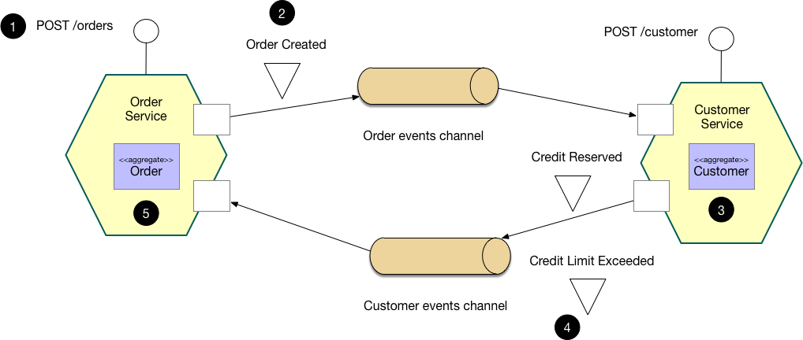
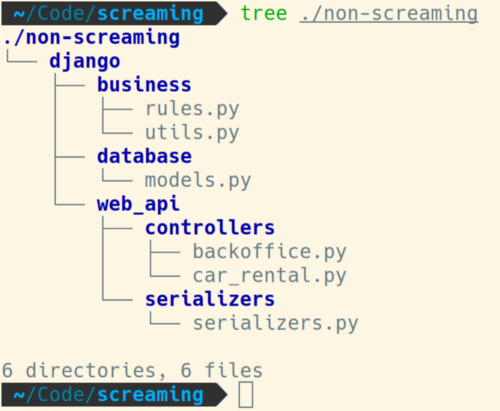
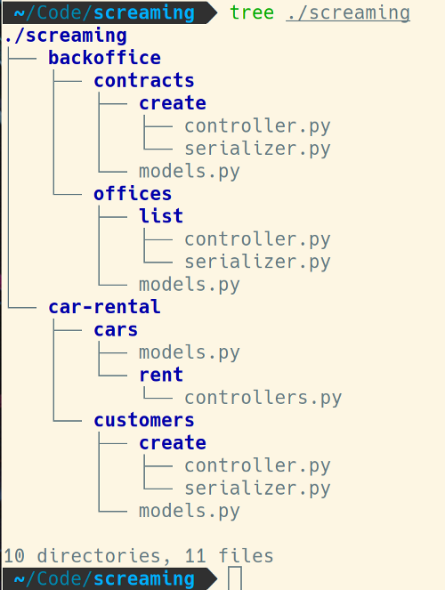
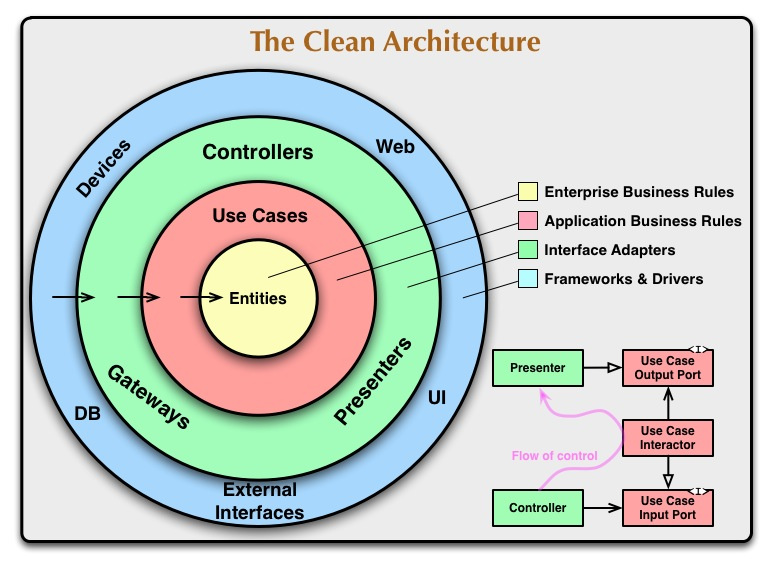
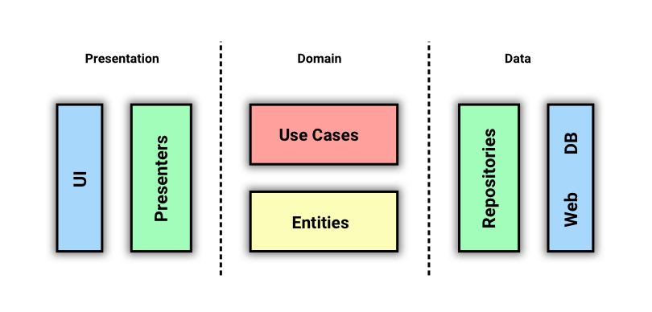

### Architecture

#### Критерии mission critical систем

Для достижения уровня доступности mission critical систем (99.99%) должны выполняться следующие минимальные требования:
* приложение должно быть георезервировано:
    * во избежание проблем (отключение электричества / любое происшествие) с отдельно взятым ЦОД (центром обработки данных,
      т.е. местом, где находятся сервера), необходимо диплоить приложение сразу в несколько ЦОД, желательно достаточно
      разнесенных друг от друга (например, находящихся в разных городах);
* в рамках каждого ЦОД приложение должно быть развернуто в необходимом количестве инстансов:
    * количество инстансов приложения рассчитывается по формуле: (EL / SL) * MF:
        * EL (expected load) - ожидаемая нагрузка на сервис со стороны потребителей;
        * SL (service load) - максимально выдерживаемая инстансом сервиса нагрузка, количественный показатель которой
          должен быть получен по результатам проведения НТ (нагрузочного тестирования);
        * MF (multiplication factor) - коэффициент умножения, точный количественный показатель которого может зависеть от
          особенностей приложения:
            * например, приложения использующие принципы кворума рекомендуется развертывать в нечетное количество инстансов:
                * стоит заметить, что в таком случае также следует использовать нечетное количество ЦОД'ов, т.к. например,
                  при разрыве сети между двумя ЦОД'ами будет наблюдаться эффект split brain (при одинаковом количестве инстансов
                  сервиса в каждом ЦОД), который может иметь крайне сложно разрешимые (даже в ручном режиме) последствия
                  после восстановления сети;
            * обычно, данный коэффициент >= 2 даже в условиях, когда один инстанс сервиса с запасом выдерживает заявленную
              нагрузку (на случай всплесков и возникновения неожиданных проблем с одним из инстансов).

_Примечание:_

Я специально выше использовал слово "нагрузка" (load), а не "пропускная способность" (throughput) в единицу времени,
чтобы избежать некоторых тонкостей при оперировании данным понятием.

Понятие пропускной способности (throughput) удобно использовать в ситуациях, когда все поступающие запросы и
действия, необходимые для их обработки одинаковы по размеру и сложности, соответственно:
* запросы могут сильно отличаться по размеру:
    * например, особенно актуально для файловых запросов;
        * для обработки крупных файловых запросов может потребоваться:
            * больше оперативной памяти:
                * если содержимое запроса обрабатывается не потоком;
            * больше места во временном каталоге:
                * если перед обработкой содержимого запроса необходимо выполнить какую-либо проверку
                  (например, проверить на соответствие ЭЦП);
            * больше времени на потоковую обработку запроса;
* запросы могут сильно отличаться по количеству действий, необходимых для их обработки:
    * продолжим пример с файловыми запросами, если в рамках файлового запроса может опционально (будет указываться
      в параметрах запроса) требоваться шифрование/дешифрование и/или наложение/проверка подписи на серверной стороне.

Таким образом, в общем случае, сначала потребуется определить специфику ожидаемой нагрузки, после чего можно будет
рассчитать минимальное количество инстансов сервиса, необходимое для того, чтобы выдержать данную нагрузку
(см. выше EL / SL), после чего это количество уже можно будет домножить на коэффициент (см. выше (EL / SL) * MF).

#### DDD. Расскажите в чем основная суть подхода

Ответ: DDD (Domain Driven Design) - это подход, который нацелен на изучение предметной области предприятия в целом или
каких-то отдельных бизнес-процессов. Это отличный подход для проектов, в которых сложность (запутанность) бизнес-логики
достаточно велика. Его применение призвано снизить эту сложность, насколько возможно.

**Единый язык (Ubiquitous language)**

Вне подхода DDD, когда программист пишет код, больше внимания он уделяет технологиям и инфраструктуре, например,
как отправить сообщение, как его получить, закодировать, сохранить в базу данных, в какую именно базу данных.

Подход DDD говорит о том, что всё это, конечно, важно, но вторично. Бизнес главнее и должен стоять на первом месте.
И чтобы все это заработало вместе, DDD учит нас (разработчиков) разговаривать с бизнесом на одном языке.
Не на языке программирования, а на языке бизнеса.
Это называется в DDD "Единый язык (Ubiquitous language)".

**Ограниченный Контекст (Bounded Context)**

Ограниченный Контекст (Bounded Context) — ключевой инструмент DDD, это явная граница, внутри которой существует модель
предметной области. Она отображает единый язык в модель программного обеспечения. Именно на основании контекстов можно
разделить код на модули/пакеты/компоненты таким образом, чтобы изменения в каждом из них оказывали минимальное
(или нулевое) влияние на других.

Для разработчиков такой подход позволяет вносить изменения в код не опасаясь, что где-то в другом месте что-то сломается
(например, менять что-то в кассе и не переживать, что из-за этого что-то отвалится у курьеров).

Для тимлидов такой подход позволяет в значительной степени распараллелить работу команд(ы), что может значительно
ускорить работу по проекту.

**Как понять, что пора применять DDD**

Посчитайте количество сценариев использования вашей системы. Если их в районе 10-15, значит бизнес-логика не такая
сложная, и вы можете никакого DDD не применять.

Если у вас 30-50 и более UX-кейсов, и они очень сильно пересекаются, имеет смысл задуматься над применением DDD хотя
бы в какой-то части системы.

Подробнее см. [здесь](https://habr.com/ru/company/dododev/blog/489352/).

#### SOA архитектура

SOA – это модульный подход в разработке приложений, основанный на использовании распределенных, слабо связанных,
заменяемых компонентов, доступных по сети и предоставляющих четко-определенный формат общения, никоим образом не
диктующий способ реализации.

В 2009 году был опубликован манифест (soa-manifesto.org), описывающий шесть наиболее значимых положений SOA, гласящих следующее:

* ценность бизнеса важнее технологических средств;
* стратегические цели важнее, чем выгода конкретных проектов (иначе говоря, стратегические цели важнее тактических);
* внутренняя совместимость важнее, чем точечная интеграция;
* общие (распределенные и переиспользуемые) сервисы важнее, чем узкоспециализированные;
* гибкость важнее, чем оптимизация;
* усовершенствование в развитии важнее, чем стремление к изначальному совершенству.

Звучат они так же абстрактно, как и сам SOA. Давайте рассмотрим эти принципы подробнее.

Ценность бизнеса важнее технологических средств

Необходимость адаптации под изменения в бизнесе является важнейшей стратегической целью. Следовательно, основополагающий
принцип SOA заключается в ориентации на бизнес.

Речь идет не о технологиях, определяющих направление бизнеса, а о видении бизнеса, определяющем допустимый стек
технологий для решения его задач.

Если совсем просто, то принцип говорит нам о том, что не нужно гнаться за техническим хайпом и внедрять новую
технологию, потому что вы услышали о ней на конференции. В первую очередь нужно понять, а какую ценность для бизнеса
принесет эта технология и принесет ли она ценность вообще?

Все остальные положения (ценности и принципы) манифеста, так или иначе, поддерживают реализацию данного положения.

Стратегические цели важнее выгоды конкретных проектов

Исторически так сложилось, что многие IT проекты были сосредоточены исключительно на создании приложений, проектируемых
специально для автоматизации бизнес процессов, которые были актуальны в то время.

Такой подход позволял удовлетворять насущные потребности отдельно взятого проекта (т.е. тактические, но не
стратегические потребности), но по мере того, как появлялось все больше и больше таких приложений, в результате,
оказывалось, что все состоит из таких “изолированных островков”, наполненных логикой и данными, которые, фактически,
являются полностью изолированным приложениями.

По мере поступления новых бизнес требований, либо появлялись новые изолированные приложения, либо устанавливались связи
между уже существующими, которые абсолютно не были адаптированы для этих целей.

Со временем (при поступлении очередных бизнес требований) каналы интеграции между такими приложениями приходилось еще
больше расширять, а также создавать новые “изолированные приложения”.

Вскоре, IT ландшафт становился все более:

* сложным;
* дорогим в поддержке;
* медленным в развитии.

Во многих отношениях данное положение SOA возникло самостоятельно в ответ на эти насущные проблемы. Таким образом, эта
парадигма представляет собой альтернативу разработке приложений, специфичных для отдельно взятого проекта, разрозненных
относительно остальных окружающих проектов. Альтернатива предоставляется путем определения приоритетов для достижения
долгосрочных стратегических бизнес-целей.

В целевом виде, предполагается, полное отсутствие “изолированных приложений”, но даже если таковые имеются (например, по
причинам наследования), то они должны быть доведены до такого состояния, в котором они насколько только возможно
лаконично интегрированы с окружением.

Внутренняя совместимость важнее, чем точечная интеграция

Давайте для начала поймем, что такое точечная интеграция. Как мы уже выяснили, изолированные приложения - это плохая
практика в SOA. Но даже изолированным приложениям в одной системе нет-нет, да и нужно обмениваться данными друг с
другом. Под точечной интеграцией тут понимается реализация функции обмена данными индивидуально под каждую такую задачу.
Системы, которые используют такой подход обычно характерны отсутствием четкой структуры API и наличием множества
протоколов взаимодействия. Поддержка такой системы становиться дорогостоющей и трудемкой, а также может привести к
слабым местам в архитектуре, развитие которой со временем станет обременительно.

Совместимость же, напротив, нацелена на проектирование систем с четкой структурой API и возможностью интегрировать
приложения без доработок или с минимальными доработками.

Одна из целей SOA - свести к минимум необходимость индивидуальных (точечных) интеграций путем формирования приложений (в
рамках одной доменной области) таким образом, чтобы они были изначально совместимы за счет стандартизации протоколов и
базовых форматов взаимодействий.

Общие сервисы важнее, чем узкоспециализированные

Одна из важных характеристик системы - инкапсуляция логики, которая может быть совместно использована во множестве мест
для поддержки автоматизации различных бизнес-процессов.

Принцип гласит, что вместо того, чтобы реализовывать какую-либо функцию, например, функцию отправки уведомлений отдельно
для каждого сервиса [слайд-13] лучше будет вынести эту функцию в отдельный сервис для возможности его переиспользования.
Переиспользуемый сервис становится ресурсом, который обеспечивает повторяемую ценность для бизнеса, снижая при этом
затраты и усилия для предоставления решений по автоматизации новых бизнес требований.

Традиционные одноцелевые приложения, при этом, отвечают только за решение своих бизнес требований, т.е. отвечают только
за тактические цели, абсолютно не закладываясь на стратегические цели компании.

Гибкость важнее, чем оптимизация

Оптимизация, в первую очередь, отвечает за извлечение тактических выгод за счет адаптации/настройки отдельно взятого
приложения, либо ускорения процесса его разработки или delivery для удовлетворения текущих потребностей.

В самом этом действии нет ничего плохого, за исключением того, что оно может привести к появлению ранее упомянутых
“изолированных приложений”. Такое может произойти в случае, если при оптимизации не будет в нужной степени выставлен
приоритет относительно повышения, ну или, хотя бы, сохранения гибкости системы.

Это означает, что при изменении существующего бизнес-процесса или при внедрении нового мы должны иметь возможность
добавлять, удалять или расширять сервис с минимальными усилиями.

Для примера возьмем тот самый сервис уведомлений с предыдущего слайда. Вместо того, чтобы делать отправку уведомлений
только по E-mail имеет смысл задуматься о более универсальном механизме, который позволит добавлять в будущем другие
каналы отправки уведомлений. Это может потребовать немного больше времени на разработку, но принесет существенную пользу
в будущем за счет гибкости решения.

Усовершенствование в развитии важнее, чем стремление к изначальному совершенству

Для обеспечения гибкости организации, IT сервисы должны развиваться параллельно с бизнесом, но проблема в том, что, как
правило, сложно заранее предсказать, как бизнесу следует развиваться с течением времени. В связи с чем, отсутствует
возможность изначально построить сервисы идеально.

Тем не менее, как правило, на основании существующей бизнес аналитики организации можно получить достаточно информации
для проектирования сервисов согласно принципам SOA.

Использование этой информации вместе с принципам SOA, а также проверенными методологиями разработки может помочь
определить набор сервисов, которые отражают то, как бизнес существует и работает сегодня, при этом закладывая уровень
гибкости, необходимый для того, чтобы адаптироваться к возможным изменениям бизнеса с течением времени.

Альтернативные манифесту интерпретации

Параллельно с формированием манифеста гиганты индустрии (по типу Microsoft) и ряд других активных участников индустриальных стандартов опубликовали свои собственные принципы, базовые из которых звучат следующим образом:

* переиспользуемость сервисов:
    * по факту, является аналогом одного из рассмотренных положений манифеста: “общие (распределенные и переиспользуемые)
      сервисы важнее, чем узкоспециализированные (реализованне для конкретных целей бизнеса)”;
* независимость от технологического стека:
    * также совпадает с одним из рассмотренных положений манифеста: “ценность бизнеса важнее технологических средств”;
* автономность:
    * заключается в независимости сервисов при:
        * эволюционировании/развитии/версионировании;
        * масштабируемости;
        * развертывании;
* ориентированность на пользователей:
    * данная ориентированность также явно прослеживается в ряде положений манифеста, но не выделяется в них в виде
      отдельного пункта.

Подробнее см. [здесь](https://drive.google.com/drive/u/0/folders/1x5YQLrUcOC6ArRjvRg5_7mm45U5KNYKa).

#### Принцип CQRS

Ответ

CQRS расшифровывается как Command Query Responsibility Segregation (разделение ответственности на команды и запросы),
т.е. принцип гласит, что точка доступа (endpoint) сервиса, либо сервис целиком является либо командой, выполняющей
какое-то действие, либо запросом, возвращающим данные, но не является одновременно и тем и тем.

Другими словами:
* запрос на получение данных (Query) не должен изменять состояние сервиса;
* запрос на изменение данных (Command) не должен возвращать данные, не связанные со статусом/результатом выполнения записи.

При реализации принципа CQRS поверх протокола HTTP можно достаточно легко вывести соответствие с методами последнего:
* Query соответствует метод GET;
* Command соответствуют методы POST / PUT / DELETE.

В более высокоуровневой архитектурной интерпретации данный принцип декларирует разделение операций чтения и записи.

Одной из естественных причин появления CQRS в системе является несимметричность нагрузки и/или сложности бизнес-логики,
закладываемой в рамках операций чтения и записи.

В частности, обычно, большая часть бизнес-логики и нетривиальных проверок сосредоточены именно вокруг операции записи.
При всем этом, операция чтения, в среднем, вызывается намного чаще операции записи.

Эта разнотипность профилей работы и использования операций чтения и записи является основной причиной внедрения
принципа CQRS в рамках сервиса.

При его внедрении акцентируется внимание на двух основных моментах:
* разделение доменных моделей, используемых в рамках операций чтения и записи;
* разделение областей хранения данных (например, БД), используемых в рамках операций чтения и записи.

В простейшем варианте реализации допустимо разделение только доменной модели, без разделения используемых хранилищ.
Такой подход сильно упрощает реализацию, но, по факту, не позволяет полноценно разделить операции чтения и записи,
как следствие, не позволяет воспользоваться всеми преимуществами, привносимыми принципом CQRS.

В противном случае, для операций чтения и записи выделяются отдельные персистентные хранилища, каждое из которых
адаптировано под выполняемые над ним действия. Как следствие, каждое хранилища могут быть разных типов. Например, одно
из них может быть реляционной БД, а другое - чем-то иным.

Хранилище, используемое в рамках доменной модели на получение данных (т.е. для чтения, далее Read Store) насколько
возможно адаптировано под эту модель, т.е. структура хранения данных строится, ориентируясь на формат запросов данных. В
дополнение к этому под запросы полностью адаптируются навешиваемые на данные индексы (что особенно актуально в случае
использования реляционных БД).

Хранилище, используемое в рамках доменной модели на обновление (запись/изменение) данных (далее, Write Store), может
быть представлено во множестве различных вариантов. Начиная от обычной реляционной БД, адаптированной соответствующим
образом под операции записи, заканчивая персистентным хранилищем event’ов, отражающих изменение состояния данных (дельту
относительно предыдущего состояния).

Особенности использования последнего типа хранения мы, как раз, подробнее рассмотрим далее в этом уроке.

Вследствие наличия двух несвязанных хранилищ требуется некоторый механизм синхронизации хранилища, используемого в
рамках операций записи, с хранилищем, используемым в рамках операций чтения, т.к. первое всегда будет являться
“источником истины” для второго.

Механизм может быть реализован множеством различных вариантов. Например, за счет откидывания событий (event’ов),
отражающих изменения состояния данных во Write Store, в доменную модель, работающую с Read Store, чтобы та сама
необходимым образом обновила модель данных в Read Store.

Потенциально, дополняя этот механизм периодическим перестроением модели данных (всей или её части) в Read Store за счет
данных из Write Store.

Стоит заметить, что подход, заключающийся в представлении данных одной доменной модели, в виде иной структуры
соответствует одному из паттернов Domain-Driven Design (DDD) под названием Projector.

#### Принцип Event Notification

Ответ

Данный принцип предполагает, что при сколько-нибудь значимом изменении состояния системы (в нашем текущем контексте, под
системой подразумевается отдельно взятый сервис) происходит отправка в Event Channel (событийный канал) уведомления (
notification’а), содержащего информацию о произошедшем событии (event’е).

Таким образом, события являются зарегистрированными фактами произошедших действий, как следствие, события не могут (по
крайней мере, не должны) быть изменены.

В качестве event channel может выступать как web service endpoint (т.е. обычный http endpoint), так и message
queue/topic (т.е. некоторый канал сообщений).

Рассмотрим на примере:
* клиент изменяет данные в своем профиле (прикладывает/изменяет аватар или обогащает иные личные данные), отправляя
  запрос в сервис клиентского профиля;
* сервис клиентского профиля изменяет свое состояние (за счет обновления информации о клиенте в соответствующем
  хранилище сервиса, например, в БД);
* сервис клиентского профиля отправляет уведомление в event channel об изменении состояния в профиле клиента после чего
  успешно отвечает клиенту; сервис аудита вычитывает уведомление из event channel и записывает к себе во внутреннее
  хранилище информации о действиях клиента.

Последние два пункта могут меняться места в зависимости от типа используемого event channel (web endpoint или message
queue/topic).

Стоит заметить, что при использовании message queue/topic в качестве event channel, то в большинстве случаев, в качестве
синхронного ответа при размещении уведомления (о событии) ожидается лишь “отбивка” о том, что уведомление было принято,
т.е. используется асинхронный механизм обработки уведомления.

#### Pattern Event Sourcing

Ответ

Концепция event sourcing заключается в сохранении состояния бизнес сущностей в виде последовательности событий,
изменивших их состояние.

Данный принцип базируется на системе уведомлений о событиях, заложенной принципом Event Notification, но при этом обязывает:
* отправлять уведомления о событиях на любое изменение, происходящее в системе и влияющее на ее состояние;
* последовательно сохранять уведомления в некотором персистентном хранилище.

Причем, уведомления о событиях обязательно должны отправляться в event channel в той же последовательности, в которой
происходило обновление данных согласно бизнес-логике. Все уведомления, отправленные в event channel, асинхронно
вычитываются отдельным сервисом и сохраняются в персистентное хранилище (например, в БД).

В частном случае, непосредственно event channel может являться тем самым персистентным хранилищем (например, при
использовании Kafka в качестве event channel). В таком случае, для персистирования (долгосрочного хранения) последовательности событий не требуется никаких
дополнительных действий. Разве что, настроить соответствующим образом времени жизни сообщений (retention period) в
рамках этого персистентного event channel.

Имея в персистентном хранилище все события (event’ы) об изменении состояния системы, сохраненные в порядке логического
их исполнения (далее, event log’а), открываются удивительные возможности.

Event log становится “источником истины”, т.к. состояние системы становится полностью воссоздаваемо (выводимо) за счет
последовательного воспроизведения событий (“replay events”) event log’а.

Стоит заметить, что подход, заключающийся в группировке изменений данных и применению их к некоторому агрегированному (
т.е. собирательному) состоянию соответствует одному из паттернов Domain-Driven Design (DDD) под названием Aggregator.

Вследствие наличия таких особенностей, у приложения появляется возможность хранить свое состояние в любом из удобных ему
вариантов:

* полностью in-memory (за счет replicated или distributed cache, рассмотренные на предыдущем уроке в рамках
  архитектурного стиля Space-Based);
* полность персистентно (на диске, либо в специальном хранилище по типу БД);
* гибридно (каким-либо образом совмещать вариант хранения in-memory с персистентностью).

В случае хранения состояния системы полностью in-memory при рестарте её In-Memory Data Grid (штатном или после падения)
потребуется восстановление состояния, в котором находилась система в момент падения.

Состояние системы (“пустой на момент старта”) может быть восстановлено за счет последовательного извлечения из event
log (в естественном порядке) событий и “накатывания” изменений из них друг за другом на систему (на ее IMDG).

Стоит заметить, что таким же образом может быть полностью восстановлено состояние системы на любой момент времени (не
обязательно на последний) за счет прекращения вычитывания событий после определенной временной метки.

Такая возможность может быть весьма полезной в ряде ситуаций. Например, для точного воссоздания на тестовой среде
состояния системы на определенный момент времени при определении причины возникновения сложно
воспроизводимого/фантомного дефекта.

Стоит заметить, что в такой ситуации в случае работы с конфиденциальными данными также может возникнуть необходимость их
обезличивания в случае предоставления такой восстановленной среды разработчику/тестировщику, который не должен иметь
доступ к данным такого типа (во избежание потенциальных утечек данных или иных проблемных ситуаций). Тем не менее, это
не является темой нашего урока, поэтому не станем сильно акцентировать на этом внимание и будем двигаться дальше.

Очевидно, что в рамках крупного высоконагруженного сервиса производить процедуру восстановления состояния системы за
счет последовательного “накатывания” на систему абсолютно всех событий с самого первого является крайне расточительным и
может занимать неприемлемое количество времени (в зависимости от количества ивентов и объема изменений, выполняемых в
рамках каждого из них).

В качестве решения проблемы может использоваться подход, заключающийся в периодическом создании snapshot’ов, т.е.
образов, хранящих состояние системы на определенный момент времени.

Например, каждый день в 03:00 ночи может создаваться snapshot, полностью отражающий состояние системы на тот момент.
Snapshot сохраняется в отдельное персистентное хранилище (например, в БД или даже Kafka). Сама же система в процессе
работы (при возникновении новых изменений в системе) продолжает отправлять события в event channel.

В случае рестарта / падения системы, работающей в режиме in-memory (или гибридном с ним), для восстановления состояния:

* извлекается последний snapshot;
* в систему подгружается его состояние;
* из event log последовательно вычитываются все event’ы начиная с момента времени, в который был сделан использованный
  snapshot (он тем или иным образом должен содержать метку времени);
* изменения из каждого вычитанного event’а “накатываются” на систему.

Принципы CQRS и Event Sourcing довольно хорошо комбинируются вместе, например, следующим образом:

Сервис разбивается на две части:
* одна для обработки commands (запросов на изменение данных);
* вторая для обработки queries (запросов на получение данных).

При обработке запроса на изменение данных (command) компонент сервиса под названием aggregator (реализующий один
из одноименных паттернов DDD, упомянутых ранее):
* извлекает из Event Store (он же event log) все event’ы, связанные с изменяемыми данными;
* последовательно применяет упорядоченные в естественном порядке события к агрегированному (т.е. собирательному)
  состоянию модели данных (первое событие применяется к пустой модели):
    * этот и предыдущий этап могут быть оптимизированы либо за счет применения ранее рассмотренных snapshot’ов, либо за
      счет использования консистентного варианта IMDG (in-memory data grid);
* применяет новое событие (из command) на получившуюся модель данных;
* проверяет соблюдение бизнес-ограничений (constraints), накладываемых на данные:
    * если какое-либо из ограничений не выполняется, то процесс обработки прекращается, клиенту возвращается ошибка;
* добавляет новый event в Event Store;
* отправляет клиенту успешный ответ.

Компонент под названием Projector (реализующий один из одноименных паттернов DDD, упомянутых ранее):
* вычитывает из Event Store новый event, добавленный другой частью сервиса в процессе обработки command:
    * реализуется за счет подписки на новые event’ы в Event Store;
* вычитывает из БД entity (текущее состояние объекта) по ID, присутствующему в event’е;
* применяет изменения из event’а к entity;
* записывает обновленный entity обратно в БД.

При обработке запроса на получение данных (query) соответствующий компонент сервиса просто вычитывает из БД entity,
связанную с запрошенными данными и возвращает её в ответе:
* обычно перед возвращение ответа происходит минимальное преобразование формата данных, полученных из БД, в формат
  запрошенной доменной модели (либо преобразования не происходит вовсе, если они полностью совпадают), т.к. база данных
  для запросов проектировалась именно ориентируясь на данную доменную модель.

Подробнее см. [здесь](https://microservices.io/patterns/data/event-sourcing.html).

#### Pattern SAGA

Принцип SAGA является одним из вариантов решения вопроса: "Как реализовать транзакции, охватывающие несколько сервисов?"

SAGA - это последовательность локальных транзакций (в рамках каждого сервиса). Каждая локальная транзакция обновляет
базу данных и публикует событие (об изменении объекта), что является тригером для начала другой локальной транзакции
(в рамках другого сервиса).

Если транзакция завершается неудачно (например, из-за нарушения какого-либо бизнес ограничения), то в рамках сервисов,
участвующих в SAGA, выполняется серия компенсирующих транзакций (транзакций отката), т.е. действий которые отменяют
изменения состояния, внесенные предыдущими локальными транзакциями.

Другими словами, каждая локальная транзакция должна снабжаться инструкцией по её откату (undo / rollback).

Пример Choreography-based saga

1. Order Service (сервис заказов) получает запрос POST /orders и создает Order (заказ) в статусе PENDING (в ожидании);
2. Затем Order Service публикует event (событие) Order Created (о создании заказа);
3. Customer Service (сервис обслуживания клиентов) вычитывает event и пытается зарезервировать средства на сумму заказа;
4. Затем Customer Service публикует event, содержащий результат попытки резервирования средств;
5. Order Service вычитывает event и либо принимает, либо отклоняет Order (заказ) в зависимости от содержимого
   вычитанного события.

Пример Orchestration-based saga

1. Order Service (сервис заказов) получает запрос POST /orders и вызывает Create Order в Saga Orchestrator;
2. Saga Orchestrator создает Order (заказ) в статусе PENDING (в ожидании);
3. Затем Saga Orchestrator отправляет Reserve Credit (запрос на резервирование средства) в Customer Service (сервис
   обслуживания клиентов);
4. Customer Service вычитывает event и пытается зарезервировать средства на сумму заказа;
5. Затем Customer Service публикует event, содержащий результат попытки резервирования средств;
6. Saga Orchestrator вычитывает event и либо принимает, либо отклоняет Order (заказ) в зависимости от содержимого
   вычитанного события.

Подробнее см. [здесь](https://microservices.io/patterns/data/saga.html).

#### Screaming Architecture

Термин "кричащая архитектура" применяется в тех случаях, когда мы можем просто взглянув на проект сразу же получить
основное представление о том, что делает проект и о чем он, а не о том, какие фреймворки в нем используются.

Например, такого эффекта можно достичь, если при построении структуры каталогов сосредоточиться на не технологических
аспектах, а постараться отразить бизнес структуру:

Подробнее см. в [оригинальной статье](https://blog.cleancoder.com/uncle-bob/2011/09/30/Screaming-Architecture.html) или
[её интерпретации](https://levelup.gitconnected.com/what-is-screaming-architecture-f7c327af9bb2).

#### Clean Architecture & Onion architecture

Ответ

Clean Architecture объединила в себе идеи нескольких других архитектурных подходов, которые сходятся в том, что архитектура должна:
* быть тестируемой;
* не зависеть от UI;
* не зависеть от БД, внешних фреймворков и библиотек.

Это достигается разделением на слои и следованием Dependency Rule (правилу зависимостей).

Dependency Rule говорит нам, что внутренние слои не должны зависеть от внешних. То есть наша бизнес-логика и логика
приложения не должны зависеть от презентеров, UI, баз данных и т.п. На оригинальной схеме это правило изображено
стрелками, указывающими внутрь.

Имена сущностей (классов, функций, переменных, чего угодно), объявленных во внешних слоях, не должны встречаться в коде
внутренних слоев. Это правило позволяет строить системы, которые будет проще поддерживать, потому что изменения во внешних слоях не
затронут внутренние слои.

Такой способ представления уровней абстрации в виде слоев получил название слоистой архитектуры (onion architecture),
и визуализировался примерно следующим образом:

Более удобное для восприятия линейное представление этой же схемы:

А теперь давайте рассмотрим схему с точки зрения потока обработки:

Событие пользователя идет в Presenter, тот передает в Use Case. Use Case делает запрос в Repository. Repository получает
данные где-то, создает Entity, передает его в UseCase. Так Use Case получает все нужные ему Entity. Затем, применив их и
свою логику, получает результат, который передает обратно в Presenter. А тот, в свою очередь, отображает результат в UI.

Как видите, согласно этой схеме UseCases взаимодействует с Repositories, т.е. из внутреннего слоя присутствует
взаимодействие с внешним. На первый взгляд, в этом месте кажется, что нарушается правило зависимостей снаружи вовнутрь.

Чтобы зависимость была направлена в сторону обратную потоку данных, применяется принцип инверсии зависимостей (буква D
из аббревиатуры SOLID). То есть, вместо того чтобы UseCase напрямую зависел от Repositories’a (что нарушало бы
Dependency Rule), он зависит от интерфейса в своём слое, а Repositories должен этот интерфейс реализовать.

Подробнее см. в [оригинальной статье](https://blog.cleancoder.com/uncle-bob/2012/08/13/the-clean-architecture.html) или
[её интерпретации](https://habr.com/ru/company/mobileup/blog/335382/).

### SEDA архитектура

SEDA (Staged event-driven architecture) - архитектурный стиль, который разбивает сложное приложение, работающей поверх
концепции event-driven на несколько более маленьких и простых сервисов.

С логической точки зрения каждый сервис является конкретным этапом обработки данных в строго выстроенной
последовательной цепочке обработчиков (других сервисов), между каждыми из которых используется очередь (JMS / Kafka / ...).

Особенности применения подхода:
* избегание overhead'а, связанного с thread-based concurrency (locking / unlocking / polling for lock);
* низкая связность и четко ограниченный уровень ответственности серисов:
    * каждый сервис четко соответствует концепции Single Responsibility (из SOLID), не имея представления о том, что с
      данными происходит на последующих этапах.

#### Monolith, MicroServices и ServiceMesh

Monolith

Monolith Architecture - архитектурный стиль, в рамках которого все сервисы (технические и бизнес сервисы) упаковываются
в единый дистрибутив (UI, бизнес логика и общие переиспользуемые библиотеки) и запускаются на сервере в рамках одного
процесса.

Стоит заметить, что исходный код различных модулей приложения может находиться в различных репозиториях, но в конечном
итоге он собирается в единый дистрибутив, который устанавливается на сервер в рамках одного процесса.

Если вы установите несколько серверов с одним и тем же сервисом, то это все еще территория монолита. Таким образом, если
вы горизонтально масштабируете монолит - он не перестает быть монолитом.

Такой подход имеет следующие плюсы:
- `+` простота в разработке:
    - вследствие того, что весь код находится в одном репозитории (в большинстве случаев), то любой уровень доработок
      реализуется не выходя из одного проекта IDE;
- `+` простота в разворачивании:
    - требуется выполнить deploy одного WAR файла (или иерархии каталогов) в соответствующее окружение;
- `+` простота в масштабировании:
    - легко можно запустить несколько инстансов приложения, расположив перед ними балансировщик (если монолит хранит
      состояние in-memory (не stateless), то на уровне балансировщика вероятно потребуется использование механизма
      sticky session (залипания на конкретный инстанс на основании сессионной Cookie)).

Конечно же, такой подход имеет и ряд очень существенных минусов:
- `-` для сколько-нибудь крупных проектов кодовая база очень сильно разрастается:
    - в ней становится сложно ориентироваться не только новичкам, но и даже опытным разработчикам;
    - в IDE намного проще и удобнее работать с маленькими проектами (IDE работает намного быстрее);
- `-` чем больше приложение, тем больше ему требуется времени для запуска:
    - что помимо непосредственного влияния на установку новых инстансов на стенды оказывает также существенное влияние на
      работу разработчиков из-за времени, которое они тратят впустую на ожидание его запуска;
- `-` CD (continuous delivery) становится затруднительным из-за масштабов проекта:
    - долго диплоится;
    - медленно запускается;
    - для того чтобы обновить один компонент, потребуется выполнить redeploy всего приложения:
        - останавливая работу всех сервисов инстанса монолита, которые даже не были изменены;
            - могут быть затронут процесс обработки фоновых задач (scheduled tasks), что может повлечь проблемы при старте
              приложения после обновления;
- `-` отсутствие возможности масштабирования каждого сервиса/компонента отдельно в соответствии с его спецификой нагрузки:
    - горизонтальное масштабирование происходит для всех сервисов разом, порождая избыточное потребление ресурсов;
- `-` сложности в масштабировании разработки при больших объемах, которые являются препятствие для масштабируемости
  в развитии сервисов:
    - когда приложение достигает определенного размера полезно выполнить разделение на команды, которые сосредоточены на
      определенных функциональных областях (UI / платформенные сервисы / бизнес сервисы / инфраструктура), но проблема
      монолитного приложения зачастую заключается в том, что сложно построить процесс таким образом, чтобы команды могли
      работать независимо друг от друга:
        - командам приходится регулярно координировать свои действия;
- `-` накладывается долгосрочное ограничение в стеке технологий:
    - монолитная архитектура вынуждает вас писать сервисы в рамках уже используемого стека технологий (за исключением
      внешних интеграций);
    - довольно сложно постепенно внедрять новые технологии;
    - если используемая вами платформа/framework устарели, то довольно сложно постепенно перевести приложение на новую
      платформу/framework.

Подробнее см. [здесь](https://microservices.io/patterns/monolithic.html).

MicroServices

MicroServices Architecture - это архитектурный стиль построения приложений, как слабо связанных, взаимодействующих
сервисов.

Принцип разделения на сервисы может быть разным, но обычно используется принцип разделения областей ответственности,
т.е. в каждый сервис выделяется насколько возможно самодостаточная область бизнес логики (либо технологического сервиса).

Данный принцип деления позволяет сделать сервисы максимально независимыми друг от друга.

Если сервису требуется наличие персистентного хранилища, то рекомендуется для каждого сервиса иметь свое собственное
во избежания аффекта одного другим (например, при обновлении СУБД).

Если требуется межсервисное взаимодействие, то обычно используются стандартизированные протоколы:
* синхронное взаимодействие:
    * HTTP в стиле RESTful, либо JSON-pure;
* асинхронное взаимодействие:
    * Kafka / JMS / AMQP в стиле event notification.

В идеале, между сервисами поддерживается консистентность тем или иным механизмом.
Для этих целей отлично подойдет такой паттерн как Saga, но он потребует дополнительных накладных расходов.

Такой подход имеет следующие плюсы:
- `+` позволяет эффективно выстраивать CD (continuous delivery) любых масштабов:
    - удобство в тестировании;
    - удобство в развертывании:
        - каждый сервис может обновляться и диплоиться независимо от остальных;
    - организация работы под автономные команды, владеющие одним или несколькими сервисами:
        - каждая команда может разрабатывать / тестировать / диплоить и масштабировать свои сервисы независимо от других;
- `+` каждый микросервис относительно невелик:
    - простота в понимании (относительно низкий порог вхождения);
    - IDE работают значительно быстрее, повышая производительность разработчика;
    - приложения стартуют быстро:
        - повышая производительность разработчика;
        - позволяя использовать их в рамках оркестрирующих сред (cloud native);
- `+` изоляция точек отказа:
    - если по какой-либо причине отказал один сервис (например, из-за ошибки, допущенной в новой версии), то это не
      заденет соседние сервисы;
        - для контр-примера: один отказавший компонент монолите легко может вывести из строю весь инстанс монолитного приложения;
- `+` низкая связность со стеком технологий:
    - возможность использования своего стека технологий в рамках каждого сервиса;
    - возможность относительно безболезненой инкрементальной смены стека технологий в рамках отдельно взятого сервиса;

Такой подход имеет следующие минусы:
- `-` разработчикам приходится сталкиваться с дополнительными сложностями при разработке распределенных систем:
    - требуется проработка межсервисных сетевых взаимодействий и сценарии в случае отказа на том или ином участке
      взаимодействия:
        - потребуется координация между командами, занимающимися разработкой этих сервисов;
    - тестирование межсервисных взаимодействий может оказаться на столь простой задачей;
    -
- `-` потенциальные дополнительные затраты ресурсов:
    - микросервисы заменяют N монолитных приложений, грубо говоря, на N*M микросервисов, каждый из которых может нести
      дополнительные накладные инфраструктурные расходы для своей работы, например:
        - если это Java сервисы, то каждый будет запущен в своей изолированной JVM, потребляющей накладные расходы на свою
          работу;
        - если каждый сервис работает в рамках своей VM (вирутальной машины), то объем накладных расходов сильно
          увеличивается (каждая VM стартует свою ОС и виртуальную копию hardware).

Подробнее см. [здесь](https://microservices.io/patterns/microservices.html).

ServiceMesh

ServiceMesh - выделенный слой инфраструктуры для облегчения связей между сервисами (микросервисами) с использованием
прокси шлюзов.

ServiceMesh состоит из:
- data plane:
    - сетевых прокси-шлюзов, располагающихся в пару к каждому сервису (SideCar proxy, например, Envoy):
        - перехватывают межсервисные вызовы, выполняя их самостоятельно, при этом инкапсулируя в себе выполнение ряда
          важных функций, к основным из которых можно отнести следующие:
            - load balancing;
            - TLS enabling / offloading;
            - Circuit Breaker;
            - Tracing;
- control plane:
    - набора сервисов по управлению прокси-шлюзами, выполняющих функции:
        - service discovery - отслеживание сервисов (поднятие/остановки/зависание инстансов сервисов), что необходимо для:
            - сообщения актульных данных об инстансах сервисов на уровень data plane (т.е. каждому SideCar proxy) для
              выполнения их непосредственных функций.

Выделенный коммуникационный слой может предоставить ряд преимущества, таких как обеспечение наблюдения за межсервисными
взаимодействиями, обеспечение безопасных соединений и автоматизация повторных попыток отправки (с учетом использования
механизма Circuit Breaker) для неудачных запросов.

#### SOLID

Акроним для первых пяти принципов объектно-ориентированного программирования и проектирования:
* S - Принцип единственной ответственности (single responsibility principle):
    * Для каждого класса должно быть определено единственное назначение. Все ресурсы, необходимые для его осуществления,
      должны быть инкапсулированы в этот класс и подчинены только этой задаче.
* O - Принцип открытости/закрытости (open-closed principle):
    * «программные сущности должны быть открыты для расширения, но закрыты для модификации».
* L - Принцип подстановки Лисков (Liskov substitution principle):
    * «объекты в программе должны быть заменяемыми на экземпляры их подтипов без изменения правильности выполнения
      программы». См. также контрактное программирование.
* I - Принцип разделения интерфейса (interface segregation principle):
    * «много интерфейсов, специально предназначенных для клиентов, лучше, чем один интерфейс общего назначения»;
* D - Принцип инверсии зависимостей (dependency inversion principle):
    * «Зависимость на Абстракциях. Нет зависимости на что-то конкретное».

Подробнее см. [здесь](https://ru.wikipedia.org/wiki/SOLID_(%D0%BE%D0%B1%D1%8A%D0%B5%D0%BA%D1%82%D0%BD%D0%BE-%D0%BE%D1%80%D0%B8%D0%B5%D0%BD%D1%82%D0%B8%D1%80%D0%BE%D0%B2%D0%B0%D0%BD%D0%BD%D0%BE%D0%B5_%D0%BF%D1%80%D0%BE%D0%B3%D1%80%D0%B0%D0%BC%D0%BC%D0%B8%D1%80%D0%BE%D0%B2%D0%B0%D0%BD%D0%B8%D0%B5)).

#### принцип KISS, DRY

Принцип KISS ("Keep it simple, stupid" / "Делай проще, тупица") утверждает, что большинство систем работают лучше всего,
если они остаются простыми, а не усложняются. Поэтому в области проектирования простота должна быть одной из ключевых
целей, и следует избегать ненужной сложности.

Принцип DRY ("Don’t repeat yourself" / "Hе повторяйся") нацеленный на снижение повторения информации различного рода,
особенно в системах со множеством слоёв абстрагирования. Принцип DRY формулируется как: «Каждая часть знания должна
иметь единственное, непротиворечивое и авторитетное представление в рамках системы».