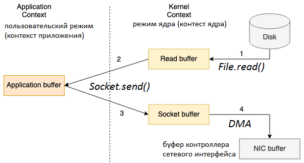

## Message Brokers

### Kafka

#### Расскажите про базовые концепции Kafka

Kafka - это платформа стриминга событий, которую можно интепретировать как распределенный брокер сообщений,
предоставляющий семантику доставки сообщений exactly-once.

Kafka работает как кластер из одного или более узлов, обычно, расположенных в различных ЦОД (дата центрах).

Ключевые концепции:
* Message - атомарная единица данных для Kafka:
    * каждое сообщение состоит из:
        * ключа (используется при выборе партиции в рамках топика - см. далее);
        * заголовков;
        * данных;
* Topic - логическая единица разделения потока сообщений (по аналогии с Queue / Topic из JMS):
    * на физическом уровне топик представлен в виде ряда партиций - файлов, в которых сообщения хранятся строго в порядке
      поступления;
* Broker - сервер, который хранит у себя партиции данных тех или иных Topic'ов:
    * каждая партиция данных хранится на нескольких брокерах:
        * один из брокеров является лидер, а остальные выступают в роли реплик (согласно концепции master/slave);
            * при падении лидера происходит выбор нового лидера среди реплик (посредством кворума при голосовании
              согласно алгоритму Raft);
* Producer - Kafka client, который публикует сообщения в Kafka Broker, являющийся мастером партиции в рамках Topic'а,
  в который происходит отправка Message:
    * для выбора партиции в рамках топика размещения используется key из сообщения (по умолчанию, выбор происходит согласно алгоритму
      consistent hash);
    * для получения информации о том, какой Kafka Broker является мастером необходимой партиции Topic'а, Producer
      с некоторой частотой запрашивает любой Kafka Broker топологию (информацию о том, какой Broker является мастером
      для каких партиций Topic'ов);
* Consumer - Kafka client, который вычитывает сообщения из Kafka Broker, являющимся мастером партиции в рамках Topic'а,
  который выдан на чтение Consumer'у:
    * единовременно одну партицию данных читает не более, чем один Consumer;
    * каждый Consumer относится к некоторой Consumer Group:
        * Consumer'ы каждой Consumer Group читая данные из Topic независимо от Consumer'ов другой Consumer Group:
            * если Consumer одного Consumer Group вычитает данные, то эти данные останутся доступными для Consumer'ов из
              другой Consumer Group;
    * при подключении нового Consumer'а на чтение данных из Topic'а происходит STW (stop the world) для всех Consumer'ов
      (в рамках Consumer Group) данного Topic'а:
        * все партиции Topic'а перераспределяются между Consumer'ами (одна партиция не может быть выдана на чтение сразу
          двум Consumer'ам в рамках одной Consumer Group);
        * после чего, все Consumer'ы (в рамках Consumer Group) продолжают чтение выданных им партиций.

Подробнее см. [здесь](https://medium.com/inspiredbrilliance/kafka-basics-and-core-concepts-5fd7a68c3193).

---

#### Что используется для управления кластером кафки

Для управления кластером Kafka используется ZooKeeper.

ZooKeeper выступает в роли центральной системы управления и согласования состояния Kafka Cluster.
Он занимается отслеживанием Kafka Broker'ов, выбором лидеров партиций данных в рамках Topic'ов (отвечает за
leader election), а также хранит прочие данные о кластере.

При выборе лидера ZooKeeper использует [алгоритм Raft](https://raft.github.io/).

Стоит заметить, что начиная с Kafka Version 2.8.0 поддерживается режим работы без ZooKeeper, который еще находится в
стадии beta-тестирования, поэтому не рекомендуется к использованию в production средах.

---

#### Как я могу получить split-brain в кафке?

Что такое split-brain

Kafka split-brain - это явление разделения Kafka кластера на две части, каждая из которых потеряла связь со второй
частью кластера, но при этом работает и считает, что она после разделения кластера достигла консенсуса в рамках
процедуры leader election для партиции каждого Topic'а. Поэтому не считает, что случилась критическая ситуация,
из-за которой необходимо остановить работу.

Как следствие каждая из частей кластера продолжает независимо от второй части принимать запросы от Producer'ов и
предоставлять данные Consumer'ам, тем самым нарушая консистентность целого кластера.

Как получить split-brain в Kafka

Пример условий для получения данного явления:
- в рамках кластера использовать четное количество серверов ZooKeeper, размещенных по ровну в двух ЦОД;
- разорвать соединение между ЦОД.

В ходе leader election каждая из половин получит ровно половину всех голосов и будет считать это достаточным для
легитимности.

---

#### Kafka zero-copy

На стороне Kafka Broker для оптимизации и ускорения работы активно используется концепция zero-copy.

Zero-copy

Под термином zero-copy понимаются операции, в ходе которых процессор не выполняет копирования данных из одной области
памяти в другую, а работает с единой копией данных.

Другими словами, этот термин применяется для технологий, которые помогли уменьшить количество копирований между
промежуточными буферами.

Kafka zero-copy

Рассмотрим какие оптимизации могут быть получены при использовании технологии zero-copy на стороне Kafka Brocker'а при
чтении данных из партиции.

Напомним, чтобы прочитать файл с жесткого диска и отправить его по сети, традиционная передача данных использует 4
переключения контекста между пользовательским режимом (контекст приложения) и режимом ядра (контекст ядра). Это
означает, что непосредственное копирование данных будет выполнено 4 раза, включая следующие этапы:

1. Вызов File.read() переключает контекст из пользовательского режима в режим ядра, и копирование данных выполняется
   DMA-механизмом, который считывает содержимое файла и сохраняет его в буфер адресного пространства ядра;
2. Данные из буфера адресного пространства ядра копируются в пользовательский буфер (буфер приложения), возвращая
   результат вызова File.read() и переключая контекст обратно в пользовательский режим;
3. Вызов Socket.send() переключает контекст в режим ядра, где выполняется третье копирование данных из пользовательского
   буфера в буфер ядра. Возврат вызова Socket.send() вновь переключает контекст в пользовательский режим.
4. Четвертая копия данных выполняется механизмом DMA, передавая данные из буфера ядра (буфера сокета) в буфер
   контроллера сетевого интерфейса (NIC, network interface controller), чтобы отправить их по сети.

Если размер запрашиваемых данных превышает размер буфера ядра, между ядром и пользовательским пространством, копий будет
еще больше. Уменьшить количество операций копирования можно с помощью технологии Zero-copy, которую мы рассмотрим далее.

Нулевое копирование выполняется без второй и третьей копий данных за счет непосредственной передачи из буфера чтения в
буфер сокета. Производительность повышается благодаря переходу ЦП к другим задачам во время копирования данных, которое
выполняется параллельно в другой части машины, и снижения переключений контекста (между режимами ядра и пользователя).
Эффективность использования системных ресурсов растет, т.к. ЦП применяется для сложных вычислительных задач, а не
простых операций копирования.

**Использование страничного кэш операционной системы**

Для обеспечения высокой скорости записи и чтения данных, Apache Kafka активно использует страничный кэш операционной
системы для хранения недавно использованных данных. Напомним, в страничном кэше (page cache) содержатся страницы памяти,
полностью заполненные данными из файлов, к которым только что производился доступ. Перед выполнением операции
страничного ввода-вывода, например, read(), ядро проверяет наличие данных, которые нужно считать, в страничном кэше.
Если они там присутствуют, то ядро может быстро возвратить требуемую страницу памяти.

Таким образом, несмотря на то, что Apache Kafka записывает сообщения на жесткий диск, а не оперирует данными в памяти, в
отличие от Spark, ей важен объем ОЗУ на узлах-брокерах. Страничный кэш находится в неиспользуемых частях ОЗУ и
используется для хранения страниц данных, которые были недавно прочитаны или записаны на диск.

Дополнительный рост скорости обеспечивает стандартизированный двоичный формат сообщений, единый для продюсера, брокера и
потребителя: данные от продюсера к брокеру передаются и сохранятся там как есть, без каких-либо изменений, отправляясь
потребителям по запросу.

При этом, когда брокер получает данные от продюсера, они немедленно записываются в постоянный журнал файловой системы,
но не сразу записываются на диск. Данные будут перенесены в страничный кэш ядра, и операционная система будет решать,
когда произвести очистку в зависимости от настроенных параметров ядра.

Так благодаря технологии zero-copy в Apache Kafka, данные копируются в страничный кэш строго однократно и повторно
используются при каждом использовании вместо хранения в памяти и копирования в пользовательское пространство при каждом
чтении. Это позволяет использовать сообщения со скоростью, близкой к пределу сетевого подключения. А комбинация
страничного кэша и системного вызова sendfile() означает, фактическое отсутствие дисковых операций в кластере Kafka,
из-за того, что потребители, в основном, будут работать с данными из кэша.

Подробнее см. [здесь](https://www.bigdataschool.ru/blog/kafka-page-cashe-and-zero-copy-transfer-technology.html).

---

#### Что произойдет если Producer отправит данные в Topic, который в кластере не существует (с настройками по умолчанию).

Согласно настройкам по умолчанию, Topic будет создан автоматически с количеством партиций по умолчанию.

---

#### В топике несколько партиций, Producer пишет сразу во все, как будет читать данные Consumer?

Consumer вычитывает сообщения из Kafka Broker, являющимся мастером партиции в рамках Topic'а, который выдан на чтение
Consumer'у:
* единовременно одну партицию данных читает не более, чем один Consumer;
* каждый Consumer относится к некоторой Consumer Group:
    * Consumer'ы каждой Consumer Group читая данные из Topic независимо от Consumer'ов другой Consumer Group:
        * если Consumer одного Consumer Group вычитает данные, то эти данные останутся доступными для Consumer'ов из
          другой Consumer Group;
* при подключении нового Consumer'а на чтение данных из Topic'а происходит STW (stop the world) для всех Consumer'ов
  (в рамках Consumer Group) данного Topic'а:
    * все партиции Topic'а перераспределяются между Consumer'ами (одна партиция не может быть выдана на чтение сразу
      двум Consumer'ам в рамках одной Consumer Group);
    * после чего, все Consumer'ы (в рамках Consumer Group) продолжают чтение выданных им партиций.

---

### MQ

#### Что такое Cluster Queue?

Cluster Queue (кластерная очередь) - это очередь, запросы к которой может обработать любой из MQ Broker'ов в рамках
кластера.

Например, в рамках IBM MQ кластераная очередь работает примерно следующим образом:
- у каждой кластерной очереди имеется лишь один master (MQ Broker);
- при получении запроса в кластерную очередь MQ Broker проверяет является ли он мастером для данной очереди;
    - если является, то обрабатывает запрос сам;
    - если не является, то перенаправляет запрос в MQ Broker являющийся мастером.

---

#### Если из одной очереди читает сразу много потребителей, как я могу обеспечить корректную работу очереди?

Если речь идет о нескольких инстансах одного и того же сервиса (отдельно взятого бизнес потребителя), то как
распараллелить процесс вычитывания сообщения для нескольких инстансов будет относиться к внутренним особенностям
реализации MQ Broker'а. Скорее всего, будут использоваться какие-либо механизмы блокировки очереди при чтении.

Если же речь идет про чтение данных одним или несколькими инстансами различных сервисов (нескольких бизнес потребителей)
из одной очереди, то можно воспользоваться механизмом JmsCorrelationID:
- при обращении Sender'а к MQ Broker каждый запрос записи данных обогащается определенным маршрутизирующим
  идентификатором (JmsCorrelationID):
    - идентификатор хранится в служебных заголовках сообщения;
    - идентификатор используется на стороне Broker'а для индексации сообщений в рамках очереди;
- при обращении Listener'а к MQ Broker на чтение запрос также обогащается Message Selector'ом (фильтром на значение
  JmsCorrelationID):
    - MQ Broker на основании JmsCorrelationID извлекает сообщение из очереди (с использованием индекса).

---

#### Расскажите в чем роль брокера? какие я на нем действия могу сделать?

MQ Broker выступает в роли хранилища (репозитория) для сообщений в рамках очередей или топиков:
- принимает запросы на размещение сообщений в очередь или топик:
    - сообщения хранятся согласно концепции FIFO (first in, first out);
- принимает запрос на получение сообщения из очереди или топика:
    - после выдачи сообщения ожидает получения от потребителя уведомления об успешной обработке сообщения (acknowledgement),
      только после этого удаляет сообщение из очереди.

---

#### мне нужно на одном менеджере разграничить права для разных потребителей (разные наборы очередей) и закрыть все это тлс. Умеет ли это WebSphrere MQ?

Да, это делается посредством MQ Channels.