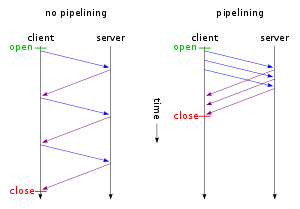

## Сети

Для полноты понимания рекомендуется посмотреть обучающий [видео курс](https://www.youtube.com/watch?v=OLFA0soYGhw&list=PLtPJ9lKvJ4oiNMvYbOzCmWy6cRzYAh9B1).

#### Чем tcp отличается от udp?
Протоколы TCP и UDP находятся на транспортном уровне модели OSI, но имеют следующие различия:

TCP:
* `+` обеспечивает гарантию доставки;
* `+` обеспечивает сохранение порядка сообщений на стороне получателя;
* `-` имеет накладные расходы:
    * на создание соединения (доп запросы на установку и разрыв соединения с обеих сторон общения);
    * на доп заголовки (20 байт, необходимые для упорядочивания сообщений, отслеживания не полученных TCP сегментов,
      управлением TCP окном и так далее):
        * особенно актуально, с учетом наличия доп запросов на установку соединения.

UDP:
* `+` не имеет накладных расходов:
    * имеет очень простое устройство, каждая UDP datagram содержит только следующие данные:
        * порт отправителя;
        * порт получателя;
        * длина UDP datagram;
        * контрольная сумма UDP datagram;
* `-` не обеспечивает гарантию доставки;
* `-` не обеспечивает сохранение порядка сообщений на стороне получателя.

Подробнее:
* сравнение см. в [видео уроке](https://www.youtube.com/watch?v=g7vq-JVId58&list=PLtPJ9lKvJ4oiNMvYbOzCmWy6cRzYAh9B1);
* обзор UDP см. в [видео уроке](https://www.youtube.com/watch?v=GBrLfZvRrd8&list=PLtPJ9lKvJ4oiNMvYbOzCmWy6cRzYAh9B1);
* обзор TCP см. в [видео уроке](https://www.youtube.com/watch?v=CKUOb4htnB4&list=PLtPJ9lKvJ4oiNMvYbOzCmWy6cRzYAh9B1).

---

#### Чем отличается Unicast / Multicast / Broadcast?
Ответ:
* unicast (юникаст) – процесс отправки пакета от одного хоста к другому хосту;
* multicast (мультикаст) – процесс отправки пакета от одного хоста к некоторой ограниченной группе хостов;
* broadcast (бродкаст) – процесс отправки пакета от одного хоста ко всем хостам в сети.
  Эти 3 типа передачи данных используются для различных целей, давайте рассмотрим более подробно.

Подробнее см. [здесь](http://infocisco.ru/types_communication.html) или в рамках [видео урока](https://www.youtube.com/watch?v=hSnXwFE0dqU).

---

#### Уровни модели OSI и модели TCP/IP

Подробнее см. [здесь](https://community.fs.com/ru/blog/tcpip-vs-osi-whats-the-difference-between-the-two-models.html),
либо в рамках кратких видео уроков по [модели OSI](https://www.youtube.com/watch?v=Tt8BTkxz_Vc&list=PLtPJ9lKvJ4oiNMvYbOzCmWy6cRzYAh9B1)
и [модели TCP/IP](https://www.youtube.com/watch?v=UZo4ffQ-aAc&list=PLtPJ9lKvJ4oiNMvYbOzCmWy6cRzYAh9B1).

---

#### Балансировщик имеет маркировку L4 и L7, какой мне нужно использовать если я хочу терминировать ssl трафик через балансировщик?

TLS/SSL относится к 6-му уровню модели OSI (presentation layer), как следствие, потребуется использование L7 балансировщика,
т.к. L4 "не поднимается" выше 4-го уровня модели OSI (transport layer).

---

#### Какие существуют способы указания длины тела сообщения

* посредством указания в заголовке Content-Length количества байт, которые следует прочитать после окончания заголовков
  (после пустой строки):
    * при этом тело сообщения может состоять как из одной единой части (в случае с Content-Type: application/*),
      так и из нескольких (multipart/*), причем в случае наличия нескольких частей:
        * Content-Length на уровне заголовков всего сообщения указывает суммарную длину
          всех частей тела сообщения (включая разделители);
        * для разделения частей сообщения используются разделитель (который указывается в заголовке boundary);
* [посредством использования механизма chunked encoding](https://developer.mozilla.org/en-US/docs/Web/HTTP/Headers/Transfer-Encoding):
    * указывается заголовок `Transfer-Encoding: chunked`;
    * тело сообщения разбивается на куски (chunk'и):
        * первая строка chunk - это длина данных этого chunk (в байтах), которые начинаются со следующей строки;
* посредством закрытия TCP соединения:
    * не удастся воспользоваться в ситуации, когда в рамках одного TCP соединения последовательно отправляется
      несколько HTTP запросов.

Подробнее см. [здесь](https://www.w3.org/Protocols/rfc2616/rfc2616-sec4.html#sec4.4).

---

#### Расскажите про TCP Back Pressure (он же TCP Sliding Window Flow Control)

Протокол TCP используется механизм управления потоком пакетов под названием "скользящее окно" (sliding window).

Данный механизм используется для избежания "простоя" в интервалы между завершением отправки пакета и получением уведомления о его получении
(со стороны получателя), что обусловлено тем, что между отправкой и получением уведомления имеется некоторая задержка,
вызванная накладными расходами на передачу данных по всем звеньям сети (например, по маршрутизаторам).

Механизм базируется на идее отправки нескольких последовательных пакетов данных не дожидаясь уведомления от
получателя (TCP ACK), вместо этого, ожидается получение одного уведомления, аккумулирующего информацию обо всех
(или части) ранее отправленных TCP пакетах.

Количество пакетов, которые могут быть отправлены не дожидаясь ACK называются TCP окном (TCP window).

Окно называется "скользящим", т.к. оно как бы скользит (движется) по потоку данных, которые нужно передать.
Если было получено уведомление о получении N пакетов (ACK), то отправляются следующие N пакетов, т.е. окно "сдвигается"
на следующую часть потока данных:

Back Pressure осуществляется за счет управления размером окна со стороны получателя:
* при отправке кумулятивного уведомления о получении TCP пакетов (ACK), в заголовке TCP ответа также указывается
  максимальное количество байт полезной нагрузки (payload), которое готов принять получатель:
    * значение заголовка рассчитывается на основании размера буфера данных:
        * поступающие по сети данные извлекаются из TCP сегментов и складываются в буфер;
        * объем свободного места в буфере и является размеров окна;
* данный заголовок должен прочитать отправитель и учесть его значение при расчете количества TCP сегментов, которые он
  будет отправлять в рамках TCP окна, например:
    * если получатель в TCP ACK указал значение 10220, а на канальном уровне (модели OSI) используется сеть Ethernet
      (где мо умолчанию максимальный размер кадра составляет 1500 байт, он же MTU), то максимальное количество пакетов,
      которые отправителю имеет смысл отправлять можно рассчитать примерно следующим образом:
        * 10220 / 1460 == 7, пояснение:
            * 1460 - это MSS (Maximum TCP segment size), где
                * MSS = MTU - (TCP headers size + IP headers size), где
                    * MTU (Maximum transmission unit) для Ethernet, по умолчанию, составляет 1500 байт;
                    * TCP headers size == 20 байт;
                    * IP headers size == 20 байт.

Если получателю будет отправлено больше данных, чем он готов сохранить в буфер, то он просто будет откидывать такие
TCP сегменты.

Подробнее см. [здесь](https://blog.wallaroolabs.com/2018/04/how-the-end-to-end-back-pressure-mechanism-inside-wallaroo-works/)
или в двух видео уроков:
1. [Sliding TCP Window](https://www.youtube.com/watch?v=hd6QNXK5rPk&list=PLtPJ9lKvJ4oiNMvYbOzCmWy6cRzYAh9B1);
2. [Flow Control Over Sliding TCP Window](https://www.youtube.com/watch?v=YCW4fLqFlME&list=PLtPJ9lKvJ4oiNMvYbOzCmWy6cRzYAh9B1).

---

#### Что такое HTTP pipelining

Особенность HTTP/1.1, позволяющая последовательно передавать несколько HTTP запросов в рамках одного TCP канала,
без ожидания ответа на них.

После завершения передачи всех HTTP запросов, начинается получение ответов, порядок которых должен соответствовать
порядку отправки запросов.

Подробнее см. [здесь](https://en.wikipedia.org/wiki/HTTP_pipelining) или в рамках [видео урока](https://youtu.be/7DitlqcesKI?list=PLtPJ9lKvJ4oiNMvYbOzCmWy6cRzYAh9B1&t=401).
[Пример использования](https://github.com/apache/httpcomponents-core/blob/5.0.x/httpcore5/src/test/java/org/apache/hc/core5/http/examples/AsyncPipelinedRequestExecutionExample.java).

---

#### Что такое TCP no delay или что такое алгоритм Нейгла (Nagle algorithm)

Это алгоритм буферизации отправляемых данных в рамках TCP пакета, являющийся средством повышения эффективности работы
сетей TCP/IP, позволяющим уменьшить количество пакетов, которые должны быть отправлены по сети.

Он используется, когда размер отправляемых данных в рамках TCP пакета очень маленький, т.е. когда служебная информации
(например, TCP заголовки) по размеру сильно превышает полезную нагрузку (сами передаваемые данные).

Данный алгоритм скапливает данные в своем буфере до тех пор, пока не будет получено уведомление об успешно получении
предыдущего TCP пакета (TCP ACK).

Параметр TCP_NODELAY используется для отключения данного механизма поведения.

Подробнее см. [здесь](https://ru.wikipedia.org/wiki/%D0%90%D0%BB%D0%B3%D0%BE%D1%80%D0%B8%D1%82%D0%BC_%D0%9D%D0%B5%D0%B9%D0%B3%D0%BB%D0%B0)
или [здесь](https://stackoverflow.com/questions/3761276/when-should-i-use-tcp-nodelay-and-when-tcp-cork).

---

#### Как можно организовать балансировку нагрузки между сервисами на два ЦОД

Для балансировки запросов между несколькими ЦОД можно воспользоваться одним из следующих подходов:

VRRP

Используем технологию VRRP (Virtual Router Redundancy Protocol):
* заводим один виртуальный IP адрес в сети, доступной потребителю (например, в internet):
    * заводим доменное имя (для удобства потребителя) DNS type A (для IPv4) / type AAAA (для IPv6),
      которое резолвится в данный виртуальный IP;
* в каждом из ЦОД заводим свой граничный маршрутизаторов (border gateway);
    * для каждого из маршрутизаторов заводим отдельный IP адрес в нашей внутренней сети;
    * настраиваем граничные маршрутизаторы нашей сети на работу в режиме VRRP
      (следует использовать маршрутизаторы с поддержкой данной технологии).

Особенности решения:
* `-` самое дорогое;
* `+` обеспечивает самые высокие гарантии доступности сервиса;
* `+` может обеспечивать высокие гарантии равномерности распределения нагрузки;

Подробнее см. [здесь](https://habr.com/ru/post/452490/).

Round robin DNS (multiple IP for DNS record)

Использование балансировку за счет особенностей DNS type A (для IPv4) / type AAAA (для IPv6):
* в каждом из ЦОД заводим свой граничный маршрутизатор (border gateway);
* для каждого из маршрутизаторов заводим отдельный IP адрес в сети, доступной потребителю (например, в internet);
* заводим доменное имя, которое может резолвиться в любой из данных IP адресов (по умолчанию, с использованием
  алгоритма round-robin);

Особенности решения:
* самое дешевое и простое;
* при обновлении DNS записи (удалении/добавлении/изменении IP адреса(ов)) обновленные данные будут
  гарантировано получены на каждом клиенте только спустя определенный выставленный для этой записи
  [TTL](https://support.google.com/a/answer/48090?hl=ru#TTL);
* не проверяет доступность сервисов по IP адресам, по возвращаемым в ответе на DNS запрос
  (не для fail-over систем);
    * не гарантирует равномерности распределения нагрузки:
    * например, если каждый второй запрос - это health check, а ЦОД всего два, то вся реальная нагрузка будет
      уходить на один и тот же ЦОД, а все health check запросы - на второй;

Подробнее см. [здесь](https://ru.wikipedia.org/wiki/Round_robin_DNS).

Client-side load balancing

* в каждом из ЦОД заводим свой граничный маршрутизатор (border gateway);
* для каждого из маршрутизаторов заводим отдельный IP адрес в сети, доступной потребителю (например, в internet);
* клиентская сторона сама выбирает на IP адрес какого из ЦОД направиться:
    * для достижения условий равномерной нагрузки и доступности сервисов необходимо:
        * периодически опрашивать каждый из IP адресов информацию о нагрузке (отсутствие ответа воспринимается,
          как недоступность):
            * чтобы основной сервис не упал под наплывом таких запросов в рамках каждого ЦОД следует на отдельный IP
              адрес выделить самостоятельный сервис:
                * собирающий информацию о доступности и нагруженности сервисов
                  (с использованием метрик оркестрирующей среды);
                * выдающий на запросы потребителей заранее собранную информацию;
* для удобства использования данного подхода на клиентской стороне должна использоваться библиотека для работы
  с данным сервисом (в несколько ином use-case, но схожий подход используется в таком продукте как Kafka).

Особенности решения:
* самое неудобное для потребителя (клиента);
* может обеспечить высокие гарантии доступности сервиса;
* может обеспечить достаточно равномерную распределенность нагрузки:
    * достижимо только в случае, если библиотека в том или ином виде запрашивает у сервеной стороны информацию
      о текущей нагруженности точек балансировки;

Пример: [Spring Cloud LoadBalancing](https://spring.io/guides/gs/spring-cloud-loadbalancer/).

DNS type A / AAAA redirecting

ToDo:
Интервьювер сказал, что имеется еще какая-то возможность балансировки за счет особенностей работы DNS typa A, если
специфичный ответ от DNS сервера поддерживает браузер, но я сходу не нашел как даже в
[RFC1035](https://datatracker.ietf.org/doc/html/rfc1035).

---